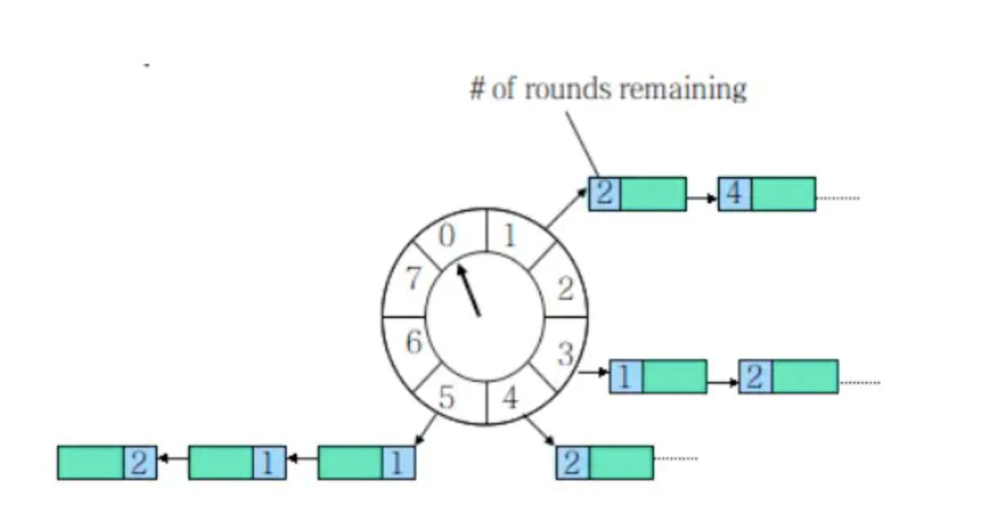
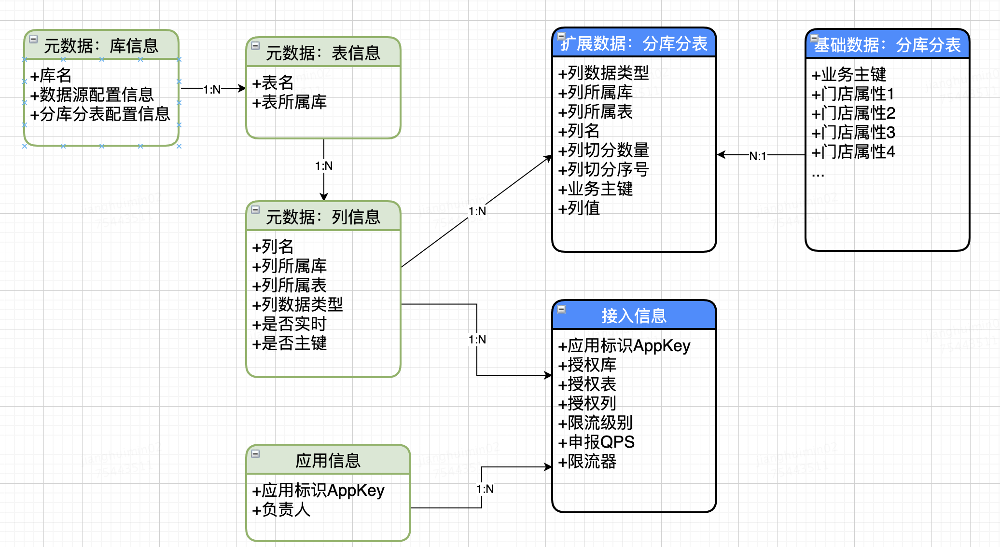
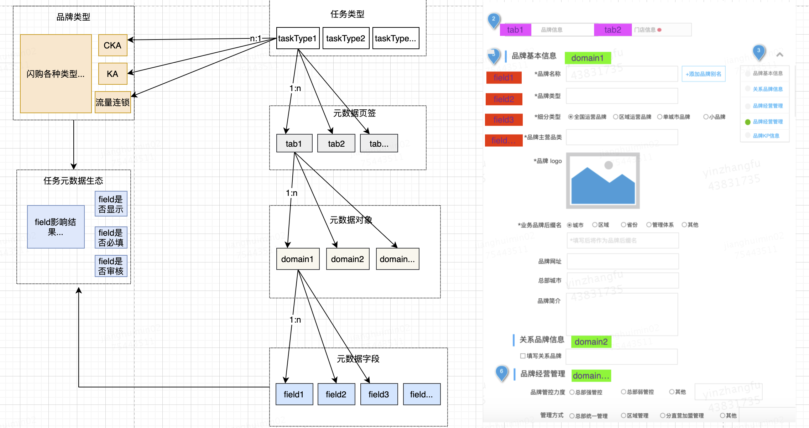
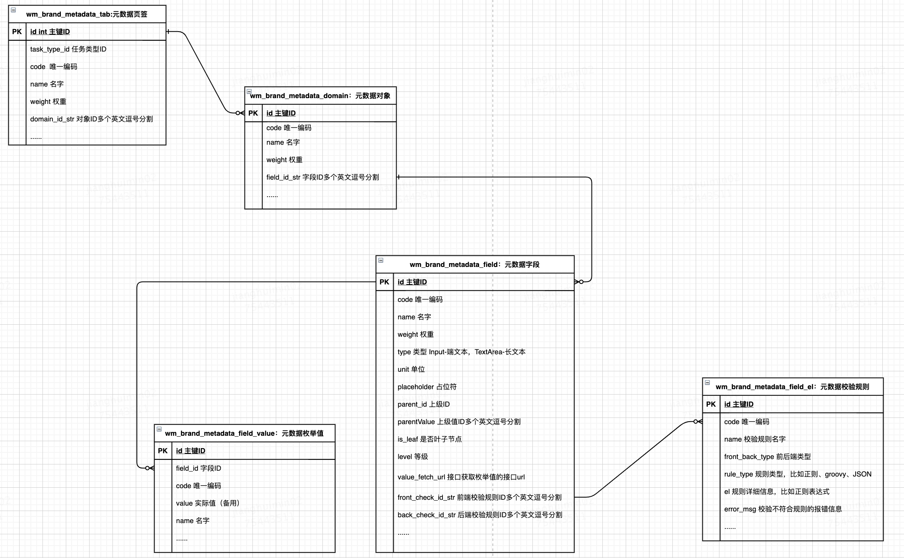
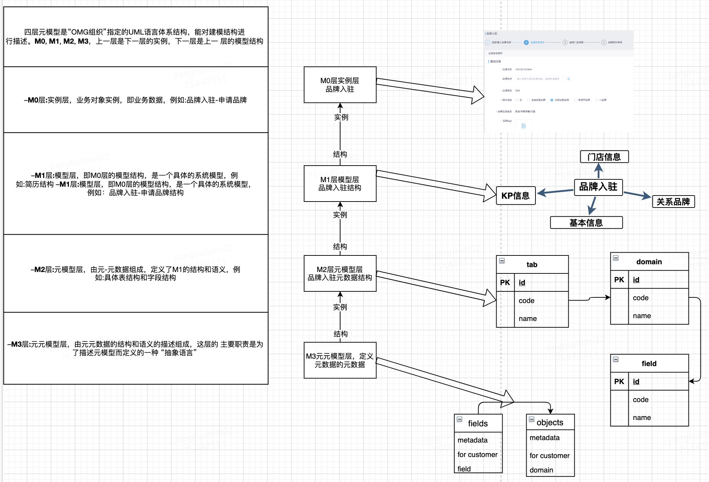
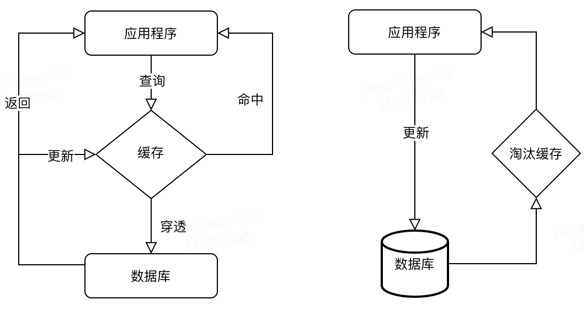
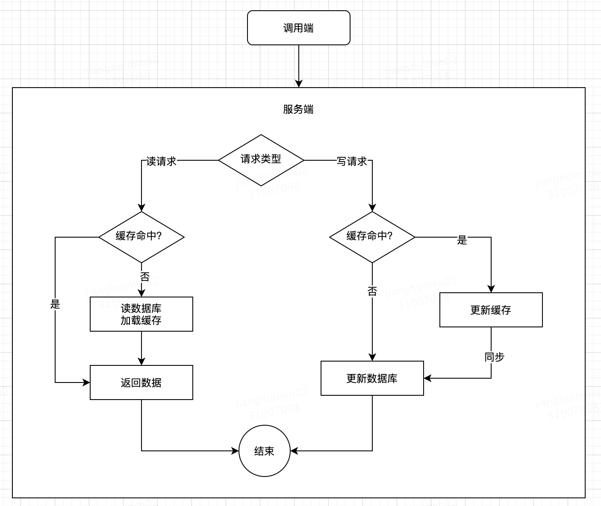
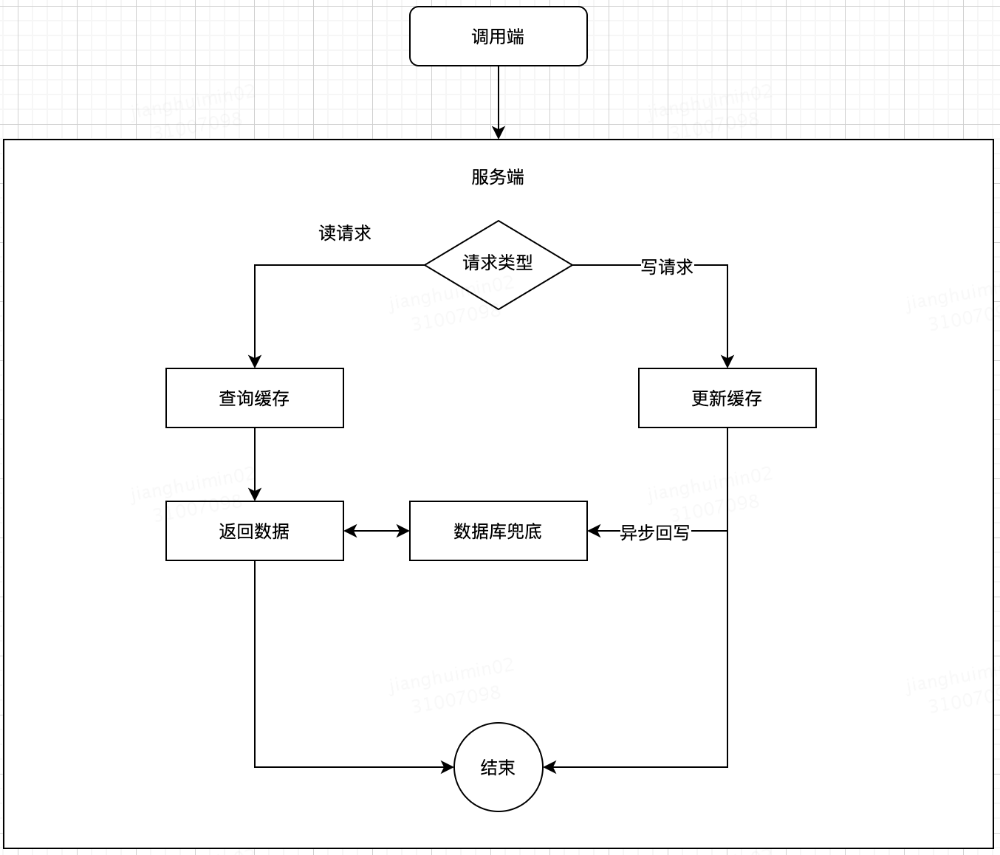

### 1 延时队列的实现思路

> 引用自：https://segmentfault.com/a/1190000023829389

> 这个也不错：https://blog.csdn.net/Taobaojishu/article/details/108675473

#### 1.1 DelayQueue 延时队列
JDK 中提供了一组实现延迟队列的API，位于Java.util.concurrent包下DelayQueue。DelayQueue是一个BlockingQueue（无界阻塞）队列，它本质就是封装了一个PriorityQueue（优先队列），PriorityQueue内部使用完全二叉堆（不知道的自行了解哈）来实现队列元素排序，我们在向DelayQueue队列中添加元素时，会给元素一个Delay（延迟时间）作为排序条件，队列中最小的元素会优先放在队首。队列中的元素只有到了Delay时间才允许从队列中取出。队列中可以放基本数据类型或自定义实体类，在存放基本数据类型时，优先队列中元素默认升序排列，自定义实体类就需要我们根据类属性值比较计算了。

DelayQueue的put方法是线程安全的，因为put方法内部使用了ReentrantLock锁进行线程同步。DelayQueue还提供了两种出队的方法 poll() 和 take() ， poll() 为非阻塞获取，没有到期的元素直接返回null；take()阻塞方式获取，没有到期的元素线程将会等待。
```
public class DelayQueueDemo {

    public static void main(String[] args) throws InterruptedException {
        Order Order1 = new Order("Order1", 5, TimeUnit.SECONDS);
        Order Order2 = new Order("Order2", 10, TimeUnit.SECONDS);
        Order Order3 = new Order("Order3", 15, TimeUnit.SECONDS);
        DelayQueue<Order> delayQueue = new DelayQueue<>();
        delayQueue.put(Order1);
        delayQueue.put(Order2);
        delayQueue.put(Order3);

        System.out.println("订单延迟队列开始时间:" + LocalDateTime.now().format(DateTimeFormatter.ofPattern("yyyy-MM-dd HH:mm:ss")));
        while (delayQueue.size() != 0) {
            /**
             * 取队列头部元素是否过期
             */
            Order task = delayQueue.poll();
            if (task != null) {
                System.out.format("订单:{%s}被取消, 取消时间:{%s}\n", task.name, LocalDateTime.now().format(DateTimeFormatter.ofPattern("yyyy-MM-dd HH:mm:ss")));
            }
            Thread.sleep(1000);
        }
    }
}

```

#### 1.2 Quartz 定时任务

Quartz一款非常经典任务调度框架，在Redis、RabbitMQ还未广泛应用时，超时未支付取消订单功能都是由定时任务实现的。定时任务它有一定的周期性，可能很多单子已经超时，但还没到达触发执行的时间点，那么就会造成订单处理的不够及时。

#### 1.3 Redis sorted set
Redis的数据结构Zset，同样可以实现延迟队列的效果，主要利用它的score属性，redis通过score来为集合中的成员进行从小到大的排序。消费端轮询队列delayqueue， 将元素排序后取最小时间与当前时间比对，如小于当前时间代表已经过期移除key。
```
    /**
     * 消费消息
     */
    public void pollOrderQueue() {

        while (true) {
            Set<Tuple> set = jedis.zrangeWithScores(DELAY_QUEUE, 0, 0);

            String value = ((Tuple) set.toArray()[0]).getElement();
            int score = (int) ((Tuple) set.toArray()[0]).getScore();
            
            Calendar cal = Calendar.getInstance();
            int nowSecond = (int) (cal.getTimeInMillis() / 1000);
            if (nowSecond >= score) {
                jedis.zrem(DELAY_QUEUE, value);
                System.out.println(sdf.format(new Date()) + " removed key:" + value);
            }

            if (jedis.zcard(DELAY_QUEUE) <= 0) {
                System.out.println(sdf.format(new Date()) + " zset empty ");
                return;
            }
            Thread.sleep(1000);
        }
    }

```

#### 1.4 Redis 过期回调
Redis 的key过期回调事件，也能达到延迟队列的效果，简单来说我们开启监听key是否过期的事件，一旦key过期会触发一个callback事件。修改redis.conf文件开启notify-keyspace-events Ex
```
notify-keyspace-events Ex
```
Redis监听配置，注入Bean RedisMessageListenerContainer
```
@Configuration
public class RedisListenerConfig {
    @Bean
    RedisMessageListenerContainer container(RedisConnectionFactory connectionFactory) {
        RedisMessageListenerContainer container = new RedisMessageListenerContainer();
        container.setConnectionFactory(connectionFactory);
        return container;
    }
}
```
编写Redis过期回调监听方法，必须继承KeyExpirationEventMessageListener ，有点类似于MQ的消息监听。
```
@Component
public class RedisKeyExpirationListener extends KeyExpirationEventMessageListener {
 
    public RedisKeyExpirationListener(RedisMessageListenerContainer listenerContainer) {
        super(listenerContainer);
    }
    @Override
    public void onMessage(Message message, byte[] pattern) {
        String expiredKey = message.toString();
        System.out.println("监听到key：" + expiredKey + "已过期");
    }
}
```

#### 1.5 RabbitMQ 延时队列
利用 RabbitMQ 做延时队列是比较常见的一种方式，而实际上RabbitMQ 自身并没有直接支持提供延迟队列功能，而是通过 RabbitMQ 消息队列的 TTL和 DXL这两个属性间接实现的。先来认识一下 TTL和 DXL两个概念：
```
Time To Live(TTL) ：
```

TTL 顾名思义：指的是消息的存活时间，RabbitMQ可以通过x-message-tt参数来设置指定Queue（队列）和 Message（消息）上消息的存活时间，它的值是一个非负整数，单位为微秒。RabbitMQ 可以从两种维度设置消息过期时间，分别是队列和消息本身

设置队列过期时间，那么队列中所有消息都具有相同的过期时间。
设置消息过期时间，对队列中的某一条消息设置过期时间，每条消息TTL都可以不同。
如果同时设置队列和队列中消息的TTL，则TTL值以两者中较小的值为准。而队列中的消息存在队列中的时间，一旦超过TTL过期时间则成为Dead Letter（死信）。
```
Dead Letter Exchanges（DLX）
```
DLX即死信交换机，绑定在死信交换机上的即死信队列。RabbitMQ的 Queue（队列）可以配置两个参数x-dead-letter-exchange 和 x-dead-letter-routing-key（可选），一旦队列内出现了Dead Letter（死信），则按照这两个参数可以将消息重新路由到另一个Exchange（交换机），让消息重新被消费。

x-dead-letter-exchange：队列中出现Dead Letter后将Dead Letter重新路由转发到指定 exchange（交换机）。
x-dead-letter-routing-key：指定routing-key发送，一般为要指定转发的队列。

队列出现Dead Letter的情况有：

- 消息或者队列的TTL过期
- 队列达到最大长度
- 消息被消费端拒绝（basic.reject or basic.nack）

下边结合一张图看看如何实现超30分钟未支付关单功能，我们将订单消息A0001发送到延迟队列order.delay.queue，并设置x-message-tt消息存活时间为30分钟，当到达30分钟后订单消息A0001成为了Dead Letter（死信），延迟队列检测到有死信，通过配置x-dead-letter-exchange，将死信重新转发到能正常消费的关单队列，直接监听关单队列处理关单逻辑即可。

#### 1.6 时间轮算法

前边几种延时队列的实现方法相对简单，比较容易理解，时间轮算法就稍微有点抽象了。kafka、netty都有基于时间轮算法实现延时队列，下边主要实践Netty的延时队列讲一下时间轮是什么原理。解读一下时间轮的几个基本概念

wheel ：时间轮，图中的圆盘可以看作是钟表的刻度。比如一圈round 长度为24秒，刻度数为 8，那么每一个刻度表示 3秒。那么时间精度就是 3秒。时间长度 / 刻度数值越大，精度越大。

当添加一个定时、延时任务A，假如会延迟25秒后才会执行，可时间轮一圈round 的长度才24秒，那么此时会根据时间轮长度和刻度得到一个圈数 round和对应的指针位置 index，也是就任务A会绕一圈指向0格子上，此时时间轮会记录该任务的round和 index信息。当round=0，index=0 ，指针指向0格子 任务A并不会执行，因为 round=0不满足要求。

所以每一个格子代表的是一些时间，比如1秒和25秒 都会指向0格子上，而任务则放在每个格子对应的链表中，这点和HashMap的数据有些类似。

Netty构建延时队列主要用HashedWheelTimer，HashedWheelTimer底层数据结构依然是使用DelayedQueue，只是采用时间轮的算法来实现。

一般采用定时器+哈希桶+链表的方式。



假设我们创建了一个长度为 8 的时间轮，时间轮的具体过程：

- task0 = 当我们需要新建一个 5s 延时消息，则只需要将它放到下标为 5 的那个槽中。
- task1 = 而如果是一个 10s 的延时消息，则需要将它放到下标为 2 的槽中，但同时需要记录它所对应的圈数，不然就和 2 秒的延时消息重复了。
- task2= 当创建一个 21s 的延时消息时，它所在的位置就和 task0 相同了，都在下标为 5 的槽中，所以为了区别需要为他加上圈数为 2。
- 当我们需要取出延时消息时，只需要每秒往下移动这个指针，然后取出该位置的所有任务即可。
- 当然取出任务之前还得判断圈数是否为 0 ，不为 0 时说明该任务还得再轮几圈，同时需要将圈数 -1 。
- 这样就可避免轮询所有的任务，不过如果时间轮的槽比较少，导致某一个槽上的任务非常多那效率也比较低，这就和 HashMap 的 hash 冲突是一样的。

##### 1.7 团团 redis + 定时任务

延迟队列API：无状态服务，接受客户单的延迟消息，将消息存储在cellar中，等待scheduler按延迟时间分发给消费者。
延迟队列Scheduler：扫描cellar存储，将指定时间的消息投递给消费端。
DelayServer实现了基于消息粒度的延迟消费，主要负责将消息延迟一段时间，然后发送给mafka集群。

整体流程：

- Producer发送消息到DelayServer上，携带延迟的相对值，即从现在开始，多久后消费；
- DelaySever收到消息后，将延迟相对值加上当前时间，即到期时间，作为主key，消息体作为Value，发送到Tair；
- 集群中的节点，根据当前时间，取出到期消息；
- 集群节点取出消息后发送给Broker，后续流程与非延迟消费消息处理逻辑一致；

Key设计：Key的设计影响两个方面，消息丢失和到期消息查询速度。如果Key有重复，可能导致消息丢失；到期查询主要依据是Key，Key的设计需要结合Tair特点，以便快速查找到所有的到期消息；tair的GetRange操作可以把当前主Key下的所有的数据取出，因此用TimeStamp做主Key，这样既可以快速取出到期消息。副key用来区分特定Timestamp下的消息，只要是当前Timestamp下一个唯一的MessageID即可。

到期消费发送：在到期消息获取中，对于到期的时刻，延迟一定时间后（此时间大于Tair写入耗时即可，防止正在写入中的消息漏读），用此时间做为主key，通过此主Key可以获取到即将到期的所有消息。根据此Key通过Tair的GetRange接口，会返回一批数据，逐条取出进行发送。发送时从连接池中取出此Topic的Producer进行发送。如果发送失败，将此消息删除，重新存入Tair中的失败队列，由专门的线程读取发送；如果发送成功，将此消息从tair中删除。

> 引用自：https://juejin.cn/post/6935314533573459998

### 2 分布式锁的实现思路

#### 2.1 数据库实现

**基于数据库实现的乐观锁**

乐观锁的通常是基于数据版本号来实现的。比如，有个商品表t_goods，有一个字段left_count用来记录商品的库存个数。在并发的情况下，为了保证不出现超卖现象，即left_count不为负数。乐观锁的实现方式为给商品表增加一个版本号字段version，默认为0，每修改一次数据，将版本号加1。无版本号并发超卖示例：
```
-- 线程1查询，当前left_count为1，则有记录
select * from t_goods where id = 10001 and left_count > 0
-- 线程2查询，当前left_count为1，也有记录
select * from t_goods  where id = 10001 and left_count > 0
-- 线程1下单成功库存减一，修改left_count为0,
update t_goods set left_count = left_count - 1 where id = 10001
-- 线程2下单成功库存减一，修改left_count为-1，产生脏数据
update t_goods set left_count = left_count - 1 where id = 10001
```
有版本号的乐观锁示例：
```
-- 线程1查询，当前left_count为1，则有记录，当前版本号为999
select left_count, version from t_goods where id = 10001 and left_count > 0;
-- 线程2查询，当前left_count为1，也有记录，当前版本号为999
select left_count, version from t_goods where id = 10001 and left_count > 0;
-- 线程1,更新完成后当前的version为1000，update状态为1，更新成功
update t_goods set version = 1000, left_count = left_count-1 where id = 10001 and version = 999;
-- 线程2,更新由于当前的version为1000，udpate状态为0，更新失败，再针对相关业务做异常处理
update t_goods set version = 1000, left_count = left_count-1 where id = 10001 and version = 999;
```
可以发现，这种和CAS的乐观锁机制是类似的，所不同的是CAS的硬件来保证原子性，而这里是通过数据库来保证单条SQL语句的原子性。顺带一提CAS的ABA问题一般也是通过版本号来解决。

**基于数据库实现的排他锁**

基于数据库的排他锁需要通过数据库的唯一性约束UNIQUE KEY来保证数据的唯一性，从而为锁的独占性提供基础。
表结构如下：
```
CREATE TABLE `distribute_lock` (
   `id` int(11) unsigned NOT NULL AUTO_INCREMENT COMMENT '主键',
   `unique_mutex` varchar(64) NOT NULL COMMENT '需要锁住的资源或者方法',
   -- `state` tinyint NOT NULL DEFAULT 1 COMMENT '1:未分配；2：已分配
   PRIMARY KEY (`id`),
   UNIQUE KEY `unique_mutex`
);
```

其中，unique_mutex就是我们需要加锁的对象，需要用UNIQUE KEY来保证此对象唯一。加锁时增加一条记录：
```
insert into distribute_lock(unique_mutex) values('mutex_demo');
```

如果当前SQL执行成功代表加锁成功，如果抛出唯一索引异常(DuplicatedKeyException)则代表加锁失败，当前锁已经被其他竞争者获取。解锁锁时删除该记录：
```
delete from distribute_lock(unique_mutex) values('muetx_demo');
```

除了增删记录，也可以通过更新state字段来标识是否获取到锁。
```
-- 获取锁
update distribute_lock set state = 2 where `unique_mutex` = 'muetx_demo' and state=1;
```
更新之前需要SELECT确认锁在数据库中存在，没有则创建之。如果创建或更新失败，则说明这个资源已经被别的线程占用了。

数据库排他锁可能出现的问题及解决思路：

- 没有失效时间， 一旦解锁失败，会导致锁记录一直在数据库中，其他线程无法再获得锁。可通过定时任务清除超时数据来解决；
- 是非重入的，同一个线程在没有释放锁之前无法再次获得该锁：可通过增加字段记录当前主机信息和当线程信息，
- 这个锁只能是非阻塞的，因为数据的insert操作，一旦插入失败就会直接报错。没有获得锁的在线程并不会进入阻塞队列，需要不停自旋直到获得锁，相对耗资源。

总的来说，基于数据库的分布式锁，能够满足一些简单的需求，好处是能够少引入依赖，实现较为简单，缺点是性能较低，且难以满足复杂场景下的高并发需求。

#### 2.2 Redis实现

一个简单的分布式锁机制是使用setnx、expire 、del 三个命令的组合来实现的。setnx命令的含义为：当且仅当key不存在时，value设置成功，返回1；否则返回0。另外两个命令，见名知意，就不多做解释了。
```
# 加锁，设置锁的唯一标识key，返回1说明加锁成功，返回0加锁失败
setnx key value
# 设置锁超时时间为30s，防止死锁
expire key 30
# 解锁， 删除锁
del key`
```

这种思路存在的问题：

- setnx和expire的非原子性：如果加锁之后，服务器宕机，导致expire和del均执行不了，会导致死锁。
- del导致误删：A线程超时之后未执行完， 锁过期释放；B线程获得锁，此时A线程执行完，执行del将B线程的锁删除。
- 锁过期后引起的并发：A线程超时之后未执行完， 锁过期释放；B线程获得锁，此时A、B线程并发执行会导致线程安全问题。

对应的解决思路：将加锁和设置锁过期时间做成一个原子性操作,在Redis2.6.12版本之后，set命令增加了NX可选参数，可替代setnx命令；增加了EX可选参数，可以设置key的同时指定过期时间或者将两个操作封装在lua脚本中，发送给Redis执行，从而实现操作的原子性。

将key的value设置为线程相关信息，del释放锁之前先判断一下锁是不是自己的。（释放和判断不是原子性的，需要封装在lua脚本中）启动一个守护线程，在后台自动给自己的锁''续期“，执行完成，显式关掉守护进程

redis分布式锁的缺点：在大型的应用中，一般redis服务都是集群形式部署的，由于Slave同步Master是异步的，所以会出现客户端A在Master上加锁，此时Master宕机，Slave没有完成锁的同步，Slave变为Master，客户端B此时可以完成加锁操作。
为了解决这一问题，官方给出了redlock算法，即使这样在一些较复杂的场景下也不能100%保证没有问题。假设Redlock算法基于N个完全独立的Redis节点（通常情况下N可以设置为5），Redlock算法描述：
。

> 引用自：http://interview.wzcu.com/%E7%AE%97%E6%B3%95/redlock%E7%AE%97%E6%B3%95.html

运行Redlock算法的客户端依次执行下面各个步骤，来完成获取锁的操作：

- 获取当前时间（毫秒数）
- 按顺序依次向N个Redis节点执行获取锁的操作。这个获取操作跟前面基于单Redis节点的获取锁的过程相同，包含随机字符串my_random_value，也包含过期时间（即锁的有效时间）。为了保证在某个Redis节点不可用的时候算法能够继续运行，这个获取锁的操作还有一个超时时间，它要远小于锁的有效时间（几十毫秒量级）。客户端在向某个Redis节点获取锁失败以后，应该立即尝试下一个Redis节点。这里的失败，应该包含任何类型的失败，比如该Redis节点不可用，或者该Redis节点上的锁已经被其他客户端持有。
- 计算整个获取锁的过程总共消耗了多长时间，计算方法是用当前时间减去第1步记录的时间。如果客户端从大多数Redis节点(>= N/2 + 1)成功获取到了锁，并且获取锁总共消耗的时间没有超过锁的有效时间(lock validaty time)，那么这时客户端才认为最终获取锁成功；否则认为最终获取锁失败。
- 如果最终获取锁成功了，那么这个锁的有效时间应该重新计算，它等于最初的锁的有效时间减去第3步计算出来的获取锁消耗的时间。
- 如果最终获取锁失败了（可能由于获取锁的Redis节点个数小于N/2+1，或者整个获取锁的过程消耗的时间超过了锁的最初有效时间），那么客户端应该立即向所有Redis节点发起释放锁的操作（即前面介绍的Redis lua脚本）

当然，上面描述的只是获取锁的过程，而释放锁的过程比较简单：客户端向所有Redis节点发起释放锁的操作，不管这些节点当时在获取锁的时候成功与否。也就是说，即使当时向某个节点获取锁没有成功，在释放锁的时候也不应该漏掉这个节点。这是为什么呢？设想这样一种情况，客户端发给某个Redis节点的获取锁的请求成功到达了该Redis节点，这个节点也成功执行了SET操作，但是它返回给客户端的响应却丢失了。这在客户端看来，获取锁的请求由于超时而失败了，但在Redis这边看来，加锁已经成功了。因此，释放锁的时候，客户端也应该对当时获取锁失败的那些Redis节点同样发起请求。实际上，这种情况在异步通信模型中是有可能发生的：客户端向服务器通信是正常的，但反方向却是有问题的。

#### 2.3 zk实现

zookeeper 是一个开源的分布式协调服务框架,主要用来解决分布式集群中的一致性问题和数据管理问题。zookeeper本质上是一个分布式文件系统，由一群树状节点组成，每个节点可以存放少量数据，且具有唯一性。
zookeeper有四种类型的节点：

- 持久节点(PERSISTENT)，默认节点类型，断开连接仍然存在
- 持久顺序节点(PERSISTENT_SEQUENTIAL)，在持久节点的基础上，增加了顺序性。指定创建同名节点，会根据创建顺序在指定的节点名称后面带上顺序编号，以保证节点具有唯一性和顺序性
- 临时节点(EPHEMERAL)：断开连接后，节点会被删除
- 临时顺序节点(EPHEMERAL_SEQUENTIAL)，在临时节点的基础上，增加了顺序性。

基于zookeeper实现的分布式锁主要利用了zookeeper临时顺序节点的特性和事件监听机制。主要思路如下：

创建节点实现加锁：通过节点的唯一性，来实现锁的互斥，如果使用临时节点，节点创建成功表示获取到锁，如果使用临时顺序节点，客户端创建的节点为顺序最小节点，表示获取到锁
删除节点实现解锁：通过临时节点的断开连接自动删除的特性来避免持有锁的服务器宕机而导致的死锁，通过节点的顺序性和事件监听机制，大节点监听小节点，形成节点监听链，来实现等待队列（公平锁）

其他思路：

- 不使用监听机制，未获取到锁的线程自旋重试或者失败退出（根据业务决定），可实现非阻塞的乐观锁。
- 不使用临时顺序节点，而使用临时节点，所有客户端都去监听该临时节点，可实现非公平锁。但是会产生"羊群效应"，单个事件，引发多个服务器响应，占用服务器资源和网络带宽，需要根据业务场景选用。

zookeeper分布式锁有着较好的可靠性，但是也有如下缺点：zookeeper分布式锁是性能可能没有redis分布式锁高，因为每次在创建锁和释放锁的过程中，都要动态创建、销毁临时节点来实现锁功能。使用zookeeper也有可能带来并发问题，只是并不常见而已。比如，由于网络抖动，客户端与zk集群的session连接断了，那么zk以为客户端挂了，就会删除临时节点，这时候其他客户端就可以获取到分布式锁了。就可能产生并发问题。这个问题不常见是因为zk有重试机制，一旦zk集群检测不到客户端的心跳，就会重试，curator客户端支持多种重试策略。多次重试之后还不行的话才会删除临时节点。


### 3. 库表的扩展性方案

#### 3.1 扩展列，如增加字段、预留字段、大字段

优点：支持一定程度扩展，简单直接；缺点：扩展容量比较有限。适用场景：扩展性要求低

#### 3.2 扩展表，即垂直切分

优点：支持多表灵活扩展，符合设计范式，冗余度低，并且支持索引。缺点：领域相关性非常高，扩展有开发工作量，没有通用性

适用场景：业务复杂度高，要求对领域模型有更高的表达能力，或者单行数据容量超出限制，比如存在大字符串字段

#### 3.3 ：列转行，即列名 + 列值这种键值对模式

优点：支持单表灵活扩展；缺点：只能支持单表扩展，通用性一般；适用场景：业务场景单一，复杂度低，扩展性要求高


#### 3.4 元数据化，即Schema（库表列）管理 + 列转行

优点：支持多表灵活扩展，通用性较好；缺点：有一定的实施成本，冗余度较高；使用场景：业务场景多变，复杂度低，扩展性要求高。



##### 3.4.1 元模型如何解决写入

通过线索进行路由，找到所属库表列名和值，然后补全其他信息。

##### 3.4.2 元模型如何解决查询的问题。

通过ES查询过滤条件

```
wm_poi_metadata_schemas：
id
schema_name
datasource
partition
remark
state
```

```
wm_poi_metadata_tables
id
table_name
schema_id
remark
state
```

```
wm_poi_metadata_columns
id
column_name
type
schema_id
table_id
realtime
primary_key
remark
state
```

### 4.元数据模型

使用场景：实体管理（大场景）、审核与生效分离场景（大场景），只是利用元模型进行数据的展示和控制，搜索要么就是KV查询，要么就是把审核生效的数据放在宽表或者ES中进行查询。

元数据就是定义数据的数据。比如页面上的一个输入框，可能是一个价格，而描述它的元数据可能有只读、最小值、最大值、小数位数、币种等。元数据驱动就是在设计架构时把复用细化到元数据级别，运行时根据元数据来处理数据，如对价格的范围进行校验。在元数据驱动的设计中，数据的处理细化到元数据级别，与具体的业务无关。

在字段级别上的元定义为：必填、只读、文案、默认值、最大值、最小值、类型、单位、上级、上级值集合、权重、取值/值的请求地址、前端校验规则以及后端校验规则等。一个基于任务的元模型的例子：



表结构设计



表之间的关联关系：

中间关系表：优点：建立多对多关系；缺点：查询关联表多
外键（主表ID存到子表中创建外键关联）：优点：建立一对多关系，查询关联少；缺点：影响性能等，感兴趣可自行学习
外键形式（主表ID存到子表中不创建外键）：优点：建立一对多关系，查询关联少；缺点：不能建立多对多关系
子表ID聚合到主表中：优点：建立多对多关系；缺点：比如一个字段同属于多个对象中，当字段增加一个值则所有关系对象中都能看到



数据、对象模型层；实例层：团子、男 这个实实在在存在的对象（UML面向对象逻辑结构下叫对象）或者叫数据（对应物理存储下叫数据）

模型层：用户对象（包含 姓名、性别两个属性）就叫做一个模型

元模型层：字段(field)表=字段规则的实例，wm_brand_metadata_field

元元模型层：字段(field)规则定义：名字、编码、字段类型、占位符、校验规则、上级字段

### 5. 一致性

#### 5.1 副本一致性：多副本，单操作

##### 5.1.1 场景

- DB的主从的一致性
- 缓存与DB的一致性

##### 5.1.2 模型
- 线性一致性，又叫严格一致性、原子一致性：所有的读操作，都能读到最近一次写的数据（即可见性、原子性）；所有节点、在任意时刻，看到的操作顺序都一样，且与全局时钟下的操作顺序（全局顺序）一致（即全局有序）。
- 顺序一致性，区别是，不存在全局的逻辑时钟：所有的读操作，都能读到最近一次写的数据（即可见行、原子性）；单个节点能看到的操作顺序，符合全局顺序，但多个节点之间看到的操作顺序，不符合全局顺序（即局部有序）
- 因果一致性，存在因果关系的操作之间，才满足顺序一致性：A发表了一个帖子，B在帖子下面评论，两者具有因果关系，满足顺序一致性；A发表了一个帖子，B也发表了一个帖子，两者不具有因果关系，不满足顺序一致性

##### 5.1.3 问题原因，难点在并发性：

并发性问题，涉及有序性、可见性

    - 思路一：串行化 + 读隔离，全局有序：a、相同Key串行化；b、不同Key并行化；c、中间状态不可读
    - 思路二：分布式共识算法，全局有序：a、Paxos及其变种；b、Zab，ZooKeeper基于Fast Paxos改造而来；c、Raft；d、Quorum NWR，读仲裁 + 写冗余，这个思路的一个特例是读主
    - 思路三：参考多核CPU的一致性方案，局部有序；a、总线锁（问题：粒度太粗）；b、缓存锁（MESI + Store Buffer + Invalidate Queue + 内存屏障）；引入MESI，缓存一致性协议，问题：C0发送独占消息，得到回复前，处于阻塞状态；引入Store Buffer（存储缓冲）和Invalidate Queue（无效队列），问题：脏写，脏读；内存屏障，写屏障前Store Buffer都写入缓存，读屏障Invalidate Queue无效指令都执行
    - 思路四：最终一致性方案，不满足一致性模型：a、过期机制；b、二次淘汰；c、检测修复

原子性问题，涉及程序逻辑错误，上游依赖、基础服务、中间件、数据库、网络、硬件等异常

    思路一：回滚
    思路二：重试

#### 5.2 事务一致性，难点在原子性：单副本，多操作

##### 5.2.1  场景

- 数据同步，DataBus/DTS
- 消息发送，Mafka
- 服务调用，幂等性、库存扣减、余额增减

##### 5.2.2 模型

A原子性、C一致性、I隔离性、D持久性，A、I、D是手段，C才是目的

##### 5.2.3 问题与方案

- 并发性问题，涉及I隔离性：a、串行化；b、MVCC解决脏读、不可重复读，锁机制解决并发写，间隙锁解决幻读；
- 原子性问题，涉及A原子性和D持久性：a、强一致性方案，undo log / redu log + 2PC / 3PC，其实就是回滚 + 重试；b、弱一致性方案，TCC、本地事件表、事务型消息、SAGA


### 6. 缓存常见的套路

#### 6.1 旁路模式，Cache Aside



一致性种类：副本一致性

一致性思路：弱一致性方案（过期机制、二次淘汰、检测修复）

优点：实现简单，性能较高

缺点：一致性问题只能缓解、不能根除，维护两套存储，对应用不友好

典型场景：一切就近的情况

#### 6.2 双写模式，Read/Write Through



一致性种类：副本一致性

一致性思路：

（1）弱一致性方案（过期机制、二次淘汰、检测修复）

（2）准一致性方案（同步双写）

（3）强一致性方案（同步双写 + 分布式锁，Paxos、Raft、Zab、Quorum NWR）

优点：对调用端友好，可以对外提供稳定持久、实时一致的服务，读性能高

缺点：写性能低，吞吐量低，容易阻塞

典型场景：商品/商家/订单等数据的基础服务

#### 6.3 回写模式，Write Back



一致性种类：以缓存数据为准，不考虑与DB的一致性

优点：I/O最快，性能最高

缺点：存在数据丢失风险

典型场景：消息消费、信息收集、秒杀抢购


### 7. 旁路缓存的一致性问题

- 旁路模式，数据库和缓存之间不一致的问题，只能降低，无法根除。
- 不一致产生的原因有两种，一种是由于原子性问题而产生的，另一种是由于并发性问题产生的。前者可以通过捕获异常发现，通过重试进行修复。后者这种就很难主动发现了，是真正需要重点关注的。 并发导致的缓存一致性问题，存在两种情况。
    - 第一种，写线程执行过程中，插入了读线程。场景：写线程先淘汰缓存，后更新数据库。线程1写操作，先淘汰缓存，线程2读操作，缓存未命中，读数据库旧数据，把旧数据写入缓存，线程1更新数据库。此时，除非过期，或者延迟二次淘汰，或者定期对比修复，否则缓存数据始终为旧。通常情况，写操作涉及加锁、当前读，比读操作慢得多，所以这种情况发生的概率不低。
    - 第二种，读线程执行过程中，插入了写线程。场景：写线程先更新数据库，后淘汰缓存。线程1读操作，读缓存未命中，读数据库旧数据，线程2写操作，先写数据库，再淘汰缓存，线程1把旧数据写入缓存。这种情况发生的条件，一是读操作恰好未命中缓存，二是写操作晚于度读操作开始，早于读操作结束。理论上，这种情况的发生概率很低。

- 怎样缓解并发产生的缓存一致性问题？

    - 第一设置过期时间。
    - 第二写操作二次延迟淘汰。
    - 第三定期检测并修复。

- 为什么写操作是淘汰缓存，而非更新缓存？原因仍然和并发有关。两个并发更新，线程1更新了数据库一条记录，线程2基于线程1的结果更新的同一条记录，继而更新缓存，然后线程1更新缓存。这个问题Facebook一篇论文（《Scaling Memcache at Facebook》）里提到过，删除操作天然幂等。另外，有一类场景是可以使用更新缓存，而不是淘汰缓存的，就是不需要外部调用方传递数据状态的更新操作，比如自增。
- 缓存一致性问题的关键，在于不要让不一致的数据，在缓存中的存在时间，超过业务的忍受时间，而不是追求完美的一致性。


### 8. DataBus/DTS的一致性问题

一、并发性问题，通过串行化解决，全局有序

MySQL的binlog是顺序且完整的，记录了数据库实例的全部操作的日志文件。MySQL的GTID机制（Global Transaction IDentifier 是全局事务标识），保证DataBus拉取binlog数据，在集群范围内全局有序。首先，按照表的维度，重新组织binlog数据，对binlog数据进行分区，分发到对应的数据流。其次，按照分片字段（可自定义，指定某列）的维度，继续对binlog数据进行分片。注意，分区和分片之后，分区和分片内部binlog数据的相对顺序不变。最后，同一分片的binlog数据，在同一线程顺序处理，前面的成功，才能下一个。

二、原子性问题，有重试无回滚，不保证原子性

同一分片的binlog数据，前面的不成功，会阻塞后面的处理；默认不断重试，直至成功；启用故障收集，重试20次，仍未成功，上报故障收集系统，然后继续处理；对于故障的变更，可以自动重试，也可以不自动重试；DBUS故障超过500个，停止上报，消息阻塞；DTS故障数量没有上限，但成功率过低会限流。


### 9. MySQL的逻辑架构

- 缓存和缓冲区，SQL命中后直接返回
- 解析器，词法分析，语法分析，形式校验，生成解析树
- 预处理器，实质校验，生成新解析树，指令树
- 优化器，执行计划
- 执行器，物理执行计划，调用存储引擎接口，数据访问，以及过滤、分组、排序、函数等
- 存储引擎


### 10. mysql结构索引

1、索引的结构分类

B+Tree索引：优点：树高度更低，查询路径固定，空间局部性好，有利于预加载

Hash索引：缺点：范围、排序、分组等查询时间复杂度高

估算数据：数据页16K，非叶子结点大小 = 8字节的bigint + 6字节页指针 = 14字节，每个数据页可以容纳16 * 1024 / 14 = 1170个非叶子节点，叶子结点大小 = 假定1KB，每个数据页可以容纳16 / 1 = 16个叶子结点，据此估算：一层B+树可以容纳16行记录；二层B+树可以容纳16 * 1170 = 18720行记录，不到2w；三层B+树可以容纳16 * 1170 * 1170 = 21902400行记录，2000w多点；如果索引列为int类型，4个字节，则非叶子结点大小 = 4 + 6 = 10字节，每个数据页可以容纳 16 * 1024 / 10 = 1638；则，三层B+树可以容纳16 * 1638 * 1638 = 42928704行记录，4000w多点

2、索引的组织方式

- 聚簇索引，非叶节点只有索引列，叶节点有整个数据行，优点，减少随机IO，缺点，主键非自增，会造成数据移动
- 二级索引，非叶节点只有索引列，叶节点有索引列和主键，优点，数据移动不影响二级索引，缺点，需要二次回表查询
- 普通索引，非叶节点只有索引列，叶节点只有记录指针，优点，占用空间低，缺点，随机IO，数据移动影响索引

3、需要使用索引的关键词和原则

where、join、group by、order by

首列必需出现，否则不能匹配、常用列优先，尽量复用、区分度大的列优先、宽度小的列优先

4、执行计划分析

type

const，主键或唯一键

eq_ref，主键关联的第二张表

ref，最左前缀索引，非主键和唯一键

range，范围查询，最低要求

index，索引顺序全表扫描，不用排序，尽量避免

all，全表扫描，杜绝

extra

using index，覆盖索引

using where，二次过滤

using index condition，索引条件下推，减少回表次数（参照：https://juejin.cn/post/6844904110072791048， https://zhuanlan.zhihu.com/p/121084592）

using temporary，临时表，杜绝

using filesort，额外排序，如order by无索引，或超出sort buffer，杜绝

possible_keys，可能用到的索引

key，优化器决定用到的索引，可以use index干预，force index(索引)，为空则全表扫描，杜绝

rows，扫描行数，优化器选择key的参考，越小越好

ken_len，用到的索引列长度之和

定长字段，int = 4，bigint=8，date=3，timestamp=4，char(n)=n * 3（编码字符的字节数）

变长字段，varchar(n) = n * 3 + 1/2

allow null字段，需要额外一个字节，无法进行优化，尽量避免

5、索引优化步骤

首先，看key是否非空；其次，看type是否为range、ref、eq_ref、const；再次，看extra是否触犯禁忌，using temporary/filesort；然后，看索引设计是否合理，索引列选择、顺序、长度（扫描行数预估一致，随机选取一个，出现额外排序，可以强制指定索引）；最后，还是不行，优化系统架构、业务逻辑

6、字符集和校对规则

字符集，字符和字符编码，有多个校对规则， 有一个默认；校对规则，用于字符比较的规则，只属于一个字符集；相关参数：character_set_client、character_set_connection、存储字符集、character_set_results

### 11. RPC框架

- 最开始，是服务提供者provider和服务调用者consumer，即consumer <-> provider
- 如果产生有效交互，必需要建立服务通道和服务协议，即，RpcProtocol <encode> RpcConnector <-RpcChannel-> RpcAcceptor <encode> RpcProtocol
- 为了方便调用，要定义好远程API，RmoteAPI，RpcServer负责定义和实现，RpcClient负责调用
- RpcInvoker，RpcCaller
- RpcProxy，RpcProcessor

### 12. LinkedBlockingQueue size = 0

没有正确深入理解线程池中 LinkedBlockingQueue 和 SynchronousQueue分别的职责，错误认为LinkedBlockingQueue size = 0的效果和 SynchronousQueue相同。因为缓冲队列为0，核心线程池中的线程pull不到task，导致线程一直处于wait状态，最大线程池中的线程超过60s的keep-alivetime，非核心线程会被关闭，然后重新新建非核心线程消费下一波提交的task。所以第一分钟可以消费64个任务，后面每台机器每分钟仅能消费32个请求，其余请求都会抛java.util.concurrent.RejectedExecutionException。

public void execute(Runnable command) {
if (command == null)
throw new NullPointerException();
int c = ctl.get();
if (workerCountOf(c) < corePoolSize) {
if (addWorker(command, true))
return;
c = ctl.get();
}
if (isRunning(c) && workQueue.offer(command)) {
int recheck = ctl.get();
if (! isRunning(recheck) && remove(command))
reject(command);
else if (workerCountOf(recheck) == 0)
addWorker(null, false);
}
else if (!addWorker(command, false))
reject(command);
}


https://blog.csdn.net/u011637069/article/details/79593114
https://www.cxyzjd.com/article/firefile/80745627
https://www.zhihu.com/question/412524104

### 13. 如何进行领域建模

https://blog.csdn.net/maoyeqiu/article/details/121416404


