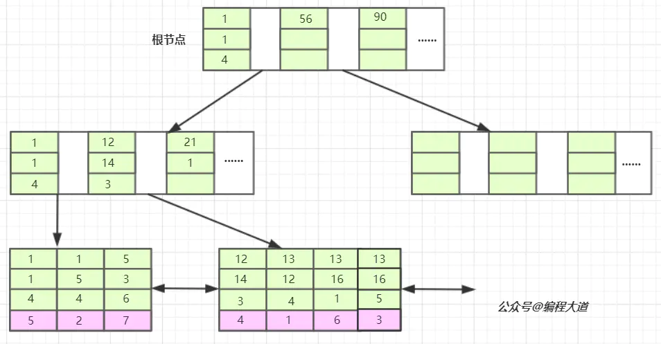
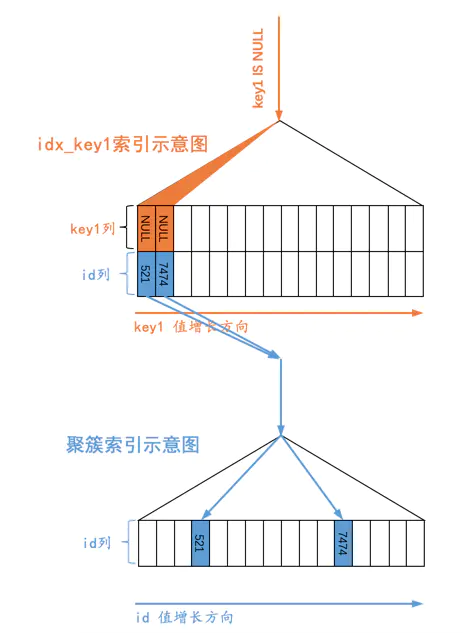
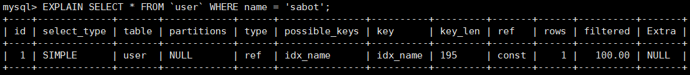

[TOC]

---

### 一、数据库事务
1. 数据库连接池为什么要用ThreadLocal呢？
   threadlocal，是为了解决数据库事务，而事务是和连接有关的，每个连接对应一个事务，多个连接的事务是不一样的。先看下连接池，我们为了避免单一数据库连接的创建和关闭耗费时间和性能，引入了数据库连接池，提前创建好了n条连接放入池中，主要是为了提高性能。而ThreadLocal缓存连接，是为了把同一个数据库连接“分享”给同一个线程的不同调用方法。（不管调用哪个方法，都是使用的同一个连接，方便进行“跨方法”的事务控制）

2. Spring @Transaction注解的方法在多线程中是否属于同一个事务?
多线程底层连接数据库的时候，是使用的线程变量（TheadLocal）,所以，开多少线程理论上就会建立多少个连接，每个线程有自己的连接，事务肯定不是同一个了。如果多线程支持同一个事物，事物分为编程式事务和声明式事务，通过编程式事务，我们就能完全掌控事务的开启和提交或者回滚操作。
能想到编程式事务，这事基本上就成了一半了。 你想，首先我们有一个全局变量为 Boolean 类型，默认为可以提交。 在子线程里面，我们可以先通过编程式事务开启事务，然后插入 10w 条数据后，但是不提交。同时告诉主线程，我这边准备好了，进入等待。
如果子线程里面出现了异常，那么我就告诉主线程，我这边出问题了，然后自己进行回滚。最后主线程收集到了 5 个子线程的状态。如果有一个线程出现了问题，那么设置全局变量为不可提交。然后唤醒所有等待的子线程，进行回滚。

3. Spring 的源码里面，对于事务的隔离性是如何保证的呢？
答案就是 ThreadLocal。在事务开启的时候，把当前的链接保存在了 ThreadLocal 里面，从而保证了多线程之间的隔离性（这篇文章非常好：https://segmentfault.com/a/1190000037770701）

4. 多线程事务违反了，哪个事务特性
- 原子性（Atomicity）;
- 一致性（Consistency）
- ;隔离性（Isolation）;
- 持久性（Durability）。

> 答案：隔离性。两个事务操作之间不应该相互干扰。 而多线程事务想要实现的是 A 线程异常了。A，B 线程的事务一起回滚。

5. 使用事务注意
- 高性能、大吞吐服务尽􏰂不用事务，而是业务补偿保证最终一致性
- 保持事务短小精悍，使用原则:即开即用，用完即关，避免把事务无关的操作放到事务里，减少锁资源的占用，事务块尽􏰂小
- BAD CASE
    - 事务中请求远程服务，事务的锁占时间完全由下游服务决定
    - 事务中嵌套事务
    - 事务中存在慢查询
    
6. 
### 二、基础知识
1. int(1)和int(11)是否有区别？
MySQL类型关键字后面的括号内指定整数值的显示宽度(例如，INT(11))。该可选显示宽度规定用于显示宽度小于指定的列宽度的值时从左侧填满宽度。显示宽度并不限制可以在列内保存的值的范围，也不限制超过列的指定宽度的值的显示。所以INT(1)和INT(11)默认是没有任何区别的！！！
定义：int(11) unsigned zerofill； 插入：insert into t2  123456;查询：00123456789，INT(M) ZEROFILL，加上ZEROFILL后M才表现出不同，比如 INT(3) ZEROFILL,你插入到数据库里的是10,则实际插入为010,也就是在前面补充加了一个0.如果INT(3)和INT(10)不加ZEROFILL,则它们没有什么区别．Ｍ不是用来限制INT列内保存值的范围的．int(M)的最大值和最小值与UNSIGNED有关。

2. 常见的数值
- 整数类型：
    - TINYINT(1Byte)8；
    - SMALLINT(2Byte)16；
    - MEDIUMINT(3Byte)24；
    - INT(4Byte)32；
    - BIGINT(8Byte)64

- 实数类型
    - FLOAT(4Byte) 7个有效位，近似存储，性能高 
    - DOUBLE(8Byte) 15个有效位 
    - DECIMAL(9Byte) 30个有效位，精确计算
    - 可存储的整数范围为-2^(N-1)到2^(N-1)-1，其中N是存储空间的位数。
    - 还可以将整数类型设为 UNSIGNED ，这样几乎可以是其范围增大一倍。例如TINYINT范围是-128 - 127，而TINYINT UNSIGNED的范围是0-255。不过这两种只是在范围上有缺别，在存储空间和性能上都是一样的。

3. 数据类型存储的原则
    1. 更小通常更好:尽量使用可以正确储存数据的最小数据类型，可占用更少的磁盘、内存和CPU缓存，同时需要处理的CPU周期也更少
    2. 简单更好:简单的数据通常需要更少的CPU操作周期，整型比字符串类型操作复杂度更低。
    3. 尽量避免NULL:通常情况下最好指定列为NOT NULL，但是把NULL改成NOT NULL 对性能带来的提升比较少。一般在索引列上最好避免NULL值，因为如果包含NULL，使得索引和索引统计都比较复杂。


4. 财务数据 (BIG)INT VS DECIMAL 哪个好?
    1. (BIG)INT 定⻓小数时，空间小性能好
    2. DECIMAL 不定⻓的高精度运算

5. varchar和char的选择
-  VARCHAR(n) 可变⻓度，支持到 65535 B;需要使用额外1-2字节记录⻓度，原数据位置更细且可变，易产生碎片。CHAR(n)，定⻓，支持到 255 B，无需额外空间，定⻓不易产生碎片。
-  VARCHAR类型用于存储可变长的字符串，所以它需要1或2个额外的字节记录字符串的长度：如果列的长度小于或等于255个字节，则只使用1个字节表示，否则使用2个字节表示。例如varchar(10)就需要11个字节，varchar(1000)则需要1002个字节。
-  CHAR类型是定长的：MySQL总是根据定义字符串的长度分配足够空间。因为CHAR会根据需要采用空格填充到字符串末尾，而且当你检索时，CHAR会删除末尾的空格。所以会有一个很有趣的事情发生，当你存储一个"Johnson  "到char(10)时，检索出来的结果却是"Johnson"，因为MySQL并不知道这空格是你存的还是系统自动填充的。CHAR很适合存储很短的字符串或所有值都接近同一个长度。例如密码的MD5值。

### 三、数据库索引

0. 以下大部分来自：
> https://mp.weixin.qq.com/s?__biz=MzUxNTQyOTIxNA==&mid=2247484041&idx=1&sn=76d3bf1772f9e3c796ad3d8a089220fa&chksm=f9b784b8cec00dae3d52318f6cb2bdee39ad975bf79469b72a499ceca1c5d57db5cbbef914ea&token=2025456560&lang=zh_CN#rd
> https://juejin.cn/post/6844904073955639304

1. 索引可以选择的数据接口有哪些？ 
- 二叉树：二叉树在某些场景下退化成了链表，这就是mysql索引底层没有使用二叉树这种数据结构的原因之一。
- 红黑树：是一种平衡二叉树，JDK1.8的hashmap就用到了红黑树。我们只有7条记录，树的高度就达到了4层，那数百万数千万甚至上亿记录的表创建的索引它的树高得有多高？一般来说都是从根节点开始查找，假如树的高度是50，那我要进行50次查找，50次磁盘IO那得多慢啊这开销已经很大了。这就是红黑树作为索引数据结构的弊端：树的高度过高导致查询效率变慢。
- hash
- B-Tree:也就是说在一个节点上可以存储更多的元素，k-v，key就是索引字段，data就是索引字段所在的那一行的数据或是那一行数据坐在的的磁盘文件地址、指针，再去查找元素的时候一次性不是Load一个小元素，而是把一个大的节点的数据一次性全部load到内存，然后再在内存里再去比对，在内存里操作是比较快的。如果我们要查找49这个元素，实际上是从根节点开始查找的，它一次性将根节点这个大节点一次性load到内存里，然后用要查找的元素在这里去比对，49大于15小于56，在15和56之间有一个节点存储的是下一个节点的磁盘地址指向下一个节点（这个节点的索引都是大于15小于56的），然后再将这个节点一次性load到内存去找这个元素，然后比对就找到了。这个节点的大小设置要合适，不能太大也不能太小，mysql对这个节点大小设置的是16K


2. B树和B+树有什么特点
- B树
    - 叶节点具有相同的深度，叶节点的指针为空
    - 所有索引元素不重复
    - 节点中的数据索引从左到右递增排序

- B+树
    - 非叶子节点不存储data，只存储索引（冗余），可以放更多的索引
    - 叶子节点包含所有索引字段
    - 叶子节点用指针连接，提高区间访问的性能

3. 和B-Tree有啥区别？
- 非叶子节点没有数据，数据都挪到叶子节点
- 叶子节点之间还有指针，非叶子节点之间跟原来一样没有指针。

4. 为啥data元素挪到叶子节点
- 非叶子节点的每个节点就可以存储更多的索引元素，减少load的次数。

5. 索引和数据存放位置是哪？
- 磁盘=》默认是安装目录的data文件里（不同版本可能有所不同），每个数据库对应data文件夹里的一个文件夹.
- 以两个自定义的表为例：user表（InnoDB存储引擎）对应两个文件，order表（MYISAM存储引擎）对应3个文件。其中.frm文件是存储的是表结构，两个存储引擎都一样，而InnoDB的.ibd文件是索引+数据，MYISAM的.MYI（I：index）和.MYD（D：data）文件分别是索引字段的索引结构和数据文件，也就是说MYISAM存储引擎的索引和数据是分开的，而InnoDB存储引擎的数据和索引是在一个文件里的。

6. 什么是聚集索引和非聚集索引？
-  聚集索引/聚簇索引，叶子节点包含了完整的数据记录，InnoDB的主键索引就是一个聚集索引，他的索引和数据是绑定在一起的（叶子节点）。MYISAM的是非聚集索引，索引和数据是分开存储的。InnoDB的主键索引我们叫做聚集索引。
-  用的最多的InnoDB存储引擎是什么样子的呢？我们可以看到，它只有两个文件。.rm文件和MYISAM一样都是表结构文件，.ibd文件就是MYISAM的MYI和MYD文件的合并，索引文件和数据文件都存储到一个文件。
-  聚族索引的好处：不用回表了，性能应该比MYISAM高，你看MYISAM查找到索引所在行记录的磁盘地址后还要回MYD文件读取一次。

7. 为什么InnoDB表必须有主键，并且推荐使用整型的自增主键？
- 我们看一下这个问题为什么InnoDB表必须有主键，并且推荐使用整型的自增主键？为甚innoDB表建议要有自增的主键，尽量建主键，建整形自增的？其实很简单，设计如此，mysql设计的就是innoDB把你的数据和主键索引用B+Tree来组织的，没有主键他的数据就没有一个结构来存储。
- 建innoDB表的时候没有建主键，表也能建成功，为什么？ 不建主键不代表没有主键，没有建主键innodb会帮你选一个字段，一个可以标识唯一的字段，选为默认字段，如果这个字段唯一的话，不重复，可一键唯一索引的话，就会作为类似于唯一索引，用这个字段来作为唯一索引来维护整个表的数据。如果没有，mysql会生成一个唯一的列，类似于rowid，只不过你看不到，他会用生成的这个唯一列，维护B+Tree的结构，查数据的时候还是用B+Tree的结构去查找。
- 为什么推荐整形呢？ 我们想象一下查找过程，是把节点load到内存然后在内存里去比较大小，也就是在查找的过程中要不断的去进行数据的比对。假设UUID，既不自增也不是整形。问一下，是整形的1<2比较的效率高还是字符串的“abc”和“abe”比较的效率高呢？显然是前者，因为字符串的比较是转换成ASICI一位一位的比，如果最后一位不一样，比到最后才比较出大小，就比整形比较慢多了，存储空间来说，整形更小。索引越节约资源越好。
- 为什么是自增的呢？我们可以看一下B-Tree的叶子节点之间是没有指针的，B+Tree优化后增加了叶子节点之间的指针，如果我们遍历数据，从当前节点遍历完之后，就可以根据节点间的指针快速找到下一个节点去遍历。讲到这，穿插一下B+Tree为什么要比B-Tree多一个节点间指针呢？那就讲一下索引的另一种数据结构就是hash。

8. Hash索引非常快，为啥不普遍使用
> 因为如果使用范围查找，hash就没有用武之地了，范围查找也是很常用的吧，所以基本就不怎么用hash这种数据结构。那B+Tree就很好的支撑范围查找，B-树没有叶子节点的指针，也没有办法很好的支持。

9. 为什么非主键索引结构叶子节点存储的是主键值？
> 为了一致性和节省存储空间。已经维护了一套主键索引+数据的B+Tree结构，如果再有其他的非主键索引的话，索引的叶子节点存储的是主键，这是为了节省空间，因为继续存数据的话，那就会导致一份数据存了多份，空间占用就会翻倍。另一方面也是一致性的考虑，都通过主键索引来找到最终的数据，避免维护多份数据导致不一致的情况。

10. MYISAM索引实现（非聚集）
- 存储：数据、行记录是存储在MYD文件，假如col1是索引字段那么这一列是存储在MYI文件里以B+Tree的结构来组织的，然后他的叶子节点的data部分存储的是索引所在行记录的磁盘文件地址，根据磁盘文件地址指针就可以从MYD文件里快速的找到我们的这一行记录。
- 查找：所以MYISAM这个存储引擎他的查找的一个大致过程就是，先看条件字段有没有用到索引，是索引字段就先去到索引文件去查找这个索引所在的那一行的磁盘文件地址，就借助B+Tree的特点从根节点顺藤摸瓜找到磁盘文件地址指针，然后从MYD文件一次性定位到所找的数据，也就是说MYISAM会垮两个文件。

11. 联合索引的存储形式

创建t1表，联合索引为：bcd
```
DROP TABLE IF EXISTS `t1`;
CREATE TABLE `t1`  (
  `a` int(11) NOT NULL AUTO_INCREMENT,
  `b` int(11) NULL DEFAULT NULL,
  `c` int(11) NULL DEFAULT NULL,
  `d` int(11) NULL DEFAULT NULL,
  `e` varchar(20) CHARACTER SET utf8 COLLATE utf8_general_ci NULL DEFAULT NULL,
  PRIMARY KEY (`a`) USING BTREE,
  INDEX `index_bcd`(`b`, `c`, `d`) USING BTREE
) ENGINE = InnoDB AUTO_INCREMENT = 8 CHARACTER SET = utf8 COLLATE = utf8_general_ci ROW_FORMAT = Dynamic;

```
插入以下数据
```
INSERT INTO `t1` VALUES (1, 13, 12, 4, 'dll');
INSERT INTO `t1` VALUES (2, 1, 5, 4, 'doc');
INSERT INTO `t1` VALUES (3, 13, 16, 5, 'img');
INSERT INTO `t1` VALUES (4, 12, 14, 3, 'xml');
INSERT INTO `t1` VALUES (5, 1, 1, 4, 'txt');
INSERT INTO `t1` VALUES (6, 13, 16, 1, 'exe');
INSERT INTO `t1` VALUES (7, 5, 3, 6, 'pdf');
```
形成如下的索引结构


InnoDB会使用主键索引在B+树维护索引和数据文件，然后我们创建了一个联合索引（b，c，d）也会生成一个索引树，同样是B+树的结构，只不过它的data部分存储的是联合索引所在行的主键值。对于联合索引来说只不过比单值索引多了几列，而这些索引列全都出现在索引树上。对于联合索引，存储引擎会首先根据第一个索引列排序，如上图我们可以单看第一个索引列，横着看，如，1 1 5 12 13....他是单调递增的；如果第一列相等则再根据第二列排序，依次类推就构成了上图的索引树，上图中的b列都等于1时，则根据c排序，此时c列也相等则按d列排序，如：1 1 4 ，1 1 5，c=4在c=5前面，以及13 12 4,13 16 1,13 16 5就可以说明这种情况。

12. 最左前缀匹配原则

首先我们创建的index_bcd(b,c,d)索引，相当于创建了(b)、（b、c）（b、c、d）三个索引，看完下面你就知道为什么相当于创建了三个索引。我们看，联合索引是首先使用多列索引的第一列构建的索引树，用上面idx_t1_bcd(b,c,d)的例子就是优先使用b列构建，当b列值相等时再以c列排序，若c列的值也相等则以d列排序。我们可以取出索引树的叶子节点看一下。


索引的第一列也就是b列可以说是从左到右单调递增的，但我们看c列和d列并没有这个特性，它们只能在b列值相等的情况下这个小范围内递增，如第一叶子节点的第1、2个元素和第二个叶子节点的后三个元素。
​
由于联合索引是上述那样的索引构建方式及存储结构，所以联合索引只能从多列索引的第一列开始查找。所以如果你的查找条件不包含b列如（c,d）、(c）、(d)是无法应用缓存的，以及跨列也是无法完全用到索引如(b,d)，只会用到b列索引。
这就像我们的电话本一样，有名和姓以及电话，名和姓就是联合索引。在姓可以以姓的首字母排序，姓的首字母相同的情况下，再以名的首字母排序。

13. 为什么主键有序如此重要
- 有序，叶子节点直接顺序追加新数据，高效
- 无序，b+树频繁调整，⻚频繁分裂，分配新空间，进行数据移动，效率低，性能差 
- 冷热明显的大数据能有更好的性能

14. 索引相关建议
- 不在更新十分频繁、离散度不高的列上建立索引，尽􏰂选择离散度比较大的字段，查询频率比更新频率高的字段 
- 联合索引使用遵循最左前缀匹配原则，一直向右匹配直到遇到范围查询 
- 创建联合索引区分度高的字段前置，范围查询尽􏰂后置
- 不要让索引列的默认值为 NULL，可以设置default值或者空
- 能使用唯一索引就要使用唯一索引提高查询效率
- update / delete 操作的 where 子句必须命中索引，否则相当于锁表
- 索引不是越多越好，按实际需要进行创建，单表中索引数􏰂不超过5个(建议3个左右) 
- 单个索引中的字段数不超过3个
- 单字母区分度:26 4字母区分度:26^4 = 456,976 6字母区分度:26^6 = 308,915,776
- 字符串列最好创建前缀索引，而非整列索引`pinyin` varchar(100) DEFAULT NULL COMMENT '', KEY `idx_pinyin` (`pinyin`(8)),整个字符串，占用空间，增加树高度

15. is null 走索引吗
- 数据量小的时候：当某一列有为null值的数据时，该列的索引依然生效，`1.EXPLAIN select * from j_copy where a is null;2.EXPLAIN select * from j_copy where a is not null;`使用is null确实是走了索引，没有问题。
- 数据量大的时候：索引不走null的

16. 为何唯一索引为影响insert速度

https://manzb.top/2020/04/23/mysql-unique/
在MySQL中，唯一索引树是一个非聚簇索引，每次插入数据时，都会在唯一索引树上进行遍历查找该插入值是否唯一，这也就是为什么会影响insert的速度，因为多一步遍历判断唯一性。不要以为唯一索引影响了insert速度，这个速度的损耗可以忽略不计，但提高查找的速度是明显的；另外，即使在应用层做了非常完善的校验控制，只要没有唯一索引，根据墨菲定律，必然有脏数据产生。

17. 给我一个不用 Null 的理由
    1. 所有使用NULL值的情况，都可以通过一个有意义的值的表示，这样有利于代码的可读性和可维护性，并能从约束上增强业务数据的规范性。
    2. NULL值到非NULL的更新无法做到原地更新，更容易发生索引分裂，从而影响性能。注意：但把NULL列改为NOT NULL带来的性能提示很小，除非确定它带来了问题，否则不要把它当成优先的优化措施，最重要的是使用的列的类型的适当性。
    3. NOT IN、!= 等负向条件查询在有 NULL 值的情况下返回永远为空结果，查询容易出错
    ```
    create table table1 (
        `id` INT (11) NOT NULL,
        `name` varchar(20) NOT NULL
    )
    
    
    create table table2 (
        `id` INT (11) NOT NULL,
        `name`  varchar(20)
    )
    
    insert into table1 values (4,"zhaoyun"),(2,"zhangfei"),(3,"liubei")
    insert into table2 values (1,"zhaoyun"),(2, null) 
    
    
    select * from table2 where name != 'zhaoyun'
    +------+-------------+
    |   id |      name   |
    |------+-------------|
    |      |             |
    +------+-------------+
    https://www.yangdx.com/2019/07/47.html 
    https://manzb.top/2020/04/23/mysql-unique/
    https://cloud.tencent.com/developer/article/1658064```
    
    4. Null 列需要更多的存储空间：需要一个额外字节作为判断是否为 NULL 的标志位
    5. Null 索引长度更长
    ```
    alter table table1 add index idx_name (name);
    alter table table2 add index idx_name (name);
    explain select * from table1 where name='zhaoyun';
    explain select * from table2 where name='zhaoyun';```
    table1的key_len = 82
    table2的key_len = 83
    key_len 的计算规则和三个因素有关：数据类型、字符编码、是否为 NULL
    key_len 82 = 20 * 4(utf8mb4 - 4字节, utf8 - 3字节) + 2(存储varchar变长字符长度为2字节，定长字段无需额外的字节)
    key_len 83 = 20 * 4(utf8mb4 - 4字节, utf8 - 3字节) + 2(存储varchar变长字符长度为2字节，定长字段无需额外的字节) + 1(是否为null的标志)
    所以说索引字段最好不要为NULL，因为NULL会使索引、索引统计和值更加复杂，并且需要额外一个字节的存储空间。
    
18. Null 是如何记录和存储的
    1. 记录：https://juejin.cn/post/6844903921450745863
        1. 首先统计表中允许存储NULL的列有哪些。我们前边说过，主键列、被NOT NULL修饰的列都是不可以存储NULL值的，所以在统计的时候不会把这些列算进去。比方说表record_format_demo的3个列c1、c3、c4都是允许存储NULL值的，而c2列是被NOT NULL修饰，不允许存储NULL值。
        2. 如果表中没有允许存储NULL的列，则NULL值列表也不存在了，否则将每个允许存储NULL的列对应一个二进制位，二进制位按照列的顺序逆序排列，二进制位表示的意义如下：二进制位的值为1时，代表该列的值为NULL。二进制位的值为0时，代表该列的值不为NULL。
        3. 设计InnoDB的大叔规定NULL值列表必须用整数个字节的位表示，如果使用的二进制位个数不是整数个字节，则在字节的高位补0。
    2. 存储
        1. 按规定，一条记录的主键值不允许存储NULL值
        2. 对于二级索引来说，索引列的值可能为NULL。那对于索引列值为NULL的二级索引记录来说，它们被放在B+树的哪里呢？答案是：放在B+树的最左边。比方说我们有如下查询语句：`SELECT * FROM s1 WHERE key1 IS NULL;`从图中可以看出，对于s1表的二级索引idx_key1来说，值为NULL的二级索引记录都被放在了B+树的最左边，这是因为设计InnoDB的大叔有这样的规定：把SQL中的NULL值认为是列中最小的值。在通过二级索引idx_key1对应的B+树快速定位到叶子节点中符合条件的最左边的那条记录后，也就是本例中id值为521的那条记录之后，就可以顺着每条记录都有的next_record属性沿着由记录组成的单向链表去获取记录了，直到某条记录的key1列不为NULL。
        
               
        
19. 索引优化

    1. 聚簇索引的顺序就是数据的物理存储顺序，而对非聚簇索引的解释是:索引顺序与数据物理排列顺序无关。正式因为如此，所以一个表最多只能有一个聚簇索引。聚簇索引的叶子节点就是数据节点，而非聚簇索引的叶子节点仍然是索引节点，只不过有指向对应数据块的指针。聚簇索引主要用在Innodb存储引擎中。非聚簇索引主要用在MyISAM存储引擎中。非聚簇索引比聚簇索引多了一次读取数据的IO操作，所以查找性能上会差。https://www.cnblogs.com/crazylqy/p/7615457.html
    2. 索引不会包含有NULL值的列：只要列中包含有NULL值，都将不会被包含在索引中，组合索引中只要有一列有NULL值，那么这一列对于此条组合索引就是无效的。所以我们在数据库设计时，不要让索引字段的默认值为NULL。尽量避免NULL：应该指定列为NOT 
    3. 使用短索引：假设，如果有一个数据类型为CHAR(255)的列，在前10个或20个字符内，绝大部分数据的值是唯一的，那么就不要对整个列进行索引。短索引不仅可以提高查询速度而且可以节省I/O操作。
    4. 索引列排序：MySQL查询只使用一个索引，因此如果WHERE子句中已经使用了索引的话，那么ORDER BY中的列是不会使用索引的。因此数据库默认排序可以符合要求的情况下，不要使用排序操作；尽量不要包含多个列的排序，如果需要，最好给这些列也创建组合索引。
    5. LIKE语句操作：一般情况下，不建议使用LIKE操作；如果非使用不可，如何使用也是一个研究的课题。LIKE "%aaaaa%"不会使用索引，但是LIKE "aaa%"却可以使用索引。
    6. 不要在索引列上进行运算：在建立索引的原则中，提到了索引列不能进行运算，这里就不再赘述了。
    7. 尽可能的扩展索引，不要新建立索引。比如表中已经有了a的索引，现在要加（a,b）的索引，那么只需要修改原来的索引即可。
    8. 尽量选择区分度高的列作为索引，区分度的公式是 COUNT(DISTINCT col) / COUNT(*)。表示字段不重复的比率，比率越大我们扫描的记录数就越少，唯一键的区分度是1，而一些状态、性别字段可能在大数据面前区分度是0。可能有人会问，这个比率有什么经验么？使用场景不同，这个值也很难确定，一般需要JOIN的字段我们要求在0.1以上，即平均1条扫描10条记录。
    9. 最左前缀匹配原则。这是非常重要、非常重要、非常重要（重要的事情说三遍）的原则，MySQL会一直向右匹配直到遇到范围查询（>,<,BETWEEN,LIKE）就停止匹配，比如： a = 1 AND b = 2 AND c > 3 AND d = 4，如果建立 （a,b,c,d）顺序的索引，d是用不到索引的，如果建立（a,b,d,c）的索引，则都可以用到，a,b,d的顺序可以任意调整。
    10. 等于（=）和in 可以乱序。比如，a = 1 AND b = 2 AND c = 3 建立（a,b,c）索引可以任意顺序，MySQL的查询优化器会帮你优化成索引可以识别的模式。
    11. 越小的数据类型通常更好：越小的数据类型通常在磁盘、内存和CPU缓存中都需要更少的空间，处理起来更快
    12. 简单的数据类型更好：整型数据比起字符，处理开销更小，因为字符串的比较更复杂。在MySQL中，应该用内置的日期和时间数据类型，而不是用字符串来存储时间；以及用整型数据类型存储IP地址
           
20. mysql索引失效的常见情况
    1. where语句中包含or时，可能会导致索引失效：使用or并不是一定会使索引失效，你需要看or左右两边的查询列是否命中相同的索引。下边这个会使用
    ```
    select * from `user` where user_id = 1 or user_id = 2
    ```
    下边这个假设age列也有索引的话，依然是无法命中索引的。
    ```
    select * from `user` where user_id = 1 or age = 20;
    ```
    2. where语句中索引列使用了负向查询，可能会导致索引失效。负向查询包括：NOT、!=、<>、!、NOT IN、NOT LIKE等。负向查询并不绝对会索引失效，这要看MySQL优化器的判断，全表扫描或者走索引哪个成本低了。
    3. 索引字段可以为null，使用is null或is not null时，可能会导致索引失效
    4. 在索引列上使用内置函数，一定会导致索引失效。比如下面语句中索引列login_time上使用了函数，会索引失效，隐式类型转换导致的索引失效。比如下面语句中索引列user_id为varchar类型，不会命中索引
    ```
    select * from `user` where DATE_ADD(login_time, INTERVAL 1 DAY) = 7;
    select * from `user` where user_id = 12（user_id被强制转化为int了）;
    ```
    5. 对索引列进行运算，一定会导致索引失效。运算如+，-，*，/等
    6. like通配符可能会导致索引失效。like查询以%开头时，会导致索引失效。解决办法有两种：将%移到后面；利用覆盖索引来命中索引，如下：
    ```
    select name from `user` where `name` like '%李%';
    ```
    7. 联合索引中，where中索引列违背最左匹配原则，一定会导致索引失效
    8. MySQL优化器的最终选择，不走索引
21. OrderBy一定会使用索引吗？
MySQL支持二种方式的排序，FileSort和Index，后者效率高，它指MySQL扫描索引本身完成排序。FileSort方式效率较低。ORDER BY满足以下情况，会使用Index方式排序:
- ORDER BY 语句使用索引最左前列。
- 使用Where子句与Order BY子句条件列组合满足索引最左前列。
- 强制使用索引也可以FORCE INDEX（key）

22. 如何提高order by的效率？
- 在使用order by时，不要用select *，只查询所需的字段。因为当查询字段过多时，会导致sort_buffer不够，从而使用多路排序或进行多次I/O操作。
- 增加sort_buffer_size。
- 增加max_length_for_sort_data。

23. filesort排序算法以及如何优化
- 双路排序：在MySQL4.1之前使用双路排序，就是两次磁盘扫描，得到最终数据。读取行指针和order by列，对他们进行排序，然后扫描已经排好序的列表，按照列表中的值重新从列表中读取对应的数据输出。即从磁盘读取排序字段，在buffer进行排序，再从磁盘取其他字段。如果使用双路排序，取一批数据要对磁盘进行两次扫描，众所周知，I/O操作是很耗时的，因此在MySQL4.1以后，出现了改进的算法：单路排序。
- 单路排序：从磁盘中查询所需的列，按照order by列在buffer中对它们进行排序，然后扫描排序后的列表进行输出。它的效率更高一些，避免了第二次读取数据，并且把随机I/O变成了顺序I/O，但是会使用更多的空间，因为它把每一行都保存在内存中了。但当读取数据超过sort_buffer的容量时，就会导致多次读取数据，并创建临时表，最后多路合并，产生多次I/O，反而增加其I/O运算。
优化解决方式：增加sort_buffer_size参数的设置。增大max_length_for_sort_data参数的设置。

24. 优化group by
group by与order by很类似，其实质是先排序后分组，遵照索引创建顺序的最佳左前缀法则。当无法使用索引列的时候，也要对sort_buffer_size和max_length_for_sort_data参数进行调整。注意where高于having，能写在where中的限定条件就不要去having限定了。

25. count(0) count(1) count(索引字段） count（非索引字段）的查找效率
- count（0）和count（1）相同，以count（1）举例， 这种情况是取出行（不取行内数据），然后把1放入这一行，server 层判断是不可能为空的，就对行数进行累加，同时也解释了为什么能取出来所有字段都为null的行
- 对于 count(主键 id) 来说，InnoDB 引擎会遍历整张表，把每一行的 id 值都取出来，返回给 server 层。server 层拿到 id 后，判断是不可能为空的，就按行累加。
- 对于 count(字段) 来说：如果这个“字段”是定义为 not null 的话，一行行地从记录里面读出这个字段，判断不能为 null，按行累加；如果这个“字段”定义允许为 null，那么执行的时候，判断到有可能是 null，还要把值取出来再判断一下，不是 null 才累加。
- 所以在统计查询的时候按照效率排序的话，count(字段)<count(主键 id)<count(1)≈count(*)，所以我建议你，尽量使用 count(*)。

                                                                                                                                                                                                                  
### 四、数据库log

1. mysql 常见的三种log
    1. redo log
    作用：当数据库对数据做修改的时候，需要把数据页从磁盘读到buffer pool中，然后在buffer pool中进行修改，那么这个时候buffer pool中的数据页就与磁盘上的数据页内容不一致，称buffer pool的数据页为dirty page 脏数据，如果这个时候发生非正常的DB服务重启，那么这些数据还没在内存，并没有同步到磁盘文件中（注意，同步到磁盘文件是个随机IO），也就是会发生数据丢失，所以在重启mysql服务的时候，可以根据redo log进行重做，从而达到事务的持久性
    内容：物理日志，即记录修改后的数据行。
    什么时候产生：事务开始之后产生redo log。
    什么时候释放：当对应事务的脏页写入到磁盘之后，redo log即可被覆盖。
    什么时候写入磁盘：Master Thread每秒一次执行刷新Innodb_log_buffer到重做日志文件；每个事务提交时将重做日志刷新到重做日志文件；当重做日志缓存可用空间少于一半时，重做日志缓存被刷新到重做日志文件。
    
    2. undo log
    作用：保存了事务发生之前的数据的一个版本，可以用于回滚，同时可以提供多版本并发控制下的读(MVCC)
    内容：物理日志，修改前的数据行
    什么时候产生：事务开始之前，将当前版本生成undo log，undo也会产生redo来保证undo log的可靠性
    什么时候释放：当事务提交之后，undo log并不能立马被删除，而是放入待清理的链表，由purge线程判断是否由其他事务在使用undo段中表的上一个事务之前的版本信息，决定是否可以清理undo log的日志空间

    3. binlog
    作用：用于复制，在主从复制中，从库利用主库上的binlog进行重播，实现主从同步；用于数据库的基于时间点的还原
    什么时候产生：事务提交的时候，一次性将事务中的sql语句或者是修改过后的语句按照一定的格式记录到binlog中
    什么时候释放：由参数expire_logs_days决定
    与redo log的不同点：
    作用不同：redo log用来保证事务的持久性，binlog则用来复制数据库
    内容不同：redo log是物理日志，binlog通常是逻辑日志
    生命周期不同
    效率不同：基于物理日志的redo log回复数据的效率高于binlog
    
2. MySQL中有六种日志文件，
分别是：重做日志（redo log）、回滚日志（undo log）、二进制日志（binlog）、错误日志（errorlog）、慢查询日志（slow query log）、一般查询日志（general log），中继日志（relay log）。

3. 重做日志（redo log）
- 作用：确保事务的持久性。防止在发生故障的时间点，尚有脏页未写入磁盘，在重启mysql服务的时候，根据redo log进行重做，从而达到事务的**持久性**这一特性。
- 内容：物理格式的日志，记录的是物理数据页面的修改的信息，其redo log是顺序写入redo log file的物理文件中去的。
- 什么时候产生：事务开始之后就产生redo log，redo log的落盘并不是随着事务的提交才写入的，而是在事务的执行过程中，便开始写入redo log文件中。
- 什么时候释放：当对应事务的脏页写入到磁盘之后，redo log的使命也就完成了，重做日志占用的空间就可以重用（被覆盖）。

4. 回滚日志（undo log）
- 作用：保存了事务发生之前的数据的一个版本，可以用于回滚，同时可以提供多版本并发控制下的读（MVCC），也即非锁定读，保障了事务的**原子性**，Undo Log也可以用来辅助完成事务的持久化。
- 内容：逻辑格式的日志，在执行undo的时候，仅仅是将数据从逻辑上恢复至事务之前的状态，而不是从物理页面上操作实现的，这一点是不同于redo log的。
- 什么时候产生：事务开始之前，将当前是的版本生成undo log，undo 也会产生 redo 来保证undo log的可靠性
- 什么时候释放：当事务提交之后，undo log并不能立马被删除，而是放入待清理的链表，由purge线程判断是否由其他事务在使用undo段中表的上一个事务之前的版本信息，决定是否可以清理undo log的日志空间。

5. 二进制日志（binlog）：
- 作用：　1，用于复制，在主从复制中，从库利用主库上的binlog进行重播，实现主从同步。2，用于数据库的基于时间点的还原。
- 内容：逻辑格式的日志，可以简单认为就是执行过的事务中的sql语句。但又不完全是sql语句这么简单，而是包括了执行的sql语句（增删改）反向的信息，也就意味着delete对应着delete本身和其反向的insert；update对应着update执行前后的版本的信息；insert对应着delete和insert本身的信息。
- 什么时候产生：事务提交的时候，一次性将事务中的sql语句（一个事物可能对应多个sql语句）按照一定的格式记录到binlog中。**这里与redo log很明显的差异就是redo log并不一定是在事务提交的时候刷新到磁盘，redo log是在事务开始之后就开始逐步写入磁盘**。

6. 事务的特点
- 为了保证持久性，必须在事务提交前将RedoLog持久化。
- 数据不需要在事务提交前写入磁盘，而是缓存在内存中。
- RedoLog保证事务的持久性。
- UndoLog保证事务的原子性。
- 有一个隐含的特点，数据必须要晚于redolog写入持久存

7. 单个事务执行的过程
主要是redo的过程:redo log的更新流程如下图，以一次Update 操作为例。
执行update操作。先将原始数据从磁盘读取到内存，修改内存中的数据。生成一条重做日志写入redo log buffer，记录数据被修改后的值。当事务提交时，需要将redo log buffer中的内容刷新到redo log file。事务提交后，也会将内存中修改数据的值写入磁盘。
为了确保每次日志都写入重做日志文件，InnoDB存储引擎会调用一次fsync操作。binlog只有在事务提交的时候才会写入，且是数据库的上层产生的。redo log是Innodb引擎层产生的。


### 五、数据库锁

1. 锁的类型
    1. 排它锁（Exclusive Lock）/ X锁:排他锁又叫做写锁。 当用户要进行数据的写入时，对数据加上排他锁。排他锁只可以加一个，他和其他的排他锁，共享锁都相斥。事务对数据加上X锁时，只允许此事务读取和修改此数据，并且其它事务不能对该数据加任何锁；
    2. 共享锁又叫做读锁。 当用户要进行数据的读取时，对数据加上共享锁。共享锁可以同时加上多个。加了S锁后，该事务只能对数据进行读取而不能修改，并且其它事务只能加S锁，不能加X锁
    3. 意向锁.意向共享锁（IS Lock）事务想要在获得表中某些记录的共享锁，需要在表上先加意向共享锁。意向排他锁（IX Lock）事务想要在获得表中某些记录的互斥锁，需要在表上先加意向互斥锁。好处：如果一个事务想要对整个表加X锁，就需要先检测是否有其它事务对该表或者该表中的某一行加了锁，这种检测非常耗时。有了意向锁之后，只需要检测整个表是否存在IX/IS/X/S锁就行了.意向锁是表级锁，其设计目的主要是为了在一个事务中揭示下一行将要被请求锁的类型。

2. 意向锁到底有什么作用

innodb的意向锁主要用于解决多粒度的锁并存的情况。比如事务A要在一个表上加S锁，如果表中的一行已被事务B加了X锁，那么该锁的申请也应被阻塞。如果表中的数据很多，逐行检查锁标志的开销将很大，系统的性能将会受到影响。为了解决这个问题，可以在表级上引入新的锁类型来表示其所属行的加锁情况，这就引出了“意向锁”的概念。
> 举个例子，如果表中记录1亿，事务A把其中有几条记录上了行锁了，这时事务B需要给这个表加表级锁，如果没有意向锁的话，那就要去表中查找这一亿条记录是否上锁了。如果存在意向锁，那么假如事务Ａ在更新一条记录之前，先加意向锁，再加Ｘ锁，事务B先检查该表上是否存在意向锁，存在的意向锁是否与自己准备加的锁冲突，如果有冲突，则等待直到事务Ａ释放，而无须逐条记录去检测。事务Ｂ更新表时，其实无须知道到底哪一行被锁了，它只要知道反正有一行被锁了就行了。

**意向锁主要作用是处理行锁和表锁之间的矛盾，能够显示“某个事务正在某一行上持有了锁，或者准备去持有锁”**                      

3. mysql锁的默认情况
mysql InnoDB引擎默认的修改数据语句，update,delete,insert都会自动给涉及到的数据加上排他锁，select语句默认不会加任何锁类型，如果加排他锁可以使用select ...for update语句，加共享锁可以使用select ... lock in share mode语句。所以加过排他锁的数据行在其他事务种是不能修改数据的，也不能通过for update和lock in share mode锁的方式查询数据，但可以直接通过select ...from...查询数据，因为普通查询没有任何锁机制。

4. 锁粒度
- MyISAM 和 MEMORY 存储引擎采用的是表级锁（table-level locking）
- BDB 存储引擎采用的是页面锁（page-level locking），但也支持表级锁
- InnoDB 存储引擎既支持行级锁（row-level locking），也支持表级锁，但默认情况下是采用行级锁。

5. 三种锁算法
InnoDB存储引擎支持表锁和行锁。顾名思义，表锁是锁住整张表，行锁只是锁住某些行。InnoDB通过给索引项加锁来实现行锁，如果没有索引，则通过隐藏的聚簇索引来对记录加锁。如果操作不通过索引条件检索数据，InnoDB 则对表中的所有记录加锁，实际效果就和表锁一样。InnoDB存储引擎有3种行锁的算法，分别是：

    1. Record Lock: 单个记录上的锁。Record Lock是对索引项加锁。记录锁有两种模式，S模式和X模式。记录锁总会锁住索引记录，锁住的是key。即使表没有建立索引，InnoDB也会创建一个隐藏的聚簇索引(隐藏的递增主键索引)，并使用此索引进行记录锁定。
    
    2. Gap Lock: 间隙锁（此间隙还没有记录），锁定一个范围，但不包括记录本上。间隙锁作用在索引记录之间的间隔，又或者作用在第一个索引之前，最后一个索引之后的间隙。不包括索引本身。
        - InnoDB中的间隙锁的唯一目的是防止其他事务插入间隙。
        - 间隙锁时针对事务隔离级别为可重复读或以上级别而配的。如果事务隔离级别改为RC，则间隙锁会被禁用。
        - Gap Lock在InnoDB的唯一作用就是防止其他事务的插入操作，以此防止幻读。
        
    3. Next-Key Lock: Gap Lock+Record Lock，锁定一个范围，并且锁定记录本身。Next-key锁是在下一个索引记录本身和索引之前的gap加上S锁或是X锁(如果是读就加上S锁（共享锁），如果是写就加X锁（排他锁）)。InnoDB使用next-key锁对索引进行扫描和搜索，这样就读取不到幻象行，避免了幻读的发生。
       - 采用Next-Key Lock的锁定技术称为Next-Key Locking。这种设计的目的是为了解决幻读（Phantom Problem）。利用这种锁定技术，锁定的不是单个值，而是一个范围。
       - 当查询的索引含有唯一属性时，InnoDB存储引擎会对Next-Key Lock 进行优化，将其降级为 Record Lock，即仅锁住索引本身，而不是范围。                                                    

例如一个索引有10,11,13,20这四个值。InnoDB可以根据需要使用Record Lock将10，11，13，20四个索引锁住，也可以使用Gap Lock将(-∞,10)，(10,11)，(11,13)，(13,20)，(20, +∞)五个范围区间锁住。Next-Key Locking类似于上述两种锁的结合，它可以锁住的区间有为(-∞,10]，(10,11]，(11,13]，(13,20]，(20, +∞)，可以看出它即锁定了一个范围，也会锁定记录本身。
> InnoDB存储引擎的行锁是通过锁住索引实现的，而不是记录。这是理解很多数据库锁问题的关键。由于InnoDB特殊的索引机制，数据库操作使用主键索引时，InnoDB会锁住主键索引；使用非主键索引时，InnoDB会先锁住非主键索引，再锁定主键索引。

6. InnoDB使用索引的条件
-（1）在不通过索引条件查询的时候，InnoDB 确实使用的是表锁，而不是行锁。
-（2）行锁是针对索引加锁，不是针对记录加的锁。即使访问的是不同行，但如果它们索引相同，还是会出现锁冲突。
-（3）当表中含有多个索引的时候，不同的事务可以使用不同的索引锁定不同的行。
-（4）即使在条件中使用了索引，但是否使用索引来检索数据是由 MySQL 通过判断不同执行计划的代价决定的。如果 MySQL 认为全表扫描效率更高，比如很小的表，也不会使用索引，此时 InnoDB 将使用表锁，而不是行锁。因此，在分析锁冲突的时候，不要忘记检查 SQL 的执行计划，以确定是否真正使用了索引。

7. 死锁怎么解决?
死锁：是指两个或两个以上事务在执行过程中因争抢锁资源而造成的互相等待（形成环路）的现象。表级锁不会产生死锁。死锁的关键在于：两个(或以上)的Session加锁的顺序不一致。那么对应的解决死锁问题的关键就是：让不同的session加锁有次序。
- 查出的线程杀死 kill SELECT trx_MySQL_thread_id FROM information_schema.INNODB_TRX;
- 设置锁的超时时间:Innodb 行锁的等待时间，单位秒。可在会话级别设置，RDS 实例该参数的默认值为 50（秒）。生产环境不推荐使用过大的 innodb_lock_wait_timeout参数值该参数支持在会话级别修改，方便应用在会话级别单独设置某些特殊操作的行锁等待超时时间，如下：set innodb_lock_wait_timeout=1000; —设置当前会话 Innodb 行锁等待超时时间，单位秒。
- 如果不同程序会并发存取多个表，尽量约定以相同的顺序访问表，可以大大降低死锁机会。
- 在同一个事务中，尽可能做到一次锁定所需要的所有资源，减少死锁产生概率；
- 对于非常容易产生死锁的业务部分，可以尝试使用升级锁定颗粒度，通过表级锁定来减少死锁产生的概率

8. 锁的优化策略
- 读写分离
- 分段加锁
- 减少锁持有的时间
- 多个线程尽量以相同的顺序去获取资源

9. 乐观锁和悲观锁
- 乐观锁：总是认为不会产生并发问题，每次去取数据的时候总认为不会有其他线程对数据进行修改，因此不会上锁，但是在更新时会判断其他线程在这之前有没有对数据进行修改，一般会使用版本号机制或CAS操作实现。
    - version方式：一般是在数据表中加上一个数据版本号version字段，表示数据被修改的次数，当数据被修改时，version值会加一。当线程A要更新数据值时，在读取数据的同时也会读取version值，在提交更新时，若刚才读取到的version值为当前数据库中的version值相等时才更新，否则重试更新操作，直到更新成功。核心SQL代码：
   ```
   update table set x=x+1, version=version+1 where id=#{id} and version=#{version};  
   ```
   - CAS操作方式：即compare and swap 或者 compare and set，涉及到三个操作数，数据所在的内存值，预期值，新值。当需要更新时，判断当前内存值与之前取到的值是否相等，若相等，则用新值更新，若失败则重试，一般情况下是一个自旋操作，即不断的重试。
- 悲观锁：总是假设最坏的情况，每次取数据时都认为其他线程会修改，所以都会加锁（读锁、写锁、行锁等），当其他线程想要访问数据时，都需要阻塞挂起。可以依靠数据库实现，如行锁、读锁和写锁等，都是在操作之前加锁，在Java中，synchronized的思想也是悲观锁。


> [InnoDB存储引擎的三种锁算法](https://github.com/txxs/tofuture/blob/master/db/mysql/%E9%94%81%E6%9C%BA%E5%88%B6%E4%B8%8EInnoDB%E9%94%81%E7%AE%97%E6%B3%95.md)

### 六、数据库隔离级别

https://blog.csdn.net/u014316026/article/details/78726459

1. 数据库的四个特性
- 原子性(Atomicity)：整个事务操作要么全部成功，要么全部失败。
- 一致性(Consistency)：
- 隔离性(Isolation)：一个事务所做的修改在提交之前，对其他事务是不可见的。也就是说事务互不影响。
- 持久性(Durability)：一旦事务提交，则其所做的修改就会永久保存到数据库中。

2. 隔离级别：
    1. read uncommit(读未提交)：在此隔离级别下，事务中的修改，及时没有提交，对其他事务也都是可见的。会出现脏读。
    2. read commit(读已提交)：事务中的修改，在提交之前，对其他事务是不可见的。会出现不可重复读。
    3. repeatable read(可重复读)：mysql默认的隔离级别。同一个事务中 ，多次执行相同的select，结果是一致的。会出现幻读。需要注意的是InnoDB和XtraDb存储引擎通过MVCC(多版本控制)解决了幻读的问题，准确来说是通过间隙锁解决了幻读的问题。
    4. serializable（可串行化）：会在读取的每一行上都加锁，解决了幻读，但不建议使用。

    - 脏读：事务可以读取未提交的数据。
    - 不可重复读：同一个事务，多次执行相同的select，结果不一样。
    - 幻读：事务A读取某个范围的记录时，事物B在该范围插入了新事物，事物A再次读取该范围内的记录时，会产生幻行。

### 七、多版本控制

https://segmentfault.com/a/1190000037557620

1. MVCC是啥
MVCC指的是一种提高并发的技术。最早的数据库系统，只有读读之间可以并发，读写，写读，写写都要阻塞。引入多版本之后，只有写写之间相互阻塞，其他三种操作都可以并行，这样大幅度提高了InnoDB的并发度。在内部实现中，InnoDB是在undo log中实现的，通过undo log可以找回数据的历史版本。找回的数据历史版本可以提供给用户读(按照隔离级别的定义，有些读请求只能看到比较老的数据版本)，也可以在回滚的时候覆盖数据页上的数据。在InnoDB内部中，会记录一个全局的活跃读写事务数组，其主要用来判断事务的可见性。
多版本并发控制技术的英文全称是 Multiversion Concurrency Control，简称 MVCC。
多版本并发控制（MVCC）是通过保存数据在某个时间点的快照来实现并发控制的。也就是说，不管事务执行多长时间，事务内部看到的数据是不受其它事务影响的，根据事务开始的时间不同，每个事务对同一张表，同一时刻看到的数据可能是不一样的。
简单来说，多版本并发控制的思想就是保存数据的历史版本，通过对数据行的多个版本管理来实现数据库的并发控制。这样我们就可以通过比较版本号决定数据是否显示出来，读取数据的时候不需要加锁也可以保证事务的隔离效果。
可以认为多版本并发控制（MVCC）是行级锁的一个变种，但是它在很多情况下避免了加锁操作，因此开销更低。虽然实现机制有所不同，但大都实现了非阻塞的读操作，写操作也只锁定必要的行。
> 多版本并发控制（MVCC） 在一定程度上实现了读写并发，它只在 可重复读（REPEATABLE READ） 和 提交读（READ COMMITTED） 两个隔离级别下工作。

2. MVCC具体内容
- MySQL的大多数事务型存储引擎实现的其实都不是简单的行级锁。基于提升并发性能的考虑, 它们一般都同时实现了多版本并发控制(MVCC)。不仅是MySQL, 包括Oracle,PostgreSQL等其他数据库系统也都实现了MVCC, 但各自的实现机制不尽相同, 因为MVCC没有一个统一的实现标准。
- 可以认为MVCC是行级锁的一个变种, 但是它在很多情况下避免了加锁操作, 因此开销更低。虽然实现机制有所不同, 但大都实现了非阻塞的读操作，写操作也只锁定必要的行。
- MVCC的实现方式有多种, 典型的有乐观(optimistic)并发控制 和 悲观(pessimistic)并发控制。
- MVCC只在 READ COMMITTED 和 REPEATABLE READ 两个隔离级别下工作。其他两个隔离级别够和MVCC不兼容, 因为 READ UNCOMMITTED 总是读取最新的数据行, 而不是符合当前事务版本的数据行。而 SERIALIZABLE 则会对所有读取的行都加锁。
- 一个事务，不管其执行多长时间，其内部看到的数据是一致的。也就是事务在执行的过程中不会相互影响。InnoDB的MVCC，通过在每行记录后面保存两个隐藏的列来实现：一个保存了行的创建时间，一个保存行的过期时间（删除时间），当然，这里的时间并不是时间戳，而是系统版本号，每开始一个新的事务，系统版本号就会递增。在RR隔离级别下，MVCC的操作如下：

3. MVCC解决了哪些问题
- 读写之间阻塞的问题：通过 MVCC 可以让读写互相不阻塞，即读不阻塞写，写不阻塞读，这样就可以提升事务并发处理能力。提高并发的演进思路：
    - 普通锁，只能串行执行；
    - 读写锁，可以实现读读并发；
    - 数据多版本并发控制，可以实现读写并发。
    
- 降低了死锁的概率：因为InnoDB的MVCC采用了乐观锁的方式，读取数据时并不需要加锁，对于写操作，也只锁定必要的行。2. 
- 解决一致性读的问题：一致性读也被称为快照读，当我们查询数据库在某个时间点的快照时，只能看到这个时间点之前事务提交更新的结果，而不能看到这个时间点之后事务提交的更新结果。

4. read view（一致性视图），快照snapshot
在innodb中，创建一个新事务的时候，innodb会将当前系统中的活跃事务列表创建一个副本（read view），副本中保存的是系统当前不应该被本事务看到的其他事务id列表。当用户在这个事务中要读取该行记录的时候，innodb会将该行当前的版本号与该read view进行比较。当执行查询sql时，会生成一致性视图 read-view，它由执行查询时所有未提交事务id数组（）和已创建最大事务id（max_id）组成。查询的数据结果需要跟read-view做对比从而得到快照结果

5. read view在RC, RR下生成时机不同，可见性不同：                                                                          
- 在InnoDB（RC下），事务在每一个select之后，生成一个快照（read view）。在每次语句执行的过程中，都关闭read_view, 重新创建当前的一份新的read_view。这样就可以根据当前的全局事务链表创建read_view的事务区间，实现read committed隔离级别。
- 在InnoDB（默认RR下），事务在begin/start transaction之后第一条select读操作后，生成一个快照（read view）。在repeatable read的隔离级别下，创建事务trx结构的时候，就生成了当前的global read view。使用trx_assign_read_view函数创建，一直维持到事务结束，这样就实现了repeatable read隔离级别。                                              
正是因为Read Commited和 Repeatable read的read view 生成方式和时机不同，导致在不同隔离级别下,read committed 总是读最新一份快照数据，而repeatable read 读事务开始时的行数据版本。
 
6. 版本链比对规则：
- 绿色（trx_id < min_id) , 表示这个版本是已提交的事务生成的，这个数据是可见的
- 红色（trx_id > max_id) , 这个版本是由将来启动的事务生成的，肯定是不可见的。
- 粉色（min_id<= trx_id <=max_id）,两种：
    - 若row的trx_id 在数组中，表示这个版本由未提交的事务生成的，不可见，当前自己的事务是可见的。
    - 若row的trx_id 不在数组中，表示这个版本是已提交事务生成的，可见。
删除是 update的特殊情况，会将版本链最新的数据复制一份，将trx_id修改成删除操作事务的trx_id，在头信息（record header）里的（deleted_flag）标记bit上写上true，表示当前记录被删除，查询时按照以上规则如果deleted_flag为true，则不返回数据
   
7. 什么是快照读与当前读

快照读（SnapShot Read）是一种一致性不加锁的读，是InnoDB并发如此之高的核心原因之一。这里的一致性是指，事务读取到的数据，要么是事务开始前就已经存在的数据，要么是事务自身插入或者修改过的数据。不加锁的简单的SELECT都属于快照读，例如：
`SELECT * FROM t WHERE id=1`
与快照读相对应的则是当前读，当前读就是读取最新数据，而不是历史版本的数据。加锁的SELECT就属于当前读，例如：
```
SELECT * FROM t WHERE id=1 LOCK IN SHARE MODE;
SELECT * FROM t WHERE id=1 FOR UPDATE;
```
    1. MySQL的InnoDB存储引擎默认事务隔离级别是RR(可重复读), 是通过 "行排他锁+MVCC" 一起实现的, 不仅可以保证可重复读, 还可以部分防止幻读, 而非完全防止;
    2. 为什么是部分防止幻读, 而不是完全防止? 效果: 在如果事务B在事务A执行中, insert了一条数据并提交, 事务A再次查询, 虽然读取的是undo中的旧版本数据(防止了部分幻读), 但是事务A中执行update或者delete都是可以成功的!!因为在innodb中的操作可以分为当前读(current read)和快照读(snapshot read):
    3. 快照读(snapshot read) 简单的select操作(当然不包括select...lockinsharemode,select...forupdate)
    4. 当前读(current read) 官网文档 Locking Reads：select ... lock in share mode和select ... for update和insert、update、delete
在RR级别下，快照读是通过MVVC(多版本控制)和undo log来实现的，当前读是通过加record lock(记录锁)和gap lock(间隙锁)来实现的。innodb在快照读的情况下并没有真正的避免幻读, 但是在当前读的情况下避免了不可重复读和幻读!!!

8. InnoDB 是如何存储记录的多个版本的
- 事务版本号：是每开启一个事务，我们都会从数据库中获得一个事务ID（也就是事务版本号），这个事务ID是自增长的，通过ID大小，我们就可以判断事务的时间顺序。
- 行记录的隐藏列：InnoDB 的叶子段存储了数据页，数据页中保存了行记录，而在行记录中有一些重要的隐藏字段：
    - 行ID：DB_ROW_ID：6-byte，隐藏的行 ID，用来生成默认聚簇索引。如果我们创建数据表的时候没有指定聚簇索引，这时 InnoDB 就会用这个隐藏 ID 来创建聚集索引。采用聚簇索引的方式可以提升数据的查找效率。
    - 事务ID：DB_TRX_ID：6-byte，操作这个数据的事务ID，也就是最后一个对该数据进行插入或更新的事务 ID。
    - 回滚指针：DB_ROLL_PTR：7-byte，回滚指针，也就是指向这个记录的 Undo Log 信息。
- Undo Log：InnoDB 将行记录快照保存在了 Undo Log 里，我们可以在回滚段中找到它们，回滚指针将数据行的所有快照记录都通过链表的结构串联了起来，每个快照的记录都保存了当时的 db_trx_id，也是那个时间点操作这个数据的事务 ID。这样如果我们想要找历史快照，就可以通过遍历回滚指针的方式进行查找。

9. 在可重复读（REPEATABLE READ）隔离级别下，InnoDB的MVCC是如何工作的
- 查询（SELECT）:InnoDB 会根据以下两个条件检查每行记录(需要全部符合)：
    - InnoDB只查找版本早于当前事务版本的数据行（也就是，行的系统版本号小于或等于事务的系统版本号），这样可以确保事务读取的行，要么是在事务开始前已经存在的，要么是事务自身插入或者修改过的。
    - 行的删除版本要么未定义，要么大于当前事务版本号。这可以确保事务读取到的行，在事务开始之前未被删除。
- 插入（INSERT）：InnoDB为新插入的每一行保存当前系统版本号作为行版本号。
- 删除（DELETE）：InnoDB为删除的每一行保存当前系统版本号作为行删除标识。删除在内部被视为更新，行中的一个特殊位会被设置为已删除。
- 更新（UPDATE）：InnoDB为插入一行新记录，保存当前系统版本号作为行版本号，同时保存当前系统版本号到原来的行作为行删除标识。

10. Un doLog作用
用于快照读和事务失败后的数据回滚,MySQL在合适的时机会清理undoLog，undoLog中记录的就是多版本数据。

undo log是为回滚而用，具体内容就是copy事务前的数据库内容（行）到undo buffer，在适合的时间把undo buffer中的内容刷新到磁盘。undo buffer与redo buffer一样，也是环形缓冲，但当缓冲满的时候，undo buffer中的内容会也会被刷新到磁盘；与redo log不同的是，磁盘上不存在单独的undo log文件，所有的undo log均存放在主ibd数据文件中（表空间），即使客户端设置了每表一个数据文件也是如此。

undo log 在 Rollback segment中又被细分为 insert 和 update undo log , insert 类型的undo log 仅仅用于事务回滚,当事务一旦提交，insert undo log 就会被丢弃。update的undo log 被用于 一致性的读和事务回滚，update undo log 的清理 是在 没有事务 需要对这部分数据快照进行一致性读的时候 进行清理。

undo log 的创建：每次对数据进行更新操作时，都会copy 当前数据,保存到undo log 中。并修改 当前行的 回滚指针指向 undo log 中的 旧数据行。

11. 单纯加锁是怎么实现read committed的？
从此隔离级别效果入手：事务只能读其他事务已提交的记录。数据库事务隔离级别的实现，InnoDB支持行级锁，写时加的是行级排他锁（X锁），那么当其他事务访问另一个事务正在更新（除选择操作外其他操作本质上都是写操作）的同一条记录时，事务的读操作会被阻塞。所以只能等到记录（其实是索引上的锁）上的排他锁释放后才能进行访问，也就是事务提交的时候。这样确实能实现read commited隔离级别效果。数据库这样做确实可以实现事务只能读其他事务已提交的记录的效果，但是这是很低效的一种做法，为什么呢？因为对于大部分应用来说，读操作是多于写操作的，当写操作加锁时，那么读操作全部被阻塞，这样会导致应用的相应能力受数据库的牵制。


### 八、主从复制
1. mysql主从复制的过程
MySQL复制过程分成三步：

- 1)、master将改变记录到二进制日志（binary log）。
- 2)、slave将master的binary log events拷贝到它的中继日志（relay log）；
- 3)、slave重做中继日志中的事件，将改变应用到自己的数据库中。 

简单来说: Mysql的复制（replication）是一个异步的复制，就是Slave从Master端获取该日志然后再在自己身上完全顺序的执行日志中所记录的各种操作。复制的详细过程：
- （1）Slave上面的IO进程连接上Master，并请求从指定日志文件的指定位置（或者从最开始的日志）之后的日志内容；
- （2）Master接收到来自Slave的IO进程的请求后，通过负责复制的IO进程根据请求信息读取制定日志指定位置之后的日志信息，返回给Slave 的IO进程。返回信息中除了日志所包含的信息之外，还包括本次返回的信息已经到Master端的bin-log文件的名称以及bin-log的位置；、
- （3）Slave的IO进程接收到信息后，将接收到的日志内容依次添加到Slave端的relay-log文件的最末端，并将读取到的Master端的 bin-log的文件名和位置记录到master-info文件中，以便在下一次读取的时候能够清楚的高速Master“我需要从某个bin-log的哪个位置开始往后的日志内容，请发给我”；
- （4）Slave的Sql进程检测到relay-log中新增加了内容后，会马上解析relay-log的内容成为在Master端真实执行时候的那些可执行的内容，并在自身执行。

2. mysql主从复制的两种机制
MySQL 实际上在这一块有两个机制，一个是**半同步复制（semi-sync）**，用来解决主库数据丢失问题；一个是**并行复制**，用来解决主从同步延时问题。
所谓**并行复制**，指的是从库开启多个线程，并行读取 relay log 中不同库的日志，然后**并行重放不同库的日志**，这是库级别的并行。

3. 如何实现 MySQL 的读写分离？
其实很简单，就是基于主从复制架构，简单来说，就搞一个主库，挂多个从库，然后我们就单单只是写主库，然后主库会自动把数据给同步到从库上去。

4. MySQL 主从复制原理的是啥？
主库将变更写入 binlog 日志，然后从库连接到主库之后，从库有一个 IO 线程，将主库的 binlog 日志拷贝到自己本地，写入一个 relay 中继日志中。接着从库中有一个 SQL 线程会从中继日志读取 binlog，然后执行 binlog 日志中的内容，也就是在自己本地再次执行一遍 SQL，这样就可以保证自己跟主库的数据是一样的。

这里有一个非常重要的一点，就是从库同步主库数据的过程是串行化的，也就是说主库上并行的操作，在从库上会串行执行。所以这就是一个非常重要的点了，由于从库从主库拷贝日志以及串行执行 SQL 的特点，在高并发场景下，从库的数据一定会比主库慢一些，是**有延时**的。所以经常出现，刚写入主库的数据可能是读不到的，要过几十毫秒，甚至几百毫秒才能读取到。

而且这里还有另外一个问题，就是如果主库突然宕机，然后恰好数据还没同步到从库，那么有些数据可能在从库上是没有的，有些数据可能就丢失了。

所以 MySQL 实际上在这一块有两个机制，一个是**半同步复制**，用来解决主库数据丢失问题；一个是**并行复制**，用来解决主从同步延时问题。

这个所谓**半同步复制**，也叫 `semi-sync` 复制，指的就是主库写入 binlog 日志之后，就会将**强制**此时立即将数据同步到从库，从库将日志写入自己本地的 relay log 之后，接着会返回一个 ack 给主库，主库接收到**至少一个从库**的 ack 之后才会认为写操作完成了。

所谓**并行复制**，指的是从库开启多个线程，并行读取 relay log 中不同库的日志，然后**并行重放不同库的日志**，这是库级别的并行。

5. MySQL 主从同步延时问题（精华）
以前线上确实处理过因为主从同步延时问题而导致的线上的 bug，属于小型的生产事故。是这个么场景。有个同学是这样写代码逻辑的。先插入一条数据，再把它查出来，然后更新这条数据。在生产环境高峰期，写并发达到了 2000/s，这个时候，主从复制延时大概是在小几十毫秒。线上会发现，每天总有那么一些数据，我们期望更新一些重要的数据状态，但在高峰期时候却没更新。用户跟客服反馈，而客服就会反馈给我们。
我们通过 MySQL 命令：
```
show status
```
查看 `Seconds_Behind_Master`，可以看到从库复制主库的数据落后了几 ms。

一般来说，如果主从延迟较为严重，有以下解决方案：
- 分库，将一个主库拆分为多个主库，每个主库的写并发就减少了几倍，此时主从延迟可以忽略不计。
- 打开 MySQL 支持的并行复制，多个库并行复制。如果说某个库的写入并发就是特别高，单库写并发达到了 2000/s，并行复制还是没意义。
- 重写代码，写代码的同学，要慎重，插入数据时立马查询可能查不到。
- 如果确实是存在必须先插入，立马要求就查询到，然后立马就要反过来执行一些操作，对这个查询**设置直连主库**。**不推荐**这种方法，你要是这么搞，读写分离的意义就丧失了。

6. mysql 同步的三种方式
- 异步复制（Asynchronous replication）,
    逻辑上：MySQL默认的复制即是异步的，主库在执行完客户端提交的事务后会立即将结果返给给客户端，并不关心从库是否已经接收并处理，这样就会有一个问题，主如果crash掉了，此时主上已经提交的事务可能并没有传到从库上，如果此时，强行将从提升为主，可能导致新主上的数据不完整。
    技术上：主库将事务 Binlog 事件写入到 Binlog 文件中，此时主库只会通知一下 Dump 线程发送这些新的 Binlog，然后主库就会继续处理提交操作，而此时不会保证这些 Binlog 传到任何一个从库节点上。

- 全同步复制（Fully synchronous replication）
    逻辑上：指当主库执行完一个事务，所有的从库都执行了该事务才返回给客户端。因为需要等待所有从库执行完该事务才能返回，所以全同步复制的性能必然会收到严重的影响。
    技术上：当主库提交事务之后，所有的从库节点必须收到、APPLY并且提交这些事务，然后主库线程才能继续做后续操作。但缺点是，主库完成一个事务的时间会被拉长，性能降低。

- 半同步复制（Semisynchronous replication）
    逻辑上：是介于全同步复制与全异步复制之间的一种，主库只需要等待至少一个从库节点收到并且 Flush Binlog 到 Relay Log 文件即可，主库不需要等待所有从库给主库反馈。同时，这里只是一个收到的反馈，而不是已经完全完成并且提交的反馈，如此，节省了很多时间。
    技术上：介于异步复制和全同步复制之间，主库在执行完客户端提交的事务后不是立刻返回给客户端，而是等待至少一个从库接收到并写到relay log中才返回给客户端。相对于异步复制，半同步复制提高了数据的安全性，同时它也造成了一定程度的延迟，这个延迟最少是一个TCP/IP往返的时间。所以，半同步复制最好在低延时的网络中使用。

### 九、分库分表
1. 分表
比如你单表都几千万数据了，你确定你能扛住么？绝对不行，**单表数据量太大**，会极大影响你的 sql **执行的性能**，到了后面你的 sql 可能就跑的很慢了。一般来说，就以我的经验来看，单表到几百万的时候，性能就会相对差一些了，你就得分表了。分表是啥意思？就是把一个表的数据放到多个表中，然后查询的时候你就查一个表。比如按照用户 id 来分表，将一个用户的数据就放在一个表中。然后操作的时候你对一个用户就操作那个表就好了。这样可以控制每个表的数据量在可控的范围内，比如每个表就固定在 200 万以内。

2. 分库
分库是啥意思？就是你一个库一般我们经验而言，最多支撑到并发 2000，一定要扩容了，而且一个健康的单库并发值你最好保持在每秒 1000 左右，不要太大。那么你可以将一个库的数据拆分到多个库中，访问的时候就访问一个库好了。这就是所谓的**分库分表**，为啥要分库分表？你明白了吧。

| # | 分库分表前 | 分库分表后 |
|---|---|---|
| 并发支撑情况 | MySQL 单机部署，扛不住高并发 | MySQL从单机到多机，能承受的并发增加了多倍 |
| 磁盘使用情况 | MySQL 单机磁盘容量几乎撑满 | 拆分为多个库，数据库服务器磁盘使用率大大降低 |
| SQL 执行性能 | 单表数据量太大，SQL 越跑越慢 | 单表数据量减少，SQL 执行效率明显提升 |

3. 用过哪些分库分表中间件？不同的分库分表中间件都有什么优点和缺点？
- Cobar:阿里 b2b 团队开发和开源的，属于 proxy 层方案，就是介于应用服务器和数据库服务器之间。应用程序通过 JDBC 驱动访问 Cobar 集群，Cobar 根据 SQL 和分库规则对 SQL 做分解，然后分发到 MySQL 集群不同的数据库实例上执行。早些年还可以用，但是最近几年都没更新了，基本没啥人用，差不多算是被抛弃的状态吧。而且不支持读写分离、存储过程、跨库 join 和分页等操作。
- TDDL:淘宝团队开发的，属于 client 层方案。支持基本的 crud 语法和读写分离，但不支持 join、多表查询等语法。目前使用的也不多，因为还依赖淘宝的 diamond 配置管理系统。
- Atlas:360 开源的，属于 proxy 层方案，以前是有一些公司在用的，但是确实有一个很大的问题就是社区最新的维护都在 5 年前了。所以，现在用的公司基本也很少了。
- Sharding-jdbc:当当开源的，属于 client 层方案，目前已经更名为 [`ShardingSphere`](https://github.com/apache/incubator-shardingsphere)（后文所提到的 `Sharding-jdbc`，等同于 `ShardingSphere`）。确实之前用的还比较多一些，因为 SQL 语法支持也比较多，没有太多限制，而且截至 2019.4，已经推出到了 `4.0.0-RC1` 版本，支持分库分表、读写分离、分布式 id 生成、柔性事务（最大努力送达型事务、TCC 事务）。而且确实之前使用的公司会比较多一些（这个在官网有登记使用的公司，可以看到从 2017 年一直到现在，是有不少公司在用的），目前社区也还一直在开发和维护，还算是比较活跃，个人认为算是一个现在也**可以选择的方案**。
- Mycat:基于 Cobar 改造的，属于 proxy 层方案，支持的功能非常完善，而且目前应该是非常火的而且不断流行的数据库中间件，社区很活跃，也有一些公司开始在用了。但是确实相比于 Sharding jdbc 来说，年轻一些，经历的锤炼少一些。
- 总结综上，现在其实建议考量的，就是 Sharding-jdbc 和 Mycat，这两个都可以去考虑使用。Sharding-jdbc 这种 client 层方案的**优点在于不用部署，运维成本低，不需要代理层的二次转发请求，性能很高**，但是如果遇到升级啥的需要各个系统都重新升级版本再发布，各个系统都需要**耦合** Sharding-jdbc 的依赖；Mycat 这种 proxy 层方案的**缺点在于需要部署**，自己运维一套中间件，运维成本高，但是**好处在于对于各个项目是透明的**，如果遇到升级之类的都是自己中间件那里搞就行了。

4. 你们具体是如何对数据库如何进行垂直拆分或水平拆分的？
- **水平拆分**的意思，就是把一个表的数据给弄到多个库的多个表里去，但是每个库的表结构都一样，只不过每个库表放的数据是不同的，所有库表的数据加起来就是全部数据。水平拆分的意义，就是将数据均匀放更多的库里，然后用多个库来扛更高的并发，还有就是用多个库的存储容量来进行扩容。
- **垂直拆分**的意思，就是**把一个有很多字段的表给拆分成多个表**，**或者是多个库上去**。每个库表的结构都不一样，每个库表都包含部分字段。一般来说，会**将较少的访问频率很高的字段放到一个表里去**，然后**将较多的访问频率很低的字段放到另外一个表里去**。因为数据库是有缓存的，你访问频率高的行字段越少，就可以在缓存里缓存更多的行，性能就越好。这个一般在表层面做的较多一些。
- 一种是按照 range 来分，就是每个库一段连续的数据，这个一般是按比如**时间范围**来的，但是这种一般较少用，因为很容易产生热点问题，大量的流量都打在最新的数据上了。range 来分，好处在于说，扩容的时候很简单，因为你只要预备好，给每个月都准备一个库就可以了，到了一个新的月份的时候，自然而然，就会写新的库了；缺点，但是大部分的请求，都是访问最新的数据。实际生产用 range，要看场景。
- 或者是按照某个字段 hash 一下均匀分散，这个较为常用。hash 分发，好处在于说，可以平均分配每个库的数据量和请求压力；坏处在于说扩容起来比较麻烦，会有一个数据迁移的过程，之前的数据需要重新计算 hash 值重新分配到不同的库或表。

5. 分库分表之后ID主键如何处理
- 数据库自增 id：这个就是说你的系统里每次得到一个 id，都是往一个库的一个表里插入一条没什么业务含义的数据，然后获取一个数据库自增的一个 id。拿到这个 id 之后再往对应的分库分表里去写入。这个方案的好处就是方便简单，谁都会用；**缺点就是单库生成**自增 id，要是高并发的话，就会有瓶颈的；如果你硬是要改进一下，那么就专门开一个服务出来，这个服务每次就拿到当前 id 最大值，然后自己递增几个 id，一次性返回一批 id，然后再把当前最大 id 值修改成递增几个 id 之后的一个值；但是**无论如何都是基于单个数据库**。**适合的场景**：你分库分表就俩原因，要不就是单库并发太高，要不就是单库数据量太大；除非是你**并发不高，但是数据量太大**导致的分库分表扩容，你可以用这个方案，因为可能每秒最高并发最多就几百，那么就走单独的一个库和表生成自增主键即可。
- 设置数据库 sequence 或者表自增字段步长：可以通过设置数据库 sequence 或者表的自增字段步长来进行水平伸缩。比如说，现在有 8 个服务节点，每个服务节点使用一个 sequence 功能来产生 ID，每个 sequence 的起始 ID 不同，并且依次递增，步长都是 8。**适合的场景**：在用户防止产生的 ID 重复时，这种方案实现起来比较简单，也能达到性能目标。但是服务节点固定，步长也固定，将来如果还要增加服务节点，就不好搞了。
- UUID：好处就是本地生成，不要基于数据库来了；不好之处就是，UUID 太长了、占用空间大，**作为主键性能太差**了；更重要的是，UUID 不具有有序性，会导致 B+ 树索引在写的时候有过多的随机写操作（连续的 ID 可以产生部分顺序写），还有，由于在写的时候不能产生有顺序的 append 操作，而需要进行 insert 操作，将会读取整个 B+ 树节点到内存，在插入这条记录后会将整个节点写回磁盘，这种操作在记录占用空间比较大的情况下，性能下降明显。适合的场景：如果你是要随机生成个什么文件名、编号之类的，你可以用 UUID，但是作为主键是不能用 UUID 的。
- 获取系统当前时间：这个就是获取当前时间即可，但是问题是，**并发很高的时候**，比如一秒并发几千，**会有重复的情况**，这个是肯定不合适的。基本就不用考虑了。适合的场景：一般如果用这个方案，是将当前时间跟很多其他的业务字段拼接起来，作为一个 id，如果业务上你觉得可以接受，那么也是可以的。你可以将别的业务字段值跟当前时间拼接起来，组成一个全局唯一的编号。
- snowflake 算法：snowflake 算法是 twitter 开源的分布式 id 生成算法，采用 Scala 语言实现，是把一个 64 位的 long 型的 id，1 个 bit 是不用的，用其中的 41 bit 作为毫秒数，用 10 bit 作为工作机器 id，12 bit 作为序列号。
    - 1 bit：不用，为啥呢？因为二进制里第一个 bit 为如果是 1，那么都是负数，但是我们生成的 id 都是正数，所以第一个 bit 统一都是 0。
    - 41 bit：表示的是时间戳，单位是毫秒。41 bit 可以表示的数字多达 `2^41 - 1`，也就是可以标识 `2^41 - 1` 个毫秒值，换算成年就是表示69年的时间。
    - 10 bit：记录工作机器 id，代表的是这个服务最多可以部署在 2^10台机器上哪，也就是1024台机器。但是 10 bit 里 5 个 bit 代表机房 id，5 个 bit 代表机器 id。意思就是最多代表 `2^5`个机房（32个机房），每个机房里可以代表 `2^5` 个机器（32台机器）。
    - 12 bit：这个是用来记录同一个毫秒内产生的不同 id，12 bit 可以代表的最大正整数是 `2^12 - 1 = 4096`，也就是说可以用这个 12 bit 代表的数字来区分**同一个毫秒内**的 4096 个不同的 id。

6. 分库分表如何查询

- 全局视野法:每个库都返回3页数据，所得到的6页数据在服务层进行内存排序，得到数据全局视野，再取第3页数据，便能够得到想要的全局分页数据。 再总结一下这个方案的步骤：
    1. 将order by time offset X limit Y，改写成order by time offset 0 limit X+Y
    2. 服务层将改写后的SQL语句发往各个分库：即例子中的各取3页数据
    3. 假设共分为N个库，服务层将得到N*(X+Y)条数据：即例子中的6页数据
    4. 服务层对得到的N*(X+Y)条数据进行内存排序，内存排序后再取偏移量X后的Y条记录，就是全局视野所需的一页数据
    
    方案优点：通过服务层修改SQL语句，扩大数据召回量，能够得到全局视野，业务无损，精准返回所需数据。
    
    方案缺点（显而易见）：
    1. 每个分库需要返回更多的数据，增大了网络传输量（耗网络）；
    2. 除了数据库按照time进行排序，服务层还需要进行二次排序，增大了服务层的计算量（耗CPU）；
    3. 最致命的，这个算法随着页码的增大，性能会急剧下降，这是因为SQL改写后每个分库要返回X+Y行数据：返回第3页，offset中的X=200；假如要返回第100页，offset中的X=9900，即每个分库要返回100页数据，数据量和排序量都将大增，性能平方级下降。

- 业务折衷-不指定页查询
    1. 对于每个分表的查询语句为，初始时min变量为0，因为价格都大于0。SELECT * FROM product ORDER BY price where price > $min limit 10;
    2. 三个表一共取出30条数据，在内存中进行归并排序，再取出结果中的前10条，完成第一页查询。记录结果中的最后一条，作为下一页查询的初始锚点，即变量min。
    3. 下滑刷新，即获取下一页数据时，把min代入，继续执行第一步中的SQL，同样只接受30条数据，就完成了第二页的查询，之后无论多少“下一页”都是固定的数据量：分表数*单页数据量
    优点：查询性能有保证，不会根据分表数和页数的增加而大量占用带宽。
    缺点：需要业务折衷，商品、信息流适用，管理系统不一定适用。

- 二次查询法
    1. 将order by time offset X limit Y，改写成order by time offset X/N limit Y
    2. 找到最小值time_min
    3. between二次查询，order by time between $time_min and $time_i_max
    4. 设置虚拟time_min，找到time_min在各个分库的offset，从而得到time_min在全局的offset
    5. 得到了time_min在全局的offset，自然得到了全局的offset X limit Y
- 或者使用es


7. 大表拆分
    1. 限定数据的范围：务必禁止不带任何限制数据范围条件的查询语句。比如：我们当用户在查询订单历史的时候，我们可以控制在一个月的范围内； 
    2. 读/写分离：经典的数据库拆分方案，主库负责写，从库负责读；
    3. 垂直分区：根据数据库里面数据表的相关性进行拆分。 例如，用户表中既有用户的登录信息又有用户的基本信息，可以将用户表拆分成两个单独的表，甚至放到单独的库做分库。简单来说垂直拆分是指数据表列的拆分，把一张列比较多的表拆分为多张表。 如下图所示，这样来说大家应该就更容易理解了。 
        垂直拆分的优点： 可以使得列数据变小，在查询时减少读取的Block数，减少I/O次数。此外，垂直分区可以简化表的结构，易于维护。
        垂直拆分的缺点： 主键会出现冗余，需要管理冗余列，并会引起Join操作，可以通过在应用层进行Join来解决。此外，垂直分区会让事务变得更加复杂；  
    4. 水平分区：保持数据表结构不变，通过某种策略存储数据分片。这样每一片数据分散到不同的表或者库中，达到了分布式的目的。 水平拆分可以支撑非常大的数据量。水平拆分是指数据表行的拆分，表的行数超过200万行时，就会变慢，这时可以把一张的表的数据拆成多张表来存放。举个例子：我们可以将用户信息表拆分成多个用户信息表，这样就可以避免单一表数据量过大对性能造成影响。

8. 海量数据如何limit
原文地址：https://blog.csdn.net/zzp448561636/article/details/68952861。朋友提出一个sql语句优化的问题，limit N,M，在N数值较大，N很小的时候，例如limit 100000， 20的情况下，MySQL的性能很低。

    1. 前端加缓存，或者其他方式，减少落到库的查询操作，例如某些系统中数据在搜索引擎中有备份的，可以用es等进行搜索
    2. 使用延迟关联，即先通用limit得到需要数据的索引字段，然后再通过原表和索引字段关联获得需要数据:select a.* from a,(select id from table_1 where is_deleted='N' limit 100000,20) b where a.id = b.id
    3. 从业务上实现，不分页如此多，例如只能分页前100页，后面的不允许再查了
    4. 不使用limit N,M,而是使用limit N，即将offset转化为where条件。
    ```
    select id,namefrom tableName limit 5000000,10;
    select id,namefrom tableNamewhere id>5000000 limit 10;
   ```
但是这种有有一点问题，就是有些数据会做删除，不管是逻辑删除还是物理删除，有时候筛选会去掉这种删除字段，这个时候光自增长的id是不能准确定位的，这个时候可以传入一个参数，即上次查询结果的最后一个数据的id，然后往前往后追溯
```
select id,name from tableName where id>16838 and is_deleted='N' limit 10;
```
慢的原因，可以按照一下解释：如 * from table limit 0,10 这个没有问题 当 limit 200000,10 的时候数据读取就很慢。limit10000,20的意思扫描满足条件的10020行，扔掉前面的10000行，返回最后的20行，问题就在这里。LIMIT 451350,30 扫描了45万多行，怪不得慢的都堵死了。但是limit 30 这样的语句仅仅扫描30行。换成大于就OK了

9. 自己实现分库分表中间件
https://www.javazhiyin.com/31557.html。总体是代理的方式实现的，proxy客户端需要定制 JDBC 协议，在拿到待执行的 sql 后，解析 sql，根据查询条件判断是否存在分片字段。如果存在，再根据分片算法获取到对应的数据库实例和物理表名，重写 sql，然后找到对应的数据库 datasource 并获取物理连接，执行 sql，将结果集进行合并筛选后返回。如果没有分片字段，则需要查询所有的表，注意，即使存在分片字段，但是分片字段在一个范围内，可能也需要查询多个表，针对 select 以外的 sql 如果没有传分片字段建议直接抛出异常。
    
    1. SQL解析:解析出 sql 类型，目前生成环境主要还是4中 sql 类型： SELECT DELETE UPDATE INSERT ，目前是直接解析 sql 是否以上面4个单词开头即可，不区分大小写。
    2. insert:类型需要区分，是否是批量插入，解析出 insert 插入的列的字段名称和对应的值，如果插入的列中不包含分片字段，将无法定位到具体插入到哪个物理表，此时应该抛出异常。
    3. delete 和 update :delete 和 update 都需要解析 where 后的条件，根据查询条件里的字段，尝试路由到指定的物理表，注意此时可能会出现 where 条件里面 分片字段可能是一个范围，或者分片字段存在多个限制。
    4. select:select 和其他类型不同的是，返回结果是一个 list，而其他三种 sql 直接返回状态和影响行数即可。同时 select 可能出现关联查询，以及针对查询结果进行筛选的操作，例如where 条件中除了普通的判断表达式，还可能存在 limit，order by，group by，having等，select 的结果中也可能包含聚合统计等信息，例如 sum，count，max，min，avg等，这些都需要解析出来方便后续结果集的处理，后续重新生成 sql 主要是替换逻辑表名为物理表名，并获取对应的数据库物理连接。
    5. 分片路由算法:分片算法，主要通过一个表达式，从分片字段对应的值获取到分片结果，可以提供简单地EL表达式，就可以实现从值中截取某一段作为分表数据，也可以提供通用的一致性哈希算法的实现，应用方只需要在 xml 或者注解中配置即可，以下为一致性哈希在铜板街的实现。
    6.  结果合并:如果需要在多个物理表上执行查询，则需要对结果集进行合并处理，此处需要注意返回是一个迭代器 resultset。统计类 针对 sum count，max，min 只需要将每个结果集的返回结果在做一个 max 和min，count 和 sum 直接相加即可，针对 avg 需要通过上面改写的 sql 获取 sum 和count 然后相除计算平均值。例如分库算法用“用户id%64 分64个库” 分表算法也用 “用户id%64 分64张表”，总计 64 * 64 张表，最终数据都将落在 以下 64张表中 00库00表，01库01表… 63库63表， 其他 64 * 63张表则没有数据。这里可以推荐一个算法，分库用 用户ID/64 % 64 , 分表用 用户ID%64 测试1亿笔用户id发现分布均匀。

10. 动态实现分库的扩所容
一开始上来就是 32 个库，每个库 32 个表，那么总共是 1024 张表。我可以告诉各位同学，这个分法，第一，基本上国内的互联网肯定都是够用了，第二，无论是并发支撑还是数据量支撑都没问题。每个库正常承载的写入并发量是 1000，那么 32 个库就可以承载 32 * 1000 = 32000 的写并发，如果每个库承载 1500 的写并发，32 * 1500 = 48000 的写并发，接近 5 万每秒的写入并发，前面再加一个MQ，削峰，每秒写入 MQ 8 万条数据，每秒消费 5 万条数据。
1024 张表，假设每个表放 500 万数据，在 MySQL 里可以放 50 亿条数据。每秒 5 万的写并发，总共 50 亿条数据，对于国内大部分的互联网公司来说，其实一般来说都够了。谈分库分表的扩容，**第一次分库分表，就一次性给他分个够**，32 个库，1024 张表，可能对大部分的中小型互联网公司来说，已经可以支撑好几年了。一个实践是利用 `32 * 32` 来分库分表，即分为 32 个库，每个库里一个表分为 32 张表。一共就是 1024 张表。根据某个 id 先根据 32 取模路由到库，再根据 32 取模路由到库里的表。

| orderId | id % 32 (库) | id / 32 % 32 (表) |
|---|---|---|
| 259 | 3 | 8 |
| 1189 | 5 | 5 |
| 352 | 0 | 11 |
| 4593 | 17 | 15 |

刚开始的时候，**这个库可能就是逻辑库，建在一个数据库上的，就是一个 mysql服务器可能建了 n 个库，比如 32 个库。后面如果要拆分，就是不断在库和 mysql 服务器之间做迁移就可以了**。然后系统配合改一下配置即可。比如说最多可以扩展到 32 个数据库服务器，每个数据库服务器是一个库。如果还是不够？最多可以扩展到 1024 个数据库服务器，每个数据库服务器上面一个库一个表。因为最多是 1024 个表。


### 十、其他
1. MyISAM和InnoDB的区别

- 是否支持行级锁 : MyISAM 只有表级锁(table-level locking)，而InnoDB 支持行级锁(row-level locking)和表级锁,默认为行级锁。
- 是否支持事务和崩溃后的安全恢复： MyISAM 强调的是性能，每次查询具有原子性,其执行速度比InnoDB类型更快，但是不提供事务支持。但是InnoDB 提供事务支持事务，外部键等高级数据库功能。 具有事务(commit)、回滚(rollback)和崩溃修复能力(crash recovery capabilities)的事务安全(transaction-safe (ACID compliant))型表。
- 是否支持外键： MyISAM不支持，而InnoDB支持。
- 是否支持MVCC ：仅InnoDB支持。应对高并发事务, MVCC比单纯的加锁更高效;MVCC只在 READ COMMITTED 和 REPEATABLE READ 两个隔离级别下工作;MVCC可以使用 乐观(optimistic)锁 和 悲观(pessimistic)锁来实现;各数据库中MVCC实现并不统一。推荐阅读：MySQL-InnoDB-MVCC多版本并发控制
- 索引的区别：MySQL索引使用的数据结构主要有BTree索引和哈希索引。对于哈希索引来说，底层的数据结构就是哈希表，因此在绝大多数需求为单条记录查询的时候，可以选择哈希索引，查询性能最快；其余大部分场景，建议选择BTree索引。
- 聚组索引：MyISAM: B+Tree叶节点的data域存放的是数据记录的地址。在索引检索的时候，首先按照B+Tree搜索算法搜索索引，如果指定的Key存在，则取出其 data 域的值，然后以 data 域的值为地址读取相应的数据记录。这被称为“非聚簇索引”。InnoDB: 其数据文件本身就是索引文件。相比MyISAM，索引文件和数据文件是分离的，其表数据文件本身就是按B+Tree组织的一个索引结构，树的叶节点data域保存了完整的数据记录。这个索引的key是数据表的主键，因此InnoDB表数据文件本身就是主索引。这被称为“聚簇索引（或聚集索引）”。而其余的索引都作为辅助索引，辅助索引的data域存储相应记录主键的值而不是地址，这也是和MyISAM不同的地方。在根据主索引搜索时，直接找到key所在的节点即可取出数据；在根据辅助索引查找时，则需要先取出主键的值，再走一遍主索引。 因此，在设计表的时候，不建议使用过长的字段作为主键，也不建议使用非单调的字段作为主键，这样会造成主索引频繁分裂。

2. 各个引擎的区别
- InnoDB 支持事务，支持行级别锁定，支持 B-tree、Full-text 等索引，不支持 Hash 索引；
- MyISAM 不支持事务，支持表级别锁定，支持 B-tree、Full-text 等索引，不支持 Hash 索引；
- Memory 不支持事务，支持表级别锁定，支持 B-tree、Hash 等索引，不支持 Full-text 索引；
- NDB 支持事务，支持行级别锁定，支持 Hash 索引，不支持 B-tree、Full-text 等索引；

3. 慢查询的原因有哪些
参看原来文章：一条SQL语句执行得很慢的原因有哪些.md

4. mysql执行计划explain

其中各字段的含义为：
- id：select查询的序列号，表示查询中执行select子句或操作表的顺序。id 值越大优先级越高，越先被执行，如果id相同，执行顺序由上至下；
- select_type：查询的类型，主要用于区别普通查询，联合查询，子查询等的复杂查询。其取值及含义如下表所示：

|取值|	含义|
|---|---|
|SIMPLE	|简单查询，查询中不包含子查询或UNION|
|PRIMARY|	查询中包含任何复杂的子部分，最外层查询被标记为PRIMARY|
|SUBQUERY|	在SELECT或WHERE中包含的子查询|
|DERIVED|	在FROM列表中包含的子查询被标记为DERIVED(id), MySQL会递归的执行这些子查询，把结果放到临时表里|
|UNION|	若第二个 SELECT出现在UNIION之后，则被标记为UNION，若UNION包含在FROM子句的子查询中，外层的SELECT将被标记为DERIVED|
|UNION RESULT|	从UNION表获取结果的SELECT|
- table：查询涉及到的表。以下三种情况：
    - 直接显示表名或者表的别名；
    - <union M,N> 由 ID 为 M，N 查询 union 产生的结果；
    - 由 ID 为 N 查询产生的结果；

- partitions：使用的哪些分区（对于非分区表值为null）
- type：表示按某种类型来查询，例如按照索引类型查找，按照范围查找。从最好到最差依次是：system > const > eq_ref > ref > range > index > all。一般来说，应该保证查询至少达到range的级别，最好是能达到ref。


|取值|	含义|
|---|---|
|system	|表只有一行记录，是const类型的特例。平时不会出现，可以忽略不计。|
|const|	表示通过索引一次可以找到， 表中最多有一个匹配行，const用于比较primary key 或者unique索引。因为只匹配一行数据，所以很快，比如将主键置于WHERE列表中，MySQL就能将该查询转换为一个常量。|
|eq_ref|	唯一性索引扫描，对于每个索引键，表中只有一条记录与之匹配。常见于主键或唯一索引扫描。|
|ref	|非唯一性索引扫描，返回匹配某个单独值的所有行。本质上也是一种索引访问，但它可能会找到多个匹配的值|
|range|	只检索给定范围的行，使用一个索引来选择行。key列显示使用了哪个索引，一般是使用了between < >|
|index|	Full Index Scan , 遍历索引树，通常比ALL快， 因为索引文件通常比数据文件小|
|all	|Full Table Scan 遍历全表寻找匹配的行|
- possible_keys：指出 MySQL 能在该表中可能使用的索引，显示的是索引的名称，多个索引用逗号隔开，如果没有，则为null。
- key：MySQL决定实际用到的索引，显示的是索引的名称，多个索引用逗号隔开，如果没有，则为null
- key_len：表示索引使用的字节数，可通过该类计算查询中使用的索引的长度。在不损失精度的情况下，长度开销越短越好。
- ref：显示索引的哪一列被使用了，如果可能得话，是一个常数。哪些列或常量被用于查找索引列上的值。
- rows：根据表统计信息及索引选用情况，大致估算出找到目标记录所需读取的行数。
- filtered：给出了一个百分比的值，这个百分比值和rows列的值一起使用，可以估计出那些将要和执行计划中的前一个表（前一个表就是指id列的值比当前表的id小的表）进行连接的行的数目。
- Extra：包含其他十分重要的额外信息。表格表示如下（可以有多个取值同时出现）


|取值	|含义|
|---|---|
|Using filesort	|说明mysql会对数据使用一个额外的索引排序，而不是按表内索引顺序进行读取。MySQL中无法利用索引完成的排序操作成为“文件排序”，很影响性能|
|Using temporary	|使用了临时表保存中间结果，MySQL在对查询结果排序是使用临时表。常见于排序 order 不用和分组 group by。非常影响性能。|
|Using index	|表示相应的select操作中使用了覆盖索引，避免了访问表的数据行，效率不错|
|Using where	|表明使用了where过滤|
|Using join buffer	|使用了连接缓存|
|impossible where	|where 子句的结果总是false|
|select tables optimized away	| 在没有group by 子句的情况下，基于索引优化 min/max 操作或对于 MyISAM存储引擎优化count（*）操作，不必等到执行阶段在进行计算，查询执行计划生成的阶段即完成优化|
|distinct	| 优化distinct操作，在找到第一匹配的元组后即停止找同样值的动作|

5. 数据库合理行
   - 容量评估要到位，能够应对突如其来的读写高峰
   - 关注各种满查询，否则会容易导致服务无法正常相应
   - 合理的设置查询超时时间，设置最大超时执行时间，防止满查询一直占据资源
   - 主从同步延迟，导致业务逻辑出错，同一流程里不要先写后读，或者读主库
   - SQL注入攻击漏洞，防止SQL注入，用#而不是$
   
   
6. mysql Varchar的最大长度

    https://www.cnblogs.com/gomysql/p/3615897.html