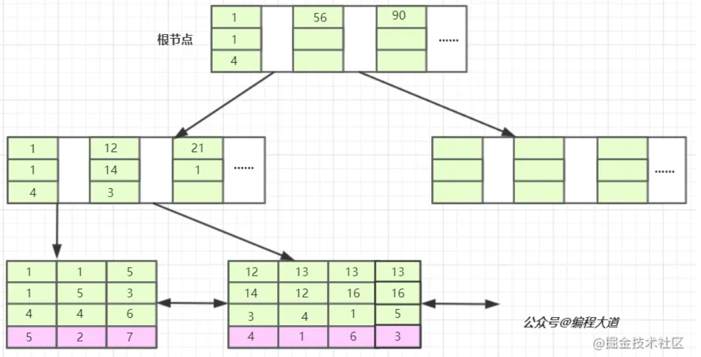
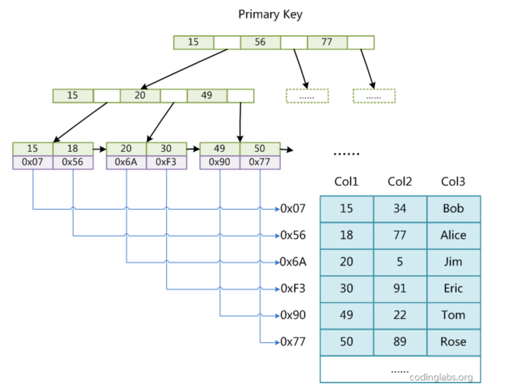
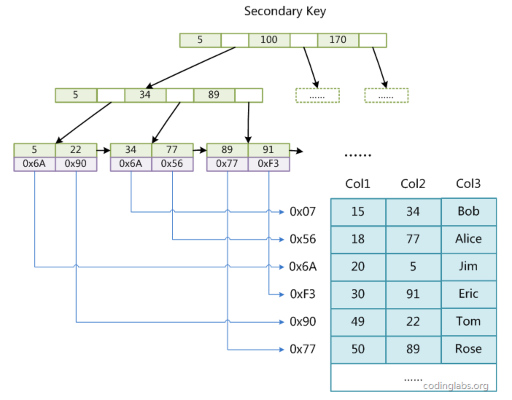
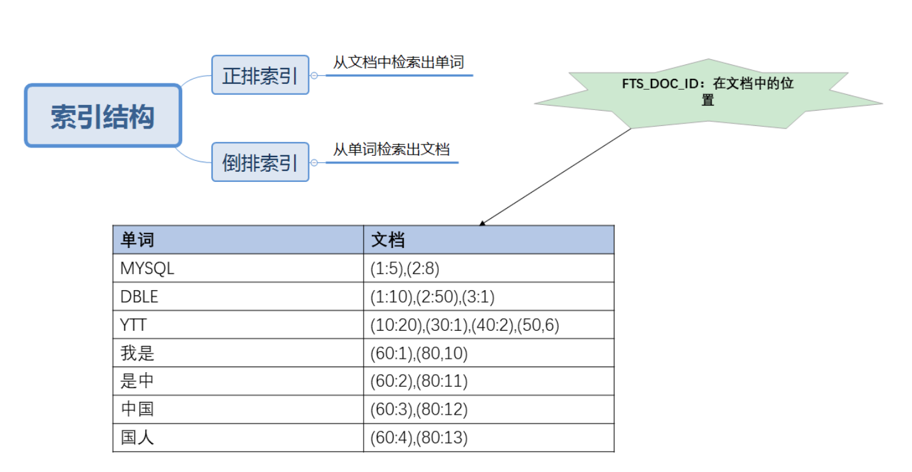

[TOC]

---
> 引用自：http://blog.codinglabs.org/articles/theory-of-mysql-index.html

索引的本质是数据结构，（Index）是帮助MySQL高效获取数据的数据结构。查询最基本的查询算法当然是顺序查找（linear search），这种复杂度为O(n)，另外还有一些算法（能够支持快速查找的数据结构有：顺序数组、哈希、搜索树。）例如二分查找（binary search）、二叉树查找（binary tree search）二分查找要求被检索数据有序，而二叉树查找只能应用于二叉查找树上，但是数据本身的组织结构不可能完全满足各种数据结构，每种查找算法都只能应用于特定的数据结构之上，在数据之外，数据库系统还维护着满足特定查找算法的数据结构，这些数据结构以某种方式引用（指向）数据，这样就可以在这些数据结构上实现高级查找算法。这种数据结构，就是索引。

### 1 Mysql的BTree索引

> 很好的文章1:https://mp.weixin.qq.com/s/IBSM6K5rnR_Zthy7vgBV8A

> 很好的文章2:https://zhuanlan.zhihu.com/p/67832788

#### 1.1 B-树和B+树

##### 1.1.1 磁盘是如何存储的

> 引用自：https://draveness.me/sql-index-intro/

一个数据库必须保证其中存储的所有数据都是可以随时读写的，同时因为MySQL中所有的数据其实都是以文件的形式存储在磁盘上的，而从磁盘上随机访问对应的数据非常耗时，所以数据库程序和操作系统提供了缓冲池和内存以提高数据的访问速度。除此之外，我们还需要知道数据库对数据的读取并不是以行为单位进行的，无论是读取一行还是多行，都会将该行或者多行所在的页全部加载进来，然后再读取对应的数据记录；也就是说，读取所耗费的时间与行数无关，只与页数有关。

- 随机读取：数据库等待一个页从磁盘读取到缓存池的所需要的成本巨大的，无论我们是想要读取一个页面上的多条数据还是一条数据，都需要消耗约 10ms 左右的时间：这 10ms 的一次随机读取是按照每秒 50 次的读取计算得到的，其中等待时间为 3ms、磁盘的实际繁忙时间约为 6ms，最终数据页从磁盘传输到缓冲池的时间为 1ms 左右，在对查询进行估算时并不需要准确的知道随机读取的时间，只需要知道估算出的 10ms 就可以了。

- 内存读取：如果在数据库的缓存池中没有找到对应的数据页，那么会去内存中寻找对应的页面，当对应的页面存在于内存时，数据库程序就会使用内存中的页，这能够将数据的读取时间降低一个数量级，将 10ms 降低到 1ms；MySQL 在执行读操作时，会先从数据库的缓冲区中读取，如果不存在与缓冲区中就会尝试从内存中加载页面，如果前面的两个步骤都失败了，最后就只能执行随机 IO 从磁盘中获取对应的数据页。

- 顺序读取：从磁盘读取数据并不是都要付出很大的代价，当数据库管理程序一次性从磁盘中顺序读取大量的数据时，读取的速度会异常的快，大概在 40MB/s 左右。如果一个页面的大小为 4KB，那么 1s 的时间就可以读取 10000 个页，读取一个页面所花费的平均时间就是0.1ms，相比随机读取的10ms已经降低了两个数量级，甚至比内存中读取数据还要快。数据页面的顺序读取有两个非常重要的优势：同时读取多个界面意味着总时间的消耗会大幅度减少，磁盘的吞吐量可以达到 40MB/s；数据库管理程序会对一些即将使用的界面进行预读，以减少查询请求的等待和响应时间；

> 存储还涉及到Log，详细可以参考：https://mp.weixin.qq.com/s/Wc6Gw6S5xMy2DhTCrogxVQ

一般来说，B+Tree比B-Tree更适合实现外存储索引结构，具体原因与外存储器原理及计算机存取原理有关，红黑树等数据结构也可以用来实现索引，但是文件系统及数据库系统普遍采用B-/+Tree作为索引结构，一般来说，索引本身也很大，不可能全部存储在内存中，因此索引往往以索引文件的形式存储的磁盘上。这样的话，索引查找过程中就要产生磁盘I/O消耗，相对于内存存取，I/O存取的消耗要高几个数量级，所以评价一个数据结构作为索引的优劣最重要的指标就是在查找过程中磁盘I/O操作次数的渐进复杂度。换句话说，索引的结构组织要尽量减少查找过程中磁盘I/O的存取次数。下面先介绍内存和磁盘存取原理，然后再结合这些原理分析B-/+Tree作为索引的效率。

计算机系统有主存和基于磁盘的辅存，主存通常就是我们说的RAM，也就是内存，这里不展开说它。索引文件本身很大，一般不会存在内存里，因此索引往往是以文件的形式存储在磁盘里，所以索引检索需要磁盘I/O操作。磁盘读取数据靠的是磁盘的机械运动。每次磁盘读取的时间有三部分：寻道时间、旋转延迟、传输时间。寻道时间指的是磁臂移动到指定磁道所需要的时间，主流磁盘一般在5ms以下；旋转延迟就是我们经常听说的磁盘转速，比如一个磁盘7200转，表示每分钟能转7200次，也就是说1秒钟能转120次，旋转延迟就是1/120/2=4.17ms；传输时间指的是从磁盘读出或将数据写入磁盘的时间，一般在零点几毫秒，相对于前两个时间可以忽略。那么访问一次磁盘读取数据的时间，即一次磁盘I/O操作的时间约9ms左右，这相对于主存存储时间50ns高出5个数量级。看着还不错的，但是一台500-MIPS（500百万每秒）的机器每秒可以执行5亿条指令，因为指令依靠的是电的性质，换句话说执行一次IO的时间可以执行40万条指令，数据库动辄十万百万乃至千万级数据，每次9毫秒的时间，显然是个灾难。更详细的过程阅读：http://blog.codinglabs.org/articles/theory-of-mysql-index.html。**磁盘IO时间 = 寻道 + 磁盘旋转 + 数据传输时间**

为了缩短磁盘读取的时间，计算机做了一些优化：磁盘预读。磁盘预读是基于局部性原理：当一个数据被用到时，其附近的数据也通常会马上被使用。所以磁盘I/O操作时不光把当前磁盘地址的数据，而是把相邻的数据也都读取到内存缓冲区内，因为局部性原理告诉我们，当计算机访问一个地址的数据的时候，与其相邻的数据也会很快被访问到。预读的长度一般为页（page）的整倍数。页是计算机管理存储器的逻辑块，硬件及操作系统往往将主存和磁盘存储区分割为连续的大小相等的块，每个存储块称为一页（在许多操作系统中，页得大小通常为4k），主存和磁盘以页为单位交换数据。

- 文件很大，不可能全部存储在内存中，故要存储到磁盘上。
- 索引的结构组织要尽量减少查找过程中磁盘I/O的存取次数，因为每次磁盘I/O消耗时间都是非常多的。
- 局部性原理与磁盘预读，预读的长度一般为页（page）的整倍数。

数据库系统巧妙利用了磁盘预读原理，将一个节点的大小设为等于一个页，这样每个节点只需要一次I/O就可以完全载入。B-树也利用这一点，每次新建节点时，直接申请一个页的空间，这样就保证一个节点物理上也存储在一个页里，加之计算机存储分配都是按页对齐的，就实现了一次磁盘I/O就读取了一页的数据。

根据B-Tree的定义，可知检索一次最多需要访问h个节点（h个树的高度）。B-Tree中一次检索最多需要h-1次I/O（根节点常驻内存），渐进复杂度为O(h)=O(logdN)。一般实际应用中，出度d是非常大的数字，通常超过100，因此h非常小（通常不超过3）。所以B-Tree作为索引效率是非常高，相比平衡二叉树、红黑树要高很多，因为这些树的h一般都比较深。


##### 1.1.2 B-Tree

为了描述B-Tree，首先定义一条数据记录为一个二元组[key, data]，key为记录的键值，对于不同数据记录，key是互不相同的；data为数据记录除key外的数据。那么B-Tree是满足下列条件的数据结构：

- d为大于1的一个正整数，称为B-Tree的度。
- h为一个正整数，称为B-Tree的高度。
- 每个非叶子节点由n-1个key和n个指针组成，其中d<=n<=2d。
- 每个叶子节点最少包含一个key和两个指针，最多包含2d-1个key和2d个指针，叶节点的指针均为null 。
- 所有叶节点具有相同的深度，等于树高h。
- key和指针互相间隔，节点两端是指针。
- 一个节点中的key从左到右非递减排列。
- 所有节点组成树结构。
- 每个指针要么为null，要么指向另外一个节点。
- 如果某个指针在节点node最左边且不为null，则其指向节点的所有key小于v(key1)，其中v(key1)为node的第一个key的值。
- 如果某个指针在节点node最右边且不为null，则其指向节点的所有key大于v(keym)，其中v(keym)为node的最后一个key的值。
- 如果某个指针在节点node的左右相邻key分别是keyi和keyi+1且不为null，则其指向节点的所有key小于v(keyi+1)且大于v(keyi)。

由于B-Tree的特性，在B-Tree中按key检索数据的算法非常直观：首先从根节点进行二分查找，如果找到则返回对应节点的data，否则对相应区间的指针指向的节点递归进行查找，直到找到节点或找到null指针，前者查找成功，后者查找失败。B-Tree上查找算法的伪代码如下：
```
BTree_Search(node, key) {
    if(node == null) 
    	return null;

    foreach(node.key){
        if(node.key[i] == key) 
        	return node.data[i];
        if(node.key[i] > key) 
        	return BTree_Search(point[i]->node);
    }
    return BTree_Search(point[i+1]->node);
}
data = BTree_Search(root, my_key);
```


##### 1.1.3 为什么使用B+-树作为索引

B+Tree:B-Tree有许多变种，其中最常见的是B+Tree，例如MySQL就普遍使用B+Tree实现其索引结构。与B-Tree相比，B+Tree有以下不同点：

- 每个节点的指针上限为2d而不是2d+1。
- 内节点不存储data，只存储key；叶子节点不存储指针。
- 带有顺序访问指针的B+Tree:一般在数据库系统或文件系统中使用的B+Tree结构都在经典B+Tree的基础上进行了优化，增加了顺序访问指针。只需顺着节点和指针顺序遍历就可以一次性访问到所有数据节点，极大提到了区间查询效率。

> 引用自：https://blog.csdn.net/qq_41008202/article/details/105204490

B+树比B-树更加适合作为磁盘的索引数据结构，原因是B+树的内部结点不存储data，内部结点的出度d越大，那么渐进复杂度越小。出度d的上限取决于节点内key和data的大小：dmax=floor(pagesize/(keysize+datasize+pointsize))一般3层B+树可以存储上百万的数据，也就是读取上百万的数据，只需要3次磁盘I/O，可见这效率，大大提升了。如果没有索引，那每次查询一次数据项，都需要一次I/O，几百万次，可怕。非叶子结点不存储Data域的好处：
- 非叶子结点不存储Data域，只是起着目录的作用，使得每一个非叶子结点可以存放更多的关键字和下一层结点的指针。数据库是存储在磁盘上的，我们读取数据是从磁盘读取到内存中，我们在进行磁盘预读取时，是以块(也可称作数据页)的单位进行数据读取，我们在检索B/B+树的结点时，每次以块为单位将一个结点读取到内存中，若一块磁盘包含了树结点以外的数据，就造成了浪费，因此我们需要使每一个结点的容量大小正好或者接近一块磁盘(数据页，一般是16k)的大小。于是我们在构建B+/B树时，树的阶数其实就取决于一块磁盘中能容纳多少个关键字以及相关的索引和Data域。B+树的非叶子结点不存储Data域，因此它可以存储更多个关键字和下一层结点的指针，因此B+树会比B树更矮胖。若我需要查找的关键字正好在叶子结点，因为B+树比B树更矮，B+树所进行的I/O次数更少,因为途中经过每一层，我们都需要进行一次I/O读取一个结点，B+树会更矮，途径的层数会更少。
- 使得B+树查询速度更稳定，B+树所有关键字数据地址都存在叶子节点上，所以每次查找的次数都相同所以查询速度要比B树更稳定;

所有叶结点构成一个有序链表的好处:

- B+树便于区间查找（这点才是B+树作为索引的关键），我们进行数据库查询大多为区间查询，B+树天然具备排序功能，B+树所有的叶子结点构成了一个有序链表，在查询大小区间的数据时候更方便，B+树查询，只需通过头结点往下找到第一个叶子结点，然后在叶子结点的链表上就行遍历即可完成区间查询。而且B+树叶子结点是以索引字段大小顺序进行排序的，索引字段大小相邻的数据位置也相邻，因此通过遍历叶子结点链表只需要进行少量I/O读取就能将所有数据都获取。而B树的索引字段大小相邻近的结点可能隔得很远，要想进行区间查询需要不停的进行中序遍历，相邻的元素可能在内存中不相邻，所以缓存命中性没有B+树好。
- B+树全结点遍历更快：B+树遍历整棵树只需要遍历所有的叶子节点即可，而不需要像B树一样需要进行中序遍历，这有利于数据库做全表扫描。

B树的优点：

如果经常访问的数据离根节点很近，而B树的非叶子节点本身存有关键字的具体数据或者其数据的地址，所以这种数据检索的时候会要比B+树快。有很多基于频率的搜索是选用B树，越频繁query的结点越往根上走，前提是需要对query做统计，而且要对key做一些变化。


> 引用自：https://www.jianshu.com/p/bd9154df8bf0

##### 1.1.4 b+树的查找过程

总体来看：InnoDB 通过一些列后台线程将相关操作进行异步处理，同时借助缓冲池来减小CPU和磁盘速度上的差异。当查询的时候会先通过索引定位到对应的数据页，然后检测数据页是否在缓冲池内，如果在就直接返回，如果不在就去聚簇索引中通过磁盘 IO 读取对应的数据页并放入缓冲池。一个数据页会包含多个数据行。缓存池通过LRU算法对数据页进行管理，也就是最频繁使用的数据页排在列表前面，不经常使用的排在队尾，当缓冲池满了的时候会淘汰掉队尾的数据页。从磁盘新读取到的数据页并不会放在队列头部而是放在中间位置，这个中间位置可以通过参数进行修。缓冲池也可以设置多个实例，数据页根据哈希算法决定放在哪个缓冲池。

假设我们用以下数字构建一个树：```3、5、9、10、13、15、28、29、36、60、75、79、90、99```那么首先会把磁盘块1由磁盘加载到内存，此时发生一次IO，在内存中用二分查找确定29在17和35之间，锁定磁盘块1的P2指针，内存时间因为非常短（相比磁盘的IO）可以忽略不计，通过磁盘块1的P2指针的磁盘地址把磁盘块3由磁盘加载到内存，发生第二次IO，29在26和30之间，锁定磁盘块3的P2指针，通过指针加载磁盘块8到内存，发生第三次IO，同时内存中做二分查找找到29，结束查询，总计三次IO。真实的情况是，3层的b+树可以表示上百万的数据，如果上百万的数据查找只需要三次IO，性能提高将是巨大的，如果没有索引，每个数据项都要发生一次IO，那么总共需要百万次的IO，显然成本非常非常高。

##### 1.1.5 联合索引的查找过程

> 引用自：https://juejin.cn/post/6844904073955639304

```
INSERT INTO `t1` VALUES (1, 13, 12, 4, 'dll');
INSERT INTO `t1` VALUES (2, 1, 5, 4, 'doc');
INSERT INTO `t1` VALUES (3, 13, 16, 5, 'img');
INSERT INTO `t1` VALUES (4, 12, 14, 3, 'xml');
INSERT INTO `t1` VALUES (5, 1, 1, 4, 'txt');
INSERT INTO `t1` VALUES (6, 13, 16, 1, 'exe');
INSERT INTO `t1` VALUES (7, 5, 3, 6, 'pdf');
INDEX `index_bcd`(`b`, `c`, `d`)
```




如上图我们可以单看第一个索引列，横着看，如，1 1 5 12 13....他是单调递增的；如果第一列相等则再根据第二列排序，依次类推就构成了上图的索引树，上图中的b列都等于1时，则根据c排序，此时c列也相等则按d列排序，如：1 1 4 ，1 1 5，c=4在c=5前面，以及13 12 4,13 16 1,13 16 5就可以说明这种情况。另外一个例子是：当b+树的数据项是复合的数据结构，比如(name,age,sex)的时候，b+数是按照从左到右的顺序来建立搜索树的，比如当(张三,20,F)这样的数据来检索的时候，b+树会优先比较name来确定下一步的所搜方向，如果name相同再依次比较age和sex，最后得到检索的数据；但当(20,F)这样的没有name的数据来的时候，b+树就不知道下一步该查哪个节点，因为建立搜索树的时候name就是第一个比较因子，必须要先根据name来搜索才能知道下一步去哪里查询。比如当(张三,F)这样的数据来检索时，b+树可以用name来指定搜索方向，但下一个字段age的缺失，所以只能把名字等于张三的数据都找到，然后再匹配性别是F的数据了， 这个是非常重要的性质，即索引的最左匹配特性。

当我们的SQL语言可以应用到索引的时候，比如select * from T1 where b = 12 and c = 14 and d = 3; 也就是T1表中a列为4的这条记录。存储引擎首先从根节点（一般常驻内存）开始查找，第一个索引的第一个索引列为1,12大于1，第二个索引的第一个索引列为56,12小于56，于是从这俩索引的中间读到下一个节点的磁盘文件地址，从磁盘上Load这个节点，通常伴随一次磁盘IO，然后在内存里去查找。当Load叶子节点的第二个节点时又是一次磁盘IO，比较第一个元素，b=12,c=14,d=3完全符合，于是找到该索引下的data元素即ID值，再从主键索引树上找到最终数据。


##### 1.1.6 一些琐碎知识点

> 引用自：https://www.hollischuang.com/archives/3818

1. B+Tree索引和Hash索引区别：

    - 哈希索引适合等值查询，但是不无法进行范围查询，哈希索引没办法利用索引完成排序，哈希索引不支持多列联合索引的，最左匹配规则如果有大量重复键值得情况下，哈希索引的效率会很低，因为存在哈希碰撞问题。
    - 因为Hash索引底层是哈希表，哈希表是一种以key-value存储数据的结构，所以多个数据在存储关系上是完全没有任何顺序关系的，所以，对于区间查询是无法直接通过索引查询的，就需要全表扫描。所以，哈希索引只适用于等值查询的场景。而B+ Tree是一种多路平衡查询树，所以他的节点是天然有序的（左子节点小于父节点、父节点小于右子节点），所以对于范围查询的时候不需要做全表扫描。

2. 那你知道B+ Tree的叶子节点都可以存哪些东西吗：

    - InnoDB的B+ Tree可能存储的是整行数据，也有可能是主键的值。
    - 在 InnoDB 里，索引B+ Tree的叶子节点存储了整行数据的是主键索引，也被称之为聚簇索引。而索引B+ Tree的叶子节点存储了主键的值的是非主键索引，也被称之为非聚簇索引。


3. 聚簇索引查询会更快：

    - 因为主键索引树的叶子节点直接就是我们要查询的整行数据了。而非主键索引的叶子节点是主键的值，查到主键的值以后，还需要再通过主键的值再进行一次查询。主键索引查询只会查一次，而非主键索引需要回表查询多次。
    - **主键索引查询只会查一次，而非主键索引需要回表查询多次。**但是这也不是一定的，覆盖索引（covering index）指一个查询语句的执行只用从索引中就能够取得，不必从数据表中读取。也可以称之为实现了索引覆盖。 当一条查询语句符合覆盖索引条件时，MySQL只需要通过索引就可以返回查询所需要的数据，这样避免了查到索引后再返回表操作，减少I/O提高效率。 如，表covering_index_sample中有一个普通索引 idx_key1_key2(key1,key2)。当我们通过SQL语句：select key2 from covering_index_sample where key1 = ‘keytest’;的时候，就可以通过覆盖索引查询，无需回表。


4. 你们在创建索引的时候都会考虑哪些因素呢？
    - 我们一般对于查询概率比较高，经常作为where条件的字段设置索引
    - 如果有多个索引的话就设置联合索引，把区分度最高的放在前边


5. 那你知道在MySQL 5.6中，对索引做了哪些优化吗

   Index Condition Pushdown（索引下推） MySQL5.6引入了索引下推优化，默认开启，使用SEToptimizer_switch=‘index_condition_pushdown=off’;可以将其关闭。官方文档中给的例子和解释如下：people表中（zipcode，lastname，firstname）构成一个索引:

   ```
   SELECT * FROM people WHERE zipcode=’95054′ AND lastname LIKE ‘%etrunia%’ AND address LIKE ‘%Main Street%’;
   ```

   如果没有使用索引下推技术，则MySQL会通过zipcode=’95054’从存储引擎中查询对应的数据，返回到MySQL服务端，然后MySQL服务端基于lastname LIKE ‘%etrunia%’和address LIKE ‘%Main Street%’来判断数据是否符合条件。 如果使用了索引下推技术，则MYSQL首先会返回符合zipcode=’95054’的索引，然后根据lastname LIKE ‘%etrunia%’和address LIKE ‘%Main Street%’来判断索引是否符合条件。如果符合条件，则根据该索引来定位对应的数据，如果不符合，则直接reject掉。 有了索引下推优化，可以在有like条件查询的情况下，减少回表次数。

6. 那什么情况下会发生明明创建了索引，但是执行的时候并没有通过索引呢？：

   查询优化器 一条SQL语句的查询，可以有不同的执行方案，至于最终选择哪种方案，需要通过优化器进行选择，选择执行成本最低的方案。 在一条单表查询语句真正执行之前，MySQL的查询优化器会找出执行该语句所有可能使用的方案，对比之后找出成本最低的方案。这个成本最低的方案就是所谓的执行计划。 优化过程大致如下： 1、根据搜索条件，找出所有可能使用的索引 2、计算全表扫描的代价 3、计算使用不同索引执行查询的代价 4、对比各种执行方案的代价，找出成本最低的那一个

7. 概念解释

    - 聚簇索引：聚簇索引的顺序就是数据的物理存储顺序，索引中数据域存储的就是实际的数据，一个表最多只能有一个聚簇索引，适用于查询多行数据，不适用于频繁修改的列，一般在主键上创建。
    - 非聚簇索引：索引顺序与数据物理排列顺序无关，索引中存储的内容为实际数据的地址，适应于查询单行数据。
    - 普通索引：即平时创建的普通索引。
    - 唯一索引：索引所在的列或列组合的值是全表唯一的。
    - 全文索引：MySQL从3.23.23版开始支持全文索引，它查找的是文中的关键词，而不是直接比较索引中的值。
    - 单列索引：在单列上创建的索引。
    - 组合索引：在多个列上创建的索引。
    - 最左前缀查找：where子句中有a、b、c三个查询条件，创建一个组合索引abc(a,b,c)，最左前缀的概念是说以组合索引最左边的列a组合成的查询条件，如(a,b,c)、(a,b)、(a,c)，这三种情况的查询条件都会使用abc索引，和where子句中a、b、c出现的顺序没关系，可以是where c=? and b=? and a=?，但(b,c)组合不会使用索引，即where c=? and b=?。


8. 哪些列适合创建索引

    - 经常作为查询条件的列；
    - 经常作为排序条件的列；
    - 经常作为join条件的列；
    - 经常被查询的列；

9. 哪些列不适合创建索引

    - 数据频繁被修改的列，数据被修改，索引需要做相应的修改，消耗资源；
    - 区分度不是很高的列，如性别，列值重复性太大，索引效果不是很明显；
    - 不是经常被作为查询条件、排序条件、连接条件的列。

10. 索引失效的情况

    - 联合索引使用时遵循最左匹配原则，如果不是从最左列开始时，整个索引失效，如果最左匹配则依次往右使用索引，直到碰到不匹配的地方之后生效之前匹配到的索引。
    - 范围查询会引起索引失效：为以上联合索引更换字段顺序为title，price，author。如果查询时包含范围查询则范围字段后面的字段失效，where A = 1 and B =2 and C > 3，失效的只有C。
    - like查询失效：使用模糊查询时，%只有在最右方的时候才能生效。
    - 查询中含有不等于或者or则索引不生效。
    - 在索引列上做计算或函数导致失效。
    - is null和 is not null。

> 引用自： https://mp.weixin.qq.com/s?__biz=Mzg2NjE5NDQyOA==&mid=2247483790&idx=1&sn=bf573b66517bed97ac63c3869ee6cb8a&source=41#wechat_redirect

11. 覆盖索引

    - 索引除了是一种查找数据的高效方式之外，也是一种列数据的直接获取方式。MySQL可以使用索引来直接获取列的数据，这样就不需要读取数据行。如果一个索引包含所有需要查询的字段的值，我们就称之为“覆盖索引”。会带来很多好处：
    - 索引条目数量和大小通常远小于数据行的条目和大小，所以如果只需要读取索引，那么MySQL就会极大地减少数据访问量。
    - 因为索引是按照列顺序存储的，所以对于I/O密集型的范围查找会比随机从磁盘读取每一行数据的I/O要少的多。
    - 由于InnoDB的聚簇索引，覆盖索引对InnoDB表特别有用。InnoDB的二级索引在叶子节点中保存了行的主键，索引如果二级主键能够覆盖查询，则避免对主键索引的第二次查询。

12. 聚簇索引的缺点：

    - 插入顺序严重依赖插入顺序。按照主键的顺序插入是向InnoDB表中插入数据速度最快的方式，需要避免主键键值随机的(不连续且值得分布范围非常大)聚簇索引，比如使用UUID作为主键，而应该使用类似AUTO_INCREMENT的自增列。
    - 更新聚簇索引列的代价很高，因为会强制InnoDB将每个被更新的行移动位置到新的位置。
    - 基于聚簇索引的表在插入新行，或者主键被更新导致需要移动行时，可能面临“页分裂”的问题。当行的主键值要求必须将这行插入到某个已满的页中时，存储引擎会将该页分裂成两个页面来容纳该行，这就是一次页分裂操作。页分裂会导致表占用更多的磁盘空间。
    - 二级索引可能比想象的更大，因为在二级索引中的叶节点包含了引用行的主键列。
    - 二级索引访问需要两次索引查找，而不是一次。

13. InnoDB和MyISAM的索引区别

    - 聚簇索引和非聚簇索引的数据分布有区别，以及对应的主键索引和二级索引的数据分布也有区别，通常会让人感到困惑和意外。下图展示了MyISAM和InnoDB的不同索引和数据存储方式。
    - MyISAM的数据分布非常简单，按照数据插入的顺序存储在磁盘上，主键索引和二级索引的叶节点存储着指针，指向对应的数据行。
    - InnoDB中，聚簇索引“就是”表，所以不会像MyISAM那样需要独立的行存储。聚簇索引的每个叶节点都包含了主键值和所有的剩余列(在此例中是col2)。
    - nnoDB的二级索引和聚簇索引很不同。InnoDB二级索引的叶节点中存储的不是“行指针”，而是主键值，并以此作为指向行的“指针”

> 引用自：https://mp.weixin.qq.com/s?__biz=MzkwOTI1MjI0OQ==&mid=2247488423&idx=1&sn=4c532d52391dc23c4f1c7c62b1b562c2&source=41#wechat_redirect

14. MySQL排序的手段

    - 排序和查询的字段尽量少。只查询你用到的字段，不要使用select * ；使用limit查询必要的行数据；
    - 要排序或者查询的字段，尽量不要用不确定字符函数，避免MySQL直接分配max_sort_length，导致sort buffer空间不足；
    - 使用索引来优化或者避免排序；
    - 增加sort_buffer_size大小，避免磁盘排序；
    - 不得不使用original 排序算法时，增加read_rnd_buffer_size；
    - 字段长度定义合适就好（避免过长）；
    - tmpdir建议独立存放，放在高速存储设备上。


> 引用自：https://golanghub.org/posts/MySQL/mysql-index-optimization.html

15. B+tree 和 B-tree 的区别：

B+tree 只在叶子节点存储数据，而 B-tree 的非叶子节点也存储数据，所以 B+tree 的单个节点的数据量更小，在相同的磁盘 I/O 次数下能查询更多的节点，存储更高效，另外 B+tree 叶子节点在节点内部（也就是页结构的内部）记录之间是一个单链表，更适合 MySQL 中常见的基于范围的顺序检索场景，而 B-tree 无法做到这一点。

16. B+tree 和红黑树的区别：

对于有 N 个节点的 B+tree，其查询复杂度为 O(logdN)，d 为 B+tree 的度，表示节点允许的最大子节点个数为 d 个，在实际的运用中 d 值是大于 100 的，即使数据达到千万级别时 B+tree 的高度依然维持在 3-4 左右，保证了 3-4 次磁盘 I/O 操作就能查询到目标数据；而红黑树是二叉树，节点的子节点数为两个，意味着其查询复杂度为 O(logN)，比 B+tree 高出不少，因此红黑树检索到目标数据所需经历的磁盘 I/O 次数更多。

17. B+tree 和 Hash 的区别：

范围查询时 MySQL 常见的查询场景，Hash 表不适合做范围查询，更适合做等值查询，另外 Hash 表还存在 Hash 函数选择和 Hash 值冲突等问题。因为这些原因，B+tree 要比 Hash 有更广的适用场景。

18. MRR优化和索引下推

https://mp.weixin.qq.com/s/QduIxKOykMmoZp13UGF1XQ

19. innodb使用b+树作为索引模型的原因

Mysql 设计的使用场景比较广泛，需要对遍历查询、单条查询、数据更新都需要较好的性能支持。B + 树的特性是只在叶子节点上存储数据。可以从数据读写方面与哈希表、有序数组、b 树其他几种索引模型进行比较：
- 哈希表：哈希表只能进行等值查询，在处理范围查询和排序查询时，需要全表扫描哈希表。
- 有序数组：有序数组在进行数据更新时成本较大。往数组中间位置添加数据时，需要移动后面的数据位置。
- B 树：b 树在非叶子节点上也存储数据，在遍历数据时，需要对不同层级的节点上的数据进行拼接和排序，这会导致多次磁盘 io。查询效率较低。

20. 如何删除百万级别或以上的数据？

可以考虑先删掉表的索引，等删除数据后再重建索引。当我们在进行数据修改时，需要同时修改索引，这些额外的索引维护成本较低数据修改的效率；同时，大量的数据删除会导致索引数据页产生大量的碎片空间，此时删除数据后重建索引可以使索引树更 “紧凑”，提高磁盘空间利用率。

21. 锁是如何加在索引上的

**首先InnoDB的数据是根据索引组织的，主键是聚集索引，非主键索引都包含主键信息**。INNODB行锁是通过给索引项加锁来实现的，即只有通过索引条件检索数据，InnoDB才使用行级锁，否则将使用表锁。根据索引加锁的过程可以看这篇文章：https://blog.csdn.net/geekjoker/article/details/79444076（或者搜索：Mysql加锁过程详解）
哈希索引只有Memory, NDB两种引擎支持，Memory引擎默认支持哈希索引，如果多个hash值相同，出现哈希碰撞，那么索引以链表方式存储。

但是，Memory引擎表只对能够适合机器的内存切实有限的数据集。

要使InnoDB或MyISAM支持哈希索引，可以通过伪哈希索引来实现，叫自适应哈希索引。

主要通过增加一个字段，存储hash值，将hash值建立索引，在插入和更新的时候，建立触发器，自动添加计算后的hash到表里。


#### 1.2 索引原理

##### 1.2.1 MyISAM索引实现
MyISAM引擎使用B+Tree作为索引结构，叶节点的data域存放的是数据记录的地址。下图是MyISAM索引的原理图：



这里设表一共有三列，假设我们以Col1为主键，则图8是一个MyISAM表的主索引（Primary key）示意。可以看出MyISAM的索引文件仅仅保存数据记录的地址。在MyISAM中，主索引和辅助索引（Secondary key）在结构上没有任何区别，只是主索引要求key是唯一的，而辅助索引的key可以重复。如果我们在Col2上建立一个辅助索引，则此索引的结构如下图所示：



同样也是一颗B+Tree，data域保存数据记录的地址。因此，MyISAM中索引检索的算法为首先按照B+Tree搜索算法搜索索引，如果指定的Key存在，则取出其data域的值，然后以data域的值为地址，读取相应数据记录。**MyISAM的索引方式也叫做“非聚集”的，之所以这么称呼是为了与InnoDB的聚集索引区分。聚集索引是必须按照主键聚集**


##### 1.2.2 InnoDB索引实现

InnoDB 存储引擎的逻辑存储结构从大到小依次可以分为：表空间、段、区、页、行。表空间作为存储结构的最高层，所有数据都存放在表空间中，默认情况下用一个共享表空间 ibdata1 ，如果开启了 innodb_file_per_table 则每张表的数据将存储在单独的表空间中，也就是每张表都会有一个文件，表空间由各个段构成，InnoDB存储引擎由索引组织的，而索引中的叶子节点用来记录数据，存储在数据段，而非叶子节点用来构建索引，存储在索引段，而回滚段我们在后面分析锁的时候在聊。区是由连续的页组成，任何情况下一个区都是 1MB ，

一个区中可以有多个页，每个页默认为 16KB ，所以默认情况下一个区中可以包含64个连续的页，页的大小是可以通过innodb_page_size设置，页中存储的是具体的行记录。一行记录最终以二进制的方式存储在文件里，我们要能够解析出一行记录中每个列的值，存储的时候就需要有固定的格式，至少需要知道每个列占多少空间，而MySQL中定义了一些固定长度的数据类型，例如int、tinyint、bigint、char数组、float、double、date、datetime、timestamp 等，这些字段我们只需要读取对应长度的字节，然后根据类型进行解析即可，对于变长字段，例如varchar、varbinary等，需要有一个位置来单独存储字段实际用到的长度，当然还需要头信息来存储元数据，例如记录类型，下一条记录的位置等。

> 引用自：https://mp.weixin.qq.com/s/Wc6Gw6S5xMy2DhTCrogxVQ

虽然InnoDB也使用B+Tree作为索引结构，但具体实现方式却与MyISAM截然不同。InnoDB 中有聚簇索引和普通索引之分，聚簇索引根据主键来构建，叶子节点存放的是该主键对应的这一行记录，而普通索引根据申明这个索引时候的列来构建，叶子节点存放的是这一行记录对应的主键的值，而普通索引中还有唯一索引和联合索引两个特例，唯一索引在插入和修改的时候会校验该索引对应的列的值是否已经存在，而联合索引将两个列的值按照申明时候的顺序进行拼接后在构建索引。

数据是以行为单位存储在聚簇索引里的，根据主键查询可以直接利用聚簇索引定位到所在记录，根据普通索引查询需要先在普通索引上找到对应的主键的值，然后根据主键值去聚簇索引上查找记录，**俗称回表**。普通索引上存储的值是主键的值，如果主键是一个很长的字符串并且建了很多普通索引，将造成普通索引占有很大的物理空间，这也是为什么建议使用自增ID来替代订单号作为主键，另一个原因是自增ID在插入的时候可以保证相邻的两条记录可能在同一个数据块，而订单号的连续性在设计上可能没有自增ID好，导致连续插入可能在多个数据块，增加了磁盘读写次数。**如果我们查询一整行记录的话，一定要去聚簇索引上查找**，而如果我们只需要根据普通索引查询主键的值，由于这些值在普通索引上已经存在，所以并不需要回表，这个称为索引覆盖，在一定程度上可以提高查询效率，由于联合索引上通过多个列构建索引，有时候我们可以将需要频繁查询的字段加到联合索引里面，例如如果经常需要根据 name 查找 age 我们可以建一个 name 和 age 的联合索引。

> 引用自：https://mp.weixin.qq.com/s/Wc6Gw6S5xMy2DhTCrogxVQ

普通索引上存储的值是主键的值，如果主键是一个很长的字符串并且建了很多普通索引，将造成普通索引占有很大的物理空间，这也是为什么建议使用 自增ID 来替代订单号作为主键，另一个原因是 自增ID 在插入的时候可以保证相邻的两条记录可能在同一个数据块，而订单号的连续性在设计上可能没有自增ID好，导致连续插入可能在多个数据块，增加了磁盘读写次数。

如果我们查询一整行记录的话，一定要去聚簇索引上查找，而如果我们只需要根据普通索引查询主键的值，由于这些值在普通索引上已经存在，所以并不需要回表，这个称为索引覆盖，在一定程度上可以提高查询效率，由于联合索引上通过多个列构建索引，有时候我们可以将需要频繁查询的字段加到联合索引里面，例如如果经常需要根据 name 查找 age 我们可以建一个 name 和 age 的联合索引。

查询的时候如果在索引上用了函数，将导致无法用到根据之前列上的值构建的索引，索引遵循最左匹配原则，所以如果需要查询某个列的值中间是否包含某个字符串，将无法利用索引，如果有这种需求可以利用全文索引，而如果查询是否以某个字符串开头就可以，联合索引根据第一个列查询可以用到索引，仅仅根据第二个列将无法用到索引，查询的时候用 IN 的效率高于 NOT = 。另外建议将索引的列设置为非空，这个和 NULL 字段的存储有关，下文在分析。

- 第一个重大区别是InnoDB的数据文件本身就是索引文件。从上文知道，MyISAM索引文件和数据文件是分离的，索引文件仅保存数据记录的地址。而在InnoDB中，表数据文件本身就是按B+Tree组织的一个索引结构，这棵树的叶节点data域保存了完整的数据记录。这个索引的key是数据表的主键，因此InnoDB表数据文件本身就是主索引。**这种索引叫做聚集索引。因为InnoDB的数据文件本身要按主键聚集，所以InnoDB要求表必须有主键（MyISAM可以没有），如果没有显式指定，则MySQL系统会自动选择一个可以唯一标识数据记录的列作为主键，如果不存在这种列，则MySQL自动为InnoDB表生成一个隐含字段作为主键，这个字段长度为6个字节，类型为长整形。
  **
- 第二个与MyISAM索引的不同是InnoDB的辅助索引data域存储相应记录主键的值而不是地址。换句话说，InnoDB的所有辅助索引都引用主键作为data域。

聚集索引这种实现方式使得按主键的搜索十分高效，但是辅助索引搜索需要检索两遍索引：首先检索辅助索引获得主键，然后用主键到主索引中检索获得记录。


##### 1.2.3 排序

如果没有索引：排序有好多种算法来实现，在 MySQL 中经常会带上一个 limit ,表示从排序后的结果集中取前 100 条，或者取第 n 条到第 m 条，要实现排序，我们需要先根据查询条件获取结果集，然后在内存中对这个结果集进行排序，如果结果集数量特别大，还需要将结果集写入到多个文件里，然后单独对每个文件里的数据进行排序，然后在文件之间进行归并，排序完成后在进行 limit 操作。没错，这个就是 MySQL 实现排序的方式，前提是排序的字段没有索引。

如果有索引：这样查询过程如下：

- 根据 city,name 联合索引定位到 city 等于武汉的第一条记录，获取主键索引ID
- 根据 ID 去主键索引上找到对应记录，取出 city,name,age 字段作为结果集返回
- 继续重复以上步骤直到 city 不等于武汉，或者条数大于 1000

由于联合所以在构建索引的时候，在city等于武汉的索引节点中的数据已经是根据name进行排序了的，所以这里只需要直接查询就可，另外这里如果加上city,name,age的联合索引，则可以用到索引覆盖，不行到主键索引上进行回表。**总结一下，我们在有排序操作的时候，最好能够让排序字段上建有索引，另外由于查询第一百万条开始的一百条记录，需要过滤掉前面一百万条记录，即使用到索引也很慢，所以可以根据ID来进行区分，分页遍历的时候每次缓存上一次查询结果最后一条记录的 id ， 下一次查询加上 id > xxxx limit 0,1000 这样可以避免前期扫描到的结果被过滤掉的情况**。


B树、B+树索引算法原理：https://www.codedump.info/post/20200609-btree-1/


> 引用自：https://mp.weixin.qq.com/s/rHPVEhacTBTJlJ44uJihFw

> 这篇文章对过程算法也有讲解：https://mp.weixin.qq.com/s/GHLbBd9rJsNmhAjNHcB5xA

> 这个也可以：https://mp.weixin.qq.com/s/sT-Jz67p8Gadvcft-iO-9g

排序的过程数据结构：

二叉查找树定义：又称为是二叉排序树（Binary Sort Tree）或二叉搜索树。二叉排序树或者是一棵空树，或者是具有下列性质的二叉树：

- 若左子树不空，则左子树上所有结点的值均小于它的根结点的值；
- 若右子树不空，则右子树上所有结点的值均大于或等于它的根结点值；
- 左、右子树也分别为二叉排序树；
- 没有键值相等的节点。

平衡二叉树：，且具有以下性质：它是一棵空树或它的左右两个子树的高度差的绝对值不超过1，并且左右两个子树都是一棵平衡二叉树。平衡二叉树的常用算法有红黑树、AVL树等。在平衡二叉搜索树中，我们可以看到，其高度一般都良好地维持在O(log2n)，大大降低了操作的时间复杂度。

B树的定义：B树（B-tree）是一种树状数据结构，能够用来存储排序后的数据。这种数据结构能够让查找数据、循序存取、插入数据及删除的动作，都在对数时间内完成。B树，概括来说是一个一般化的二叉查找树，可以拥有多于2个子节点。与自平衡二叉查找树不同，B-树为系统最优化大块数据的读和写操作。B-tree算法减少定位记录时所经历的中间过程，从而加快存取速度。这种数据结构常被应用在数据库和文件系统的实作上。


B+ Tree（加强版多路平衡查找树）：其定义基本与B-树相同，B+Tree与BTree的区别如下：非叶子结点的子树指针与关键字个数相同；B+节点关键字搜索采用闭合区间（B-树是开区间）；B+非叶节点不保存数据相关信息，只保存关键字和子节点的引用；B+关键字对应的数据保存在叶子节点中； B+叶子节点是顺序排列的，并且相邻节点具有顺序引用的关系。


> 引用自：https://mp.weixin.qq.com/s/sT-Jz67p8Gadvcft-iO-9g

#### 1.3 一个SQL是如何执行的

1.1 应用程序发现SQL到服务端：当执行SQL语句时，应用程序会连接到相应的数据库服务器，然后服务器对SQL进行处理。

1.2 查询缓存：接着数据库服务器会先去查询是否有该SQL语句的缓存，key是查询的语句，value是查询的结果。如果你的查询能够直接命中，就会直接从缓存中拿出value来返回客户端。查询不会被解析、不会生成执行计划、不会被执行。

1.3 查询优化处理，生成执行计划：如果没有命中缓存，则开始第三步。
- 解析SQL：生成解析树，验证关键字如select,where,left join 等）是否正确。
- 预处理：进一步检查解析树是否合法，如检查数据表和列是否存在，验证用户权限等。
- 优化SQL：决定使用哪个索引，或者在多个表相关联的时候决定表的连接顺序。紧接着，将SQL语句转成执行计划。

1.4 将查询结果返回客户端：最后，数据库服务器将查询结果返回给客户端。(如果查询可以缓存，MySQL也会将结果放到查询缓存中)


### 2 Mysql的哈希索引

> 引用自：https://piaosanlang.gitbooks.io/faq/content/mysqlha-xi-zhi-ha-xi-suo-yin.html

#### 2.1 哈希索引介绍

哈希索引只有Memory, NDB两种引擎支持，Memory引擎默认支持哈希索引，如果多个hash值相同，出现哈希碰撞，那么索引以链表方式存储。但是，Memory引擎表只对能够适合机器的内存切实有限的数据集。要使InnoDB或MyISAM支持哈希索引，可以通过伪哈希索引来实现，叫自适应哈希索引。主要通过增加一个字段，存储hash值，将hash值建立索引，在插入和更新的时候，建立触发器，自动添加计算后的hash到表里。

> 引用自：https://juejin.cn/post/6844904096424525838

#### 2.2 哈希索引需要考虑的

一般来说编写一个散列函数需要考虑以下因素：

- 散列表的大小，或者说是散列函数计算出来的散列值处于的大小区间。散列表的大小是空间换时间的典型体现，用足够的空间来换取更快的查找速度。当散列表的空间很大的时候，散列算法可以减少哈希值的冲突，那么所有元素的查找操作理想状态下时间复杂度 O(1)。但是一般是无法做到非常巨大的，只能根据情况在时间和空间之间进行权衡。
- 哈希冲突。既然是在固定范围内，随着数据量越来越大，肯定会有不同的元素得到了相同的哈希值，所以哈希算法需要考虑如何解决这个冲突问题。哈希冲突的处理方式一般有拉链法、线性探测法.
- 结果均匀分布。需要尽量将元素均匀分布在这个范围之内，当空间充足的话且在理想状态下，每一个元素置于一个槽位，加快检索速度，同时避免过度冲突失去了散列表的优势。
- 关键字的长度。如果关键字太长的话，可能对散列计算所需时间造成影响，所以简短，具备意义的关键字是非常重要的。

所以我介绍几种 Hash 函数，看下设计思路：

- 直接寻址法。取关键字或关键字的某个线性函数值为散列地址。
- 数字分析法。根据关键字特征来分析，尽量截取数据中各关键字重复或相似频率较低的部分作为关键字。
- 平方取中法。取关键字平方后的中间几位作为散列地址。
- 随机数法。使用随机函数，取随机值作为其哈希值。
- 除留余数法。取关键字被一个不长于散列表长度的数 P 除之后取余数作为哈希值

#### 2.3 解决哈希冲突

- 拉链法：拉链法的思想是不同的关键字在哈希函数中计算出了相同的哈希值，意味它们会在哈希表上处于同一个槽位。发生这种冲突的话，同个槽位的元素以链表的形式联结。当发生查询操作的时候，会先计算指定的关键字的哈希值，然后拿到链表，再使用查找算法寻找是否指定的关键字存在。拉链法的优势在于，它在插入的时候，只需要修改一下指针即可(因为链表通过引用连接)，不需要像开放定址法那样，寻找空闲地方。而缺点在于如果哈希函数没有很好地解决冲突问题，则会导致链表结点过长，空间浪费，性能降低。

- 开放定址法：开放地址法的思想和拉链法不同在于，当某关键字的哈希值的发生了冲突，它就会沿着数组往下一位进行查找，直到找到空闲的位置，然后就将关键字赋值。开放地址法的优势在于，这种方法使槽位的盈满度更高，排列更加紧凑，不会因为冲突使同一个槽位聚集结点过多而导致性能下降。

#### 2.4 Mysql查找过程

哈希索引的文件结构中仅仅包含哈希码和指针，不存储数据字段值。在哈希索引的过程中，MySQL 会先计算 where 条件值的哈希值，然后该值寻找对应的记录指针，根据指针找到数据行后，最后一步是比较是否是目标数据行。

#### 2.5 MySQL的B-Tree索引和Hash索引的区别

- Hash索引仅仅能满足"=","IN"和"<=>"查询，不能使用范围查询：由于Hash索引比较的是进行Hash运算之后的Hash值，所以它只能用于等值的过滤，不能用于基于范围的过滤，因为经过相应的Hash算法处理之后的Hash值的大小关系，并不能保证和Hash运算前完全一样。
- Hash索引无法被用来避免数据的排序操作：由于Hash索引中存放的是经过Hash计算之后的Hash值，而且Hash值的大小关系并不一定和Hash运算前的键值完全一样，所以数据库无法利用索引的数据来避免任何排序运算;
- Hash索引不能利用部分索引键查询：对于组合索引，Hash索引在计算Hash值的时候是组合索引键合并后再一起计算Hash值，而不是单独计算Hash值，所以通过组合索引的前面一个或几个索引键进行查询的时候，Hash索引也无法被利用。
- Hash索引在任何时候都不能避免表扫描：前面已经知道，Hash索引是将索引键通过Hash运算之后，将 Hash运算结果的Hash值和所对应的行指针信息存放于一个Hash表中，由于不同索引键存在相同Hash值，所以即使取满足某个Hash键值的数据的记录条数，也无法从Hash索引中直接完成查询，还是要通过访问表中的实际数据进行相应的比较，并得到相应的结果。
- Hash索引遇到大量Hash值相等的情况后性能并不一定就会比B-Tree索引高：对于选择性比较低的索引键，如果创建Hash索引，那么将会存在大量记录指针信息存于同一个Hash值相关联。这样要定位某一条记录时就会非常麻烦，会浪费多次表数据的访问，而造成整体性能低下。
- 哈希索引也没办法利用索引完成排序，以及like ‘xxx%’ 这样的部分模糊查询（这种部分模糊查询，其实本质上也是范围查询）；
- 哈希索引也不支持多列联合索引的最左匹配规则；
- B+树索引的关键字检索效率比较平均，不像B树那样波动幅度大，在有大量重复键值情况下，哈希索引的效率也是极低的，因为存在所谓的哈希碰撞问题。

个人认为，只要是只需要做等值比较查询，而不包含排序或范围查询的需求，都适合使用哈希索引。


### 3. Mysql的全文索引

#### 3.1 全文索引使用条件

mysql全文索引使用条件有两个，一个是对表存储引擎类型的要求，二是对设置全文索引字段的类型的要求。

- 表的存储引擎是MyISAM，默认存储引擎InnoDB不支持全文索引（新版本MYSQL5.6的InnoDB支持全文索引）
- 字段类型：只有字段类型为char、varchar和text的字段才能设置全文索引。

innodb存储引擎的全文索引还存在以下限制：

- 每张表只能有一个全文索引。
- 由多列组合而成的全文索引必须使用相同的字符集与排序规则。
- 不支持没有单词界定符的语言，如中文，日语，韩语等。

#### 3.2 倒排索引

> 引用自：https://opensource.actionsky.com/20210512-mysql/

全文索引通常使用倒排索引来实现。倒排索引同B+树索引一样，也是一种索引结构。它在辅助表中存储了单词与单词自身在一个或多个文档中所在的位置之间的映射。这通常利用关联数组实现，其拥有两种表现形式。

- inverted file index, 其表现形式为{单词， 单词所在文档的ID}
- full inverted index，其表现形式为{单词，（单词所在文档的ID， 再具体文档中的位置）}

【具体来说就是inverted file index只能根据单词找到对应的文档，而full inverted index不仅能找到对应的文档，还能找到单词在文档中的具体位置】

在讲全文索引之前，可以看看如下很常见的一类 SQL 语句：
```
 select count(*) from fx where s1 like '%cluster%'
```
这条语句从表 fx 中检索字段 s1，过滤条件为 ‘%cluster%’，这样的模糊查找语句性能很差，即使在字段 s1 上有索引也因无法找到切入点从而对表 fx 进行全表扫描，特别是对于一张大表，这类 SQL 的性能无疑致命。

全文索引则很好地解决了这类低效 SQL 的性能问题。全文索引的理念和普通 B 树索引的理念刚好相反，B树索引的构建是基于某个字段值的全部或者一部分；全文索引是把某个字段值的全部数据按照一定的分隔符（停止词）与字符长度（也叫分词长度）一起组成各种排列，进而在索引中记录这些字符出现的位置，次数等静态信息。



上述图片中有个定义很好，正排索引：从文档中解锁单词；倒排索引：从单词中解锁文档。全文索引（也叫倒排索引）有点类似于 HASH 索引的存储，只不过 KEY 为单词，VALUE 为关键词所属的文档 ID 与对应位置信息。比如 “YTT” 一词出现在 4 个文档里的某个位置，也就是 4 行记录里某个位置，FTS_DOC_ID 指的是文档的 ID，每条记录对应一个 ID，类似于表的主键。

#### 3.3 INNODB全文索引

> 引用自：https://www.cnblogs.com/wxzhe/p/9955534.html

INNODB存储从1.2版本开始支持全文索引的技术，其采用full inverted index的技术。在INNODB存储引擎中将（documentid， position）视为一个“ilist”。因此在全文索引的表中，有两个列，一个是word字段，另一个是ilist字段，并且在word字段上设有索引。此外，INNODB存储引擎在ilist字段上存放了position信息，故可以进行proximity  search(邻近查找)，而myisam不支持这个。

倒排索引需要将word字段存放在一张表中，这个表称为辅助表。在INNODB存储引擎中，为了提高全文检索的并行性能，共有6张辅助表，目前每张表根据word的latin编码进行分区。辅助表时持久的表，存放于磁盘上。然而在innodb存储引擎的全文索引中，还有另外一个重要的概念FTS index cache（全文索引缓存），其用来提高全文检索的性能。FTS index cache是一个红黑树结构，其根据（word， ilist）进行排序。这意味着插入的数据已经更新了对应的表，但是对全文索引的更新可能在分词操作后还在FTS index cache中，辅助表可能还没有更新。innodb存储引擎会批量对辅助表进行更新，而不是每次插入后更新一次辅助表。当对全文索引进行查询时，辅助表会首先将FTS index cache中对应的word字段合并到辅助表中，然后再进行查询。


```
CREATE TABLE ft_sample (
    id INT PRIMARY KEY,
    s1 VARCHAR(200),
    log_time DATETIME,
    s2 TEXT,
    KEY idx_log_time (log_time)
);
```

添加全文索引

```
mysql> alter table ft_sample add fulltext ft_s1(s1);
```

文档 ID，DOC_ID：DOC_ID 是关键词映射的索引表记录 ID，每条记录被当作一个文档， 映射为 MySQL 全文索引表的一个字段 FTS_DOC_ID。如果全文索引表没有显式指定这个字段，MySQL 默认建立一个隐藏字段。为了避免后期加列的开销，这个字段不会随着全文索引的销毁而删除。也就是说这个字段会一直存在，除非这张表被删掉。

全文索引事务处理：全文索引的事务处理这块有点特殊，和 INNODB 的事务处理这块有点不一样。比如对全文索引表的 INSERT/UPDATE操作，必须等待全部COMMIT后，才能检索刚才更新的数据，就算在一个事务里也看不到刚才更新但是还没有

全文索引缓冲池：全文索引有一个缓冲池：information_schema.innodb_ft_index_cache。用来缓存全文索引字段的写入操作（insert/update），标记分词以及其他相关信息，和 MySQL 其他的缓存一样，目的是把多次频繁刷盘变为按照定义的缓冲池大小写满后合并一次性刷盘（刷新到之前的六张辅助表）。刷盘后表 information_schema.innodb_ft_index_cache 被清空，下次根据全文索引字段来过滤时，直接查询对应的磁盘索引表；如果此时对全文索引字段值有更新但是还没有触发刷盘，MySQL会把缓冲池的数据和磁盘索引表的数据一起返回给客户端。其中控制单表缓冲池大小的变量为：innodb_ft_cache_size，默认8MB，最小 1.6MB，最大 80MB。

#### 3.4 几个注意点

- 使用全文索引前，搞清楚版本支持情况；
- 全文索引比 like + % 快 N 倍，但是可能存在精度问题；
- 如果需要全文索引的是大量数据，建议先添加数据，再创建索引；
- 对于中文，可以使用 MySQL 5.7.6 之后的版本，或者第三方插件。

