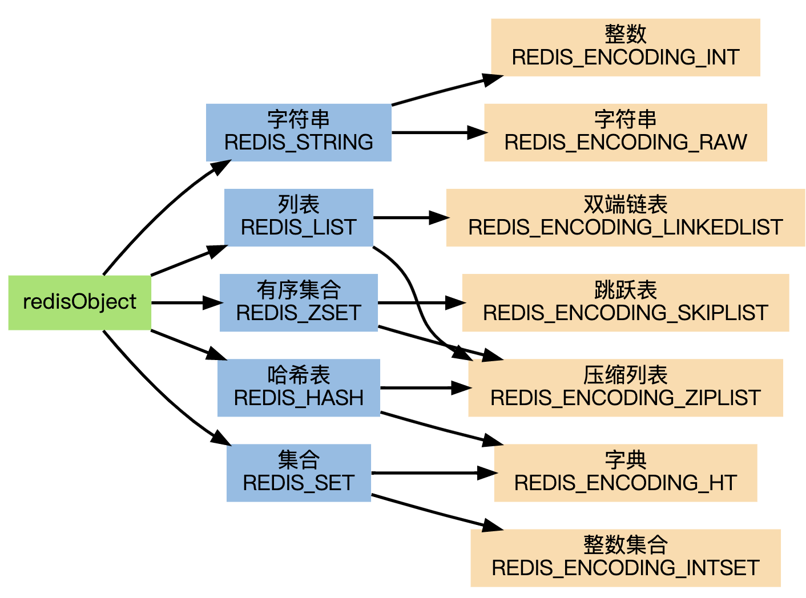
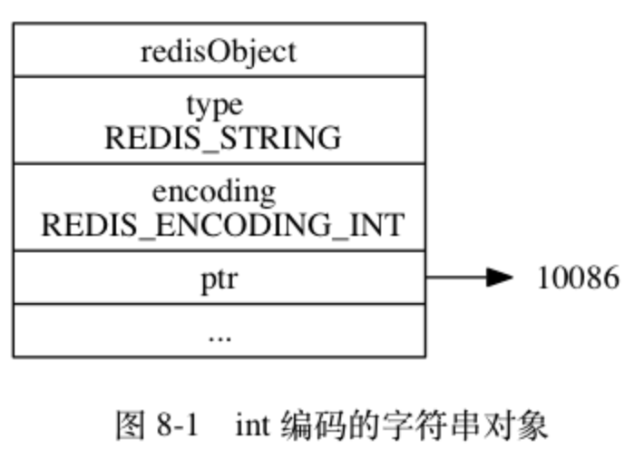
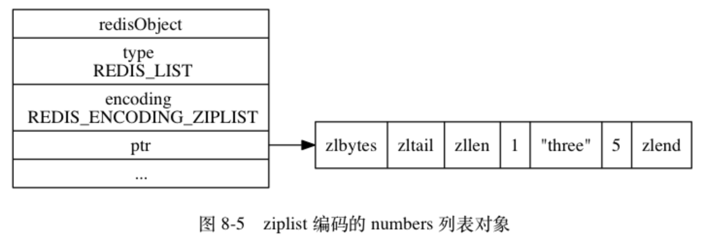
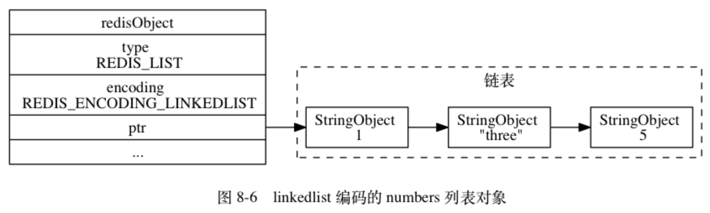
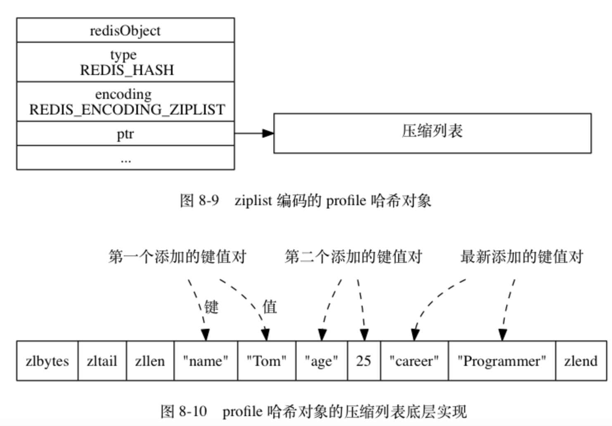
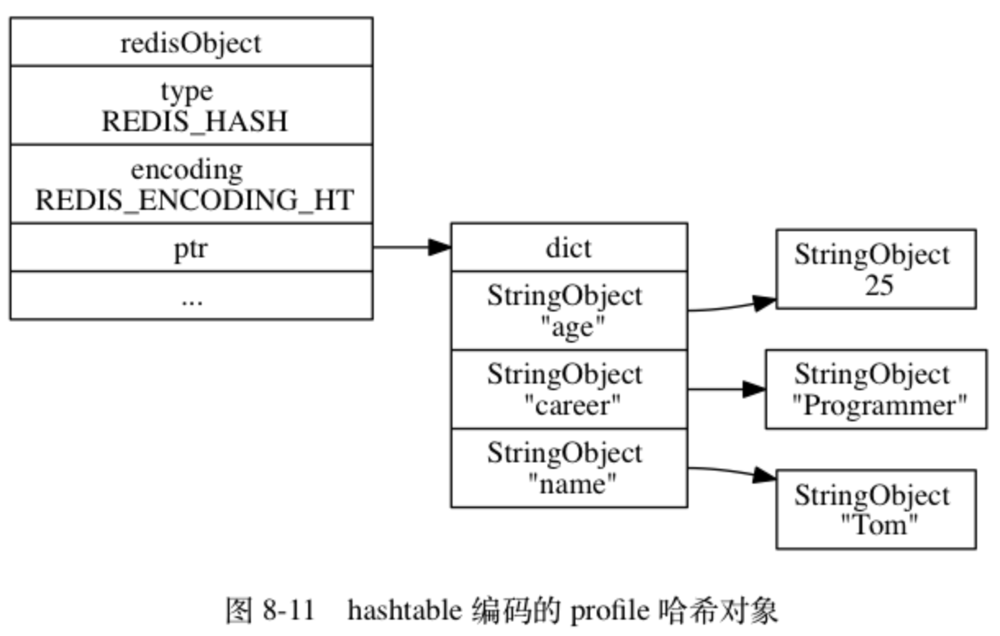
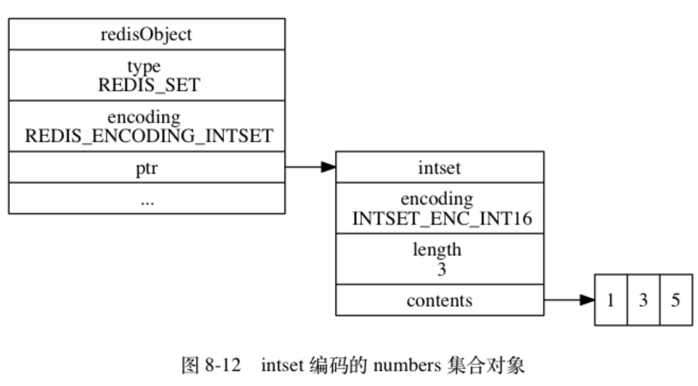
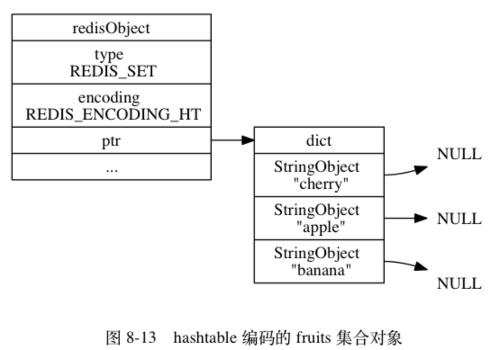
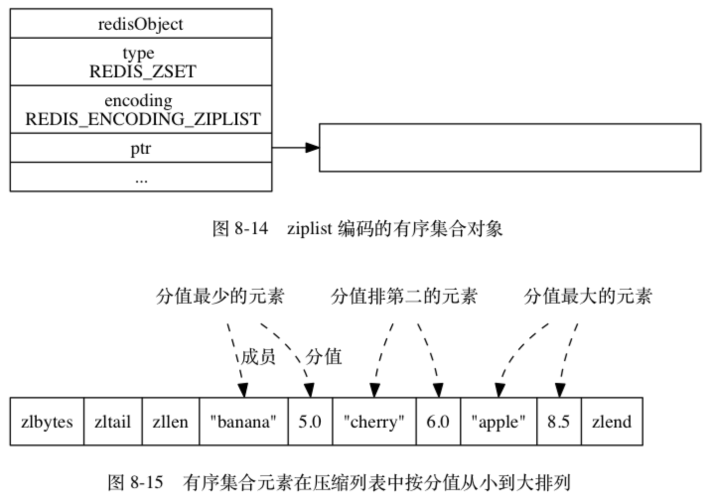

[TOC]

---
### 1. Redis基础数据结构和原理

> 引用自：https://www.pdai.tech/md/db/nosql-redis/db-redis-x-redis-object.html

> 这是很棒的一本书：http://redisbook.com/index.html

#### 1.1 redisObject

redisObject：即redis对象，redis数据库是以Key-Value形式存在，当新建一个Key-Value对时，至少会创建两个对象，一个用于作为Key对象，一个用于作为Value对象，每个对象都由一个redisObject的结构表示。

Redis 5种基础数据类型分别是字符串(string)、列表(list)、哈希(hash)、集合(set)、有序集合(zset)，以及5.0版本中RedisStream结构。整体如下图，Redis的每种对象其实都由对象结构(redisObject) 与 对应编码的数据结构组合而成。



为什么Redis会设计redisObject对象？ 在redis的命令中，用于对键进行处理的命令占了很大一部分，而对于键所保存的值的类型（键的类型），键能执行的命令又各不相同。如： LPUSH 和 LLEN 只能用于列表键, 而 SADD 和 SRANDMEMBER只能用于集合键,等等;另外一些命令,比如DEL、TTL和TYPE,可以用于任何类型的键；但是要正确实现这些命令,必须为不同类型的键设置不同的处理方式:比如说,删除一个列表键和删除一个字符串键的操作过程就不太一样。 以上的描述说明, Redis 必须让每个键都带有类型信息, 使得程序可以检查键的类型, 并为它选择合适的处理方式.为了解决以上问题, Redis 构建了自己的类型系统, 这个系统的主要功能包括: redisObject 对象. 基于 redisObject 对象的类型检查. 基于 redisObject 对象的显式多态函数. 对 redisObject 进行分配、共享和销毁的机制. redisObject数据结构如下：
```
/*
 * Redis 对象
 */
typedef struct redisObject {
    // 类型
    unsigned type:4;
    // 编码方式
    unsigned encoding:4;
    // LRU - 24位, 记录最末一次访问时间（相对于lru_clock）; 或者 LFU（最少使用的数据：8位频率，16位访问时间）
    unsigned lru:LRU_BITS; // LRU_BITS: 24

    // 引用计数
    int refcount;

    // 指向底层数据结构实例
    void *ptr;
} robj;

```

其中type、encoding和ptr是最重要的三个属性。type:1、2、3、4、5分别代表了：字符串、列表、集合、有序集和哈希表。encoding记录了对象所保存的值的编码对应上图中的数据。ptr是一个指针，指向实际保存值的数据结构，这个数据结构由type和encoding属性决定。举个例子， 如果一个redisObject 的type 属性为OBJ_LIST ， encoding 属性为OBJ_ENCODING_QUICKLIST ，那么这个对象就是一个Redis 列表（List)，它的值保存在一个QuickList的数据结构内，而ptr 指针就指向quicklist的对象；

也就是说**redisObject定义了Redis的数据结构的描述和实现方式，方便Redis对数据进行管理，为了便于操作，Redis采用redisObjec结构来统一五种不同的数据类型，这样所有的数据类型就都可以以相同的形式在函数间传递而不用使用特定的类型结构。同时，为了识别不同的数据类型，redisObjec中定义了type和encoding字段对不同的数据类型加以区别。简单地说，redisObjec就是string、hash、list、set、zset的父类，可以在函数间传递时隐藏具体的类型信息，只是C语言中没有“继承”的概念，所以作者抽象了redisObjec结构来到达同样的目的。**

当执行一个处理数据类型命令的时候，redis执行以下步骤：

- 根据给定的key，在数据库字典中查找和他相对应的redisObject，如果没找到，就返回NULL；
- 检查redisObject的type属性和执行命令所需的类型是否相符，如果不相符，返回类型错误；
- 根据redisObject的encoding属性所指定的编码，选择合适的操作函数来处理底层的数据结构；
- 返回数据结构的操作结果作为命令的返回值。


> 引用自：http://redisbook.com/index.html

#### 1.2 各个对象的实现形式

> 引用自：http://blog.caoxl.com/2018/11/28/Redis-Time-Complexity/

##### 1.2.1 各个操作的时间复杂度

**与String相关的常用命令：**

- SET：为一个key设置value，可以配合EX/PX参数指定key的有效期，通过NX/XX参数针对key是否存在的情况进行区别操作，时间复杂度O(1)
- GET：获取某个key对应的value，时间复杂度O(1)
- GETSET：为一个key设置value，并返回该key的原value，时间复杂度O(1)
- MSET：为多个key设置value，时间复杂度O(N)
- MSETNX：同MSET，如果指定的key中有任意一个已存在，则不进行任何操作，时间复杂度O(N)
- MGET：获取多个key对应的value，时间复杂度O(N)
- INCR：将key对应的value值自增1，并返回自增后的值。只对可以转换为整型的String数据起作用。时间复杂度O(1)
- INCRBY：将key对应的value值自增指定的整型数值，并返回自增后的值。只对可以转换为整型的String数据起作用。时间复杂度O(1)
- DECR/DECRBY：同INCR/INCRBY，自增改为自减。

**List相关命令**

- LPUSH：向指定List的左侧（即头部）插入1个或多个元素，返回插入后的List长度。时间复杂度O(N)，N为插入元素的数量
- RPUSH：同LPUSH，向指定List的右侧（即尾部）插入1或多个元素
- LPOP：从指定List的左侧（即头部）移除一个元素并返回，时间复杂度O(1)
- RPOP：同LPOP，从指定List的右侧（即尾部）移除1个元素并返回
- LPUSHX/RPUSHX：与LPUSH/RPUSH类似，区别在于，LPUSHX/RPUSHX操作的key如果不存在，则不会进行任何操作
- LLEN：返回指定List的长度，时间复杂度O(1)
- LRANGE：返回指定List中指定范围的元素（双端包含，即LRANGE key 0 10会返回11个元素），时间复杂度O(N)。
- LINDEX：返回指定List指定index上的元素，如果index越界，返回nil。index数值是回环的，即-1代表List最后一个位置，-2代表List倒数第二个位置。时间复杂度O(N)
- LSET：将指定List指定index上的元素设置为value，如果index越界则返回错误，时间复杂度O(N)，如果操作的是头/尾部的元素，则时间复杂度为O(1)
- LINSERT：向指定List中指定元素之前/之后插入一个新元素，并返回操作后的List长度。如果指定的元素不存在，返回-1。如果指定key不存在，不会进行任何操作，时间复杂度O(N)

**与Hash相关的常用命令：**

- HSET：将key对应的Hash中的field设置为value。如果该Hash不存在，会自动创建一个。时间复杂度O(1)
- HGET：返回指定Hash中field字段的值，时间复杂度O(1)
- HMSET/HMGET：同HSET和HGET，可以批量操作同一个key下的多个field，时间复杂度：O(N)，N为一次操作的field数量
- HSETNX：同HSET，但如field已经存在，HSETNX不会进行任何操作，时间复杂度O(1)
- HEXISTS：判断指定Hash中field是否存在，存在返回1，不存在返回0，时间复杂度O(1)
- HDEL：删除指定Hash中的field（1个或多个），时间复杂度：O(N)，N为操作的field数量
- HINCRBY：同INCRBY命令，对指定Hash中的一个field进行INCRBY，时间复杂度O(1)
- HGETALL：返回指定Hash中所有的field-value对。返回结果为数组，数组中field和value交替出现。时间复杂度O(N)

**与Set相关的常用命令：**

- SADD：向指定Set中添加1个或多个member，如果指定Set不存在，会自动创建一个。时间复杂度O(N)，N为添加的member个数
- SREM：从指定Set中移除1个或多个member，时间复杂度O(N)，N为移除的member个数
- SRANDMEMBER：从指定Set中随机返回1个或多个member，时间复杂度O(N)，N为返回的member个数
- SPOP：从指定Set中随机移除并返回count个member，时间复杂度O(N)，N为移除的member个数
- SCARD：返回指定Set中的member个数，时间复杂度O(1)
- SISMEMBER：判断指定的value是否存在于指定Set中，时间复杂度O(1)
- SMOVE：将指定member从一个Set移至另一个Set
- SMEMBERS：返回指定Hash中所有的member，时间复杂度O(N)
- SUNION/SUNIONSTORE：计算多个Set的并集并返回/存储至另一个Set中，时间复杂度O(N)，N为参与计算的所有集合的总member数
- SINTER/SINTERSTORE：计算多个Set的交集并返回/存储至另一个Set中，时间复杂度O(N)，N为参与计算的所有集合的总member数
- SDIFF/SDIFFSTORE：计算1个Set与1或多个Set的差集并返回/存储至另一个Set中，时间复杂度O(N)，N为参与计算的所有集合的总member数

**Sorted Set的主要命令：**

- ZADD：向指定Sorted Set中添加1个或多个member，时间复杂度O(Mlog(N))，M为添加的member数量，N为Sorted Set中的member数量
- ZREM：从指定Sorted Set中删除1个或多个member，时间复杂度O(Mlog(N))，M为删除的member数量，N为Sorted Set中的member数量
- ZCOUNT：返回指定Sorted Set中指定score范围内的member数量，时间复杂度：O(log(N))
- ZCARD：返回指定Sorted Set中的member数量，时间复杂度O(1)
- ZSCORE：返回指定Sorted Set中指定member的score，时间复杂度O(1)
- ZRANK/ZREVRANK：返回指定member在Sorted Set中的排名，ZRANK返回按升序排序的排名，ZREVRANK则返回按降序排序的排名。时间复杂度O(log(N))
- ZINCRBY：同INCRBY，对指定Sorted Set中的指定member的score进行自增，时间复杂度O(log(N))
- ZRANGE/ZREVRANGE：返回指定Sorted Set中指定排名范围内的所有member，ZRANGE为按score升序排序，ZREVRANGE为按score降序排序，时间复杂度O(log(N)+M)，M为本次返回的member数
- ZRANGEBYSCORE/ZREVRANGEBYSCORE：返回指定Sorted Set中指定score范围内的所有member，返回结果以升序/降序排序，min和max可以指定为-inf和+inf，代表返回所有的member。时间复杂度O(log(N)+M)
- ZREMRANGEBYRANK/ZREMRANGEBYSCORE：移除Sorted Set中指定排名范围/指定score范围内的所有member。时间复杂度O(log(N)+M)


##### 1.2.2 字符串对象

字符串对象的编码可以是int、raw或者embstr。

- 如果一个字符串对象保存的是整数值， 并且这个整数值可以用long类型来表示， 那么字符串对象会将整数值保存在字符串对象结构的ptr属性里面（将 void* 转换成 long ），并将字符串对象的编码设置为int。
- 如果字符串对象保存的是一个字符串值， 并且这个字符串值的长度大于39字节， 那么字符串对象将使用一个简单动态字符串（SDS）来保存这个字符串值， 并将对象的编码设置为raw。
- 如果字符串对象保存的是一个字符串值， 并且这个字符串值的长度小于等于39字节， 那么字符串对象将使用 embstr 编码的方式来保存这个字符串值。

embstr编码是专门用于保存短字符串的一种优化编码方式， 这种编码和raw编码一样，都使用redisObject结构和sdshdr结构来表示字符串对象， 但raw编码会调用两次内存分配函数来分别创建redisObject结构和sdshdr 结构， 而embstr编码则通过调用一次内存分配函数来分配一块连续的空间， 空间中依次包含redisObject和sdshdr两个结构。



##### 1.2.3 列表对象

列表对象的编码可以是 ziplist 或者 linkedlist 。ziplist 编码的列表对象使用压缩列表作为底层实现， 每个压缩列表节点（entry）保存了一个列表元素。举个例子， 如果我们执行以下 RPUSH 命令， 那么服务器将创建一个列表对象作为 numbers 键的值：
```
redis> RPUSH numbers 1 "three" 5
```
如果 numbers 键的值对象使用的是 ziplist 编码， 这个这个值对象将会是如下图的样子：



另一方面， linkedlist 编码的列表对象使用双端链表作为底层实现， 每个双端链表节点（node）都保存了一个字符串对象， 而每个字符串对象都保存了一个列表元素。举个例子， 如果前面所说的 numbers 键创建的列表对象使用的不是ziplist编码，而是linkedlist编码。inkedlist编码的列表对象在底层的双端链表结构中包含了多个字符串对象，这种嵌套字符串对象的行为在稍后介绍的哈希对象、集合对象和有序集合对象中都会出现， 字符串对象是 Redis 五种类型的对象中唯一一种会被其他四种类型对象嵌套的对象。



##### 1.2.4 列表对象

哈希对象的编码可以是 ziplist 或者 hashtable 。ziplist 编码的哈希对象使用压缩列表作为底层实现， 每当有新的键值对要加入到哈希对象时， 程序会先将保存了键的压缩列表节点推入到压缩列表表尾， 然后再将保存了值的压缩列表节点推入到压缩列表表尾， 因此：

- 保存了同一键值对的两个节点总是紧挨在一起， 保存键的节点在前， 保存值的节点在后；
- 先添加到哈希对象中的键值对会被放在压缩列表的表头方向， 而后来添加到哈希对象中的键值对会被放在压缩列表的表尾方向。



另一方面， hashtable 编码的哈希对象使用字典作为底层实现， 哈希对象中的每个键值对都使用一个字典键值对来保存：

- 字典的每个键都是一个字符串对象， 对象中保存了键值对的键；
- 字典的每个值都是一个字符串对象， 对象中保存了键值对的值。

举个例子， 如果前面 profile 键创建的不是 ziplist 编码的哈希对象， 而是 hashtable 编码的哈希对象， 那么这个哈希对象应该会是图 8-11 所示的样子。



##### 1.2.5 集合对象

集合对象的编码可以是 intset 或者 hashtable 。intset 编码的集合对象使用整数集合作为底层实现， 集合对象包含的所有元素都被保存在整数集合里面。举个例子， 以下代码将创建一个如图 8-12 所示的 intset 编码集合对象：



另一方面， hashtable 编码的集合对象使用字典作为底层实现， 字典的每个键都是一个字符串对象， 每个字符串对象包含了一个集合元素， 而字典的值则全部被设置为 NULL 。举个例子， 以下代码将创建一个如图 8-13 所示的 hashtable 编码集合对象



##### 1.2.6 有序集合对象

有序集合的编码可以是 ziplist 或者 skiplist 。ziplist 编码的有序集合对象使用压缩列表作为底层实现， 每个集合元素使用两个紧挨在一起的压缩列表节点来保存， 第一个节点保存元素的成员（member）， 而第二个元素则保存元素的分值（score）。压缩列表内的集合元素按分值从小到大进行排序， 分值较小的元素被放置在靠近表头的方向， 而分值较大的元素则被放置在靠近表尾的方向。举个例子， 如果我们执行以下 ZADD 命令， 那么服务器将创建一个有序集合对象作为 price 键的值：
```
redis> ZADD price 8.5 apple 5.0 banana 6.0 cherry
(integer) 3
```



skiplist 编码的有序集合对象使用 zset 结构作为底层实现， 一个 zset 结构同时包含一个字典和一个跳跃表：
```
typedef struct zset {

    zskiplist *zsl;

    dict *dict;

} zset;
```

zset结构中的zsl跳跃表按分值从小到大保存了所有集合元素， 每个跳跃表节点都保存了一个集合元素： 跳跃表节点的object属性保存了元素的成员， 而跳跃表节点的score属性则保存了元素的分值。 通过这个跳跃表， 程序可以对有序集合进行范围型操作， 比如ZRANK、ZRANGE等命令就是基于跳跃表API来实现的。除此之外， zset结构中的dict字典为有序集合创建了一个从成员到分值的映射，字典中的每个键值对都保存了一个集合元素： 字典的键保存了元素的成员， 而字典的值则保存了元素的分值。 通过这个字典， 程序可以用 O(1) 复杂度查找给定成员的分值，ZSCORE命令就是根据这一特性实现的，而很多其他有序集合命令都在实现的内部用到了这一特性。

有序集合每个元素的成员都是一个字符串对象，而每个元素的分值都是一个double类型的浮点数。值得一提的是，虽然zset结构同时使用跳跃表和字典来保存有序集合元素，但这两种数据结构都会通过指针来共享相同元素的成员和分值，所以同时使用跳跃表和字典来保存集合元素不会产生任何重复成员或者分值，也不会因此而浪费额外的内存。

为什么有序集合需要同时使用跳跃表和字典来实现？在理论上来说，有序集合可以单独使用字典或者跳跃表的其中一种数据结构来实现，但无论单独使用字典还是跳跃表，在性能上对比起同时使用字典和跳跃表都会有所降低。举个例子， 如果我们只使用字典来实现有序集合，那么虽然以O(1)复杂度查找成员的分值这一特性会被保留，但是，因为字典以无序的方式来保存集合元素，所以每次在执行范围型操作——比如ZRANK、ZRANGE等命令时，程序都需要对字典保存的所有元素进行排序，完成这种排序需要至少 O(N \log N) 时间复杂度， 以及额外的 O(N) 内存空间 （因为要创建一个数组来保存排序后的元素）。另一方面， 如果我们只使用跳跃表来实现有序集合， 那么跳跃表执行范围型操作的所有优点都会被保留， 但因为没有了字典， 所以根据成员查找分值这一操作的复杂度将从 O(1) 上升为 O(\log N) 。


##### 1.2.7 内存回收

因为C语言并不具备自动的内存回收功能，所以Redis在自己的对象系统中构建了一个引用计数（referencecounting）技术实现的内存回收机制，通过这一机制，程序可以通过跟踪对象的引用计数信息，在适当的时候自动释放对象并进行内存回收。每个对象的引用计数信息由 redisObject 结构的 refcount 属性记录：

```
typedef struct redisObject {
    // ...
    int refcount;
} robj;
```
对象的引用计数信息会随着对象的使用状态而不断变化：

- 在创建一个新对象时， 引用计数的值会被初始化为 1 ；
- 当对象被一个新程序使用时， 它的引用计数值会被增一；
- 当对象不再被一个程序使用时， 它的引用计数值会被减一；
- 当对象的引用计数值变为 0 时， 对象所占用的内存会被释放。

##### 1.2.8 对象共享

除了用于实现引用计数内存回收机制之外， 对象的引用计数属性还带有对象共享的作用。举个例子， 假设键 A 创建了一个包含整数值 100 的字符串对象作为值对象。如果这时键 B 也要创建一个同样保存了整数值 100 的字符串对象作为值对象， 那么服务器有以下两种做法：

- 为键 B 新创建一个包含整数值 100 的字符串对象；
- 让键 A 和键 B 共享同一个字符串对象；

以上两种方法很明显是第二种方法更节约内存。

在 Redis 中， 让多个键共享同一个值对象需要执行以下两个步骤：将数据库键的值指针指向一个现有的值对象；将被共享的值对象的引用计数增一。另外，这些共享对象不单单只有字符串键可以使用，那些在数据结构中嵌套了字符串对象的对象（linkedlist 编码的列表对象、 hashtable 编码的哈希对象、 hashtable 编码的集合对象、以及 zset 编码的有序集合对象）都可以使用这些共享对象。

为什么 Redis 不共享包含字符串的对象？当服务器考虑将一个共享对象设置为键的值对象时， 程序需要先检查给定的共享对象和键想创建的目标对象是否完全相同， 只有在共享对象和目标对象完全相同的情况下， 程序才会将共享对象用作键的值对象， 而一个共享对象保存的值越复杂， 验证共享对象和目标对象是否相同所需的复杂度就会越高， 消耗的 CPU 时间也会越多：

- 如果共享对象是保存整数值的字符串对象， 那么验证操作的复杂度为 O(1) ；
- 如果共享对象是保存字符串值的字符串对象， 那么验证操作的复杂度为 O(N) ；
- 如果共享对象是包含了多个值（或者对象的）对象，比如列表对象或者哈希对象，那么验证操作的复杂度将会是 O(N^2)。

因此， 尽管共享更复杂的对象可以节约更多的内存， 但受到 CPU 时间的限制， Redis 只对包含整数值的字符串对象进行共享。


#### 1.3 底层数据结构

- 简单动态字符串 - sds
- 压缩列表 - ZipList
- 快表 - QuickList
- 字典/哈希表 - Dict
- 整数集 - IntSet
- 跳表 - ZSkipList


##### 1.3.1 SDS

Redis 是用 C 语言写的，但是对于Redis的字符串，却不是 C 语言中的字符串（即以空字符’\0’结尾的字符数组），它是自己构建了一种名为 简单动态字符串（simple dynamic string,SDS）的抽象类型，并将 SDS 作为 Redis的默认字符串表示，具有动态扩展的特点。 **也就是说Redis中的key一般就是这种数据接口**，如果执行了，下边这个命令：
```
set name Mickle
```

这时候就创建了两个对象，一个是键对象，一个是值对象，键对象的底层实现是一个保存了"name"的SDS，值对象的底层实现是一个保存了"Mickle"的SDS。

SDS的组成如下：sdshdr是头部, buf是真实存储用户数据的地方. 另外注意, 从命名上能看出来, 这个数据结构除了能存储二进制数据, 显然是用于设计作为字符串使用的, 所以在buf中, 用户数据后总跟着一个\0.

为什么使用SDS 为什么不使用C语言字符串实现：

-常数复杂度获取字符串长度：由于 len 属性的存在，我们获取 SDS 字符串的长度只需要读取 len 属性，时间复杂度为 O(1)。而对于 C 语言，获取字符串的长度通常是经过遍历计数来实现的，时间复杂度为 O(n)。通过 strlen key 命令可以获取 key 的字符串长度。
- 杜绝缓冲区溢出：我们知道在 C 语言中使用strcat函数来进行两个字符串的拼接，一旦没有分配足够长度的内存空间，就会造成缓冲区溢出。而对于 SDS 数据类型，在进行字符修改的时候，会首先根据记录的 len 属性检查内存空间是否满足需求，如果不满足，会进行相应的空间扩展，然后在进行修改操作，所以不会出现缓冲区溢出。
- 减少修改字符串的内存重新分配次数：C语言由于不记录字符串的长度，所以如果要修改字符串，必须要重新分配内存（先释放再申请），因为如果没有重新分配，字符串长度增大时会造成内存缓冲区溢出，字符串长度减小时会造成内存泄露。 而对于SDS，由于len属性和alloc属性的存在，对于修改字符串SDS实现了空间预分配和惰性空间释放两种策略：

1、空间预分配：对字符串进行空间扩展的时候，扩展的内存比实际需要的多，这样可以减少连续执行字符串增长操作所需的内存重分配次数。

2、惰性空间释放：对字符串进行缩短操作时，程序不立即使用内存重新分配来回收缩短后多余的字节，而是使用alloc属性将这些字节的数量记录下来，等待后续使用。（当然SDS也提供了相应的API，当我们有需要时，也可以手动释放这些未使用的空间。）
- 二进制安全：因为C字符串以空字符作为字符串结束的标识，而对于一些二进制文件（如图片等），内容可能包括空字符串，因此C字符串无法正确存取；而所有 SDS 的API 都是以处理二进制的方式来处理 buf 里面的元素，**并且SDS不是以空字符串来判断是否结束，而是以len属性表示的长度来判断字符串是否结束**。
- 兼容部分C字符串函数 虽然SDS是二进制安全的，但是一样遵从每个字符串都是以空字符串结尾的惯例，这样可以重用C语言库<string.h> 中的一部分函数。

比起 C 字符串， SDS 具有以下优点：

- 常数复杂度获取字符串长度。
- 杜绝缓冲区溢出。
- 减少修改字符串长度时所需的内存重分配次数。
- 二进制安全。
- 兼容部分 C 字符串函数。

##### 1.3.2 链表

Redis链表就是正常的双端队列具有以下的特点：

- 双端： 链表节点带有 prev 和 next 指针， 获取某个节点的前置节点和后置节点的复杂度都是 O(1) 。
- 无环： 表头节点的 prev 指针和表尾节点的 next 指针都指向 NULL ， 对链表的访问以 NULL 为终点。
- 带表头指针和表尾指针： 通过 list 结构的 head 指针和 tail 指针， 程序获取链表的表头节点和表尾节点的复杂度为 O(1) 。
- 带链表长度计数器： 程序使用 list 结构的 len 属性来对 list 持有的链表节点进行计数， 程序获取链表中节点数量的复杂度为 O(1) 。
- 多态： 链表节点使用 void* 指针来保存节点值， 并且可以通过 list 结构的 dup 、 free 、 match 三个属性为节点值设置类型特定函数， 所以链表可以用于保存各种不同类型的值。

链表被广泛用于实现 Redis 的各种功能， 比如列表键， 发布与订阅， 慢查询， 监视器， 等等。

##### 1.3.3 字典

###### 1.3.3.1 组成

字典由哈希表组成，而哈希表又由哈希节点组成，看下边代码

```
//字典
typedef struct dict {
    // 类型特定函数
    dictType *type;
    // 私有数据
    void *privdata;
    // 哈希表
    dictht ht[2];
    // rehash 索引
    // 当 rehash 不在进行时，值为 -1
    int rehashidx; /* rehashing not in progress if rehashidx == -1 */

} dict;

//哈希表
typedef struct dictht {
    // 哈希表数组
    dictEntry **table;
    // 哈希表大小
    unsigned long size;
    // 哈希表大小掩码，用于计算索引值
    // 总是等于 size - 1
    unsigned long sizemask;
    // 该哈希表已有节点的数量
    unsigned long used;

} dictht;

//哈希表节点
typedef struct dictEntry {
    // 键
    void *key;
    // 值
    union {
        void *val;
        uint64_t u64;
        int64_t s64;
    } v;
    // 指向下个哈希表节点，形成链表
    struct dictEntry *next;

} dictEntry;
```

关系如下图，表示的是字典包含了4个元素的哈希表，但只有两个元素，但是没有哈希冲突。


ht 属性是一个包含两个项的数组， 数组中的每个项都是一个 dictht 哈希表， 一般情况下， 字典只使用 ht[0] 哈希表， ht[1] 哈希表只会在对 ht[0] 哈希表进行 rehash 时使用。除了 ht[1] 之外， 另一个和 rehash 有关的属性就是 rehashidx ： 它记录了 rehash 目前的进度， 如果目前没有在进行 rehash ， 那么它的值为 -1 。

###### 1.3.3.2 rehash

随着操作的不断执行，哈希表保存的键值对会逐渐地增多或者减少，为了让哈希表的负载因子（loadfactor）维持在一个合理的范围之内，当哈希表保存的键值对数量太多或者太少时，程序需要对哈希表的大小进行相应的扩展或者收缩。

扩展和收缩哈希表的工作可以通过执行 rehash （重新散列）操作来完成， Redis 对字典的哈希表执行 rehash 的步骤如下：

- 为字典的 ht[1] 哈希表分配空间， 这个哈希表的空间大小取决于要执行的操作， 以及 ht[0] 当前包含的键值对数量 （也即是 ht[0].used 属性的值）：
  - 如果执行的是扩展操作， 那么 ht[1] 的大小为第一个大于等于 ht[0].used * 2 的 2^n （2 的 n 次方幂）；
  - 如果执行的是收缩操作， 那么 ht[1] 的大小为第一个大于等于 ht[0].used 的 2^n 。
- 将保存在 ht[0] 中的所有键值对 rehash 到 ht[1] 上面： rehash 指的是重新计算键的哈希值和索引值， 然后将键值对放置到 ht[1] 哈希表的指定位置上。
- 当 ht[0] 包含的所有键值对都迁移到了 ht[1] 之后 （ht[0] 变为空表）， 释放 ht[0] ， 将 ht[1] 设置为 ht[0] ， 并在 ht[1] 新创建一个空白哈希表， 为下一次 rehash 做准备。

当以下条件中的任意一个被满足时， 程序会自动开始对哈希表执行扩展操作：

- 服务器目前没有在执行 BGSAVE 命令或者 BGREWRITEAOF 命令， 并且哈希表的负载因子大于等于 1 ；
- 服务器目前正在执行 BGSAVE 命令或者 BGREWRITEAOF 命令， 并且哈希表的负载因子大于等于 5 ；

其中哈希表的负载因子可以通过公式：

```
# 负载因子 = 哈希表已保存节点数量 / 哈希表大小
load_factor = ht[0].used / ht[0].size
计算得出。

比如说， 对于一个大小为 4 ， 包含 4 个键值对的哈希表来说， 这个哈希表的负载因子为：

load_factor = 4 / 4 = 1
```

扩展或收缩哈希表需要将 ht[0] 里面的所有键值对 rehash 到 ht[1] 里面， 但是， 这个 rehash 动作并不是一次性、集中式地完成的， 而是分多次、渐进式地完成的。这样做的原因在于， 如果 ht[0] 里只保存着四个键值对， 那么服务器可以在瞬间就将这些键值对全部 rehash 到 ht[1] ； 但是， 如果哈希表里保存的键值对数量不是四个， 而是四百万、四千万甚至四亿个键值对， 那么要一次性将这些键值对全部 rehash 到 ht[1] 的话， 庞大的计算量可能会导致服务器在一段时间内停止服务。因此， 为了避免 rehash 对服务器性能造成影响， 服务器不是一次性将 ht[0] 里面的所有键值对全部 rehash 到 ht[1] ， 而是分多次、渐进式地将 ht[0] 里面的键值对慢慢地 rehash 到 ht[1] 。以下是哈希表渐进式 rehash 的详细步骤：

- 为 ht[1] 分配空间， 让字典同时持有 ht[0] 和 ht[1] 两个哈希表。
- 在字典中维持一个索引计数器变量 rehashidx ， 并将它的值设置为 0 ， 表示 rehash 工作正式开始。
- 在 rehash 进行期间， 每次对字典执行添加、删除、查找或者更新操作时， 程序除了执行指定的操作以外， 还会顺带将 ht[0] 哈希表在 rehashidx 索引上的所有键值对 rehash 到 ht[1] ， 当 rehash 工作完成之后， 程序将 rehashidx 属性的值增一。
- 随着字典操作的不断执行， 最终在某个时间点上， ht[0] 的所有键值对都会被 rehash 至 ht[1] ， 这时程序将 rehashidx 属性的值设为 -1 ， 表示 rehash 操作已完成。

渐进式 rehash 的好处在于它采取分而治之的方式， 将 rehash 键值对所需的计算工作均滩到对字典的每个添加、删除、查找和更新操作上， 从而避免了集中式 rehash 而带来的庞大计算量。

因为在进行渐进式 rehash 的过程中， 字典会同时使用 ht[0] 和 ht[1] 两个哈希表， 所以在渐进式 rehash 进行期间， 字典的删除（delete）、查找（find）、更新（update）等操作会在两个哈希表上进行： 比如说， 要在字典里面查找一个键的话， 程序会先在 ht[0] 里面进行查找， 如果没找到的话， 就会继续到 ht[1] 里面进行查找， 诸如此类。

另外， 在渐进式 rehash 执行期间， 新添加到字典的键值对一律会被保存到 ht[1] 里面， 而 ht[0] 则不再进行任何添加操作： 这一措施保证了 ht[0] 包含的键值对数量会只减不增， 并随着 rehash 操作的执行而最终变成空表。

###### 1.3.3.3 总结

- 字典被广泛用于实现 Redis 的各种功能， 其中包括数据库和哈希键。
- Redis 中的字典使用哈希表作为底层实现， 每个字典带有两个哈希表， 一个用于平时使用， 另一个仅在进行 rehash 时使用。
- 当字典被用作数据库的底层实现， 或者哈希键的底层实现时， Redis 使用 MurmurHash2 算法来计算键的哈希值。
- 哈希表使用链地址法来解决键冲突， 被分配到同一个索引上的多个键值对会连接成一个单向链表。
- 在对哈希表进行扩展或者收缩操作时， 程序需要将现有哈希表包含的所有键值对 rehash 到新哈希表里面， 并且这个 rehash 过程并不是一次性地完成的， 而是渐进式地完成的。

##### 1.3.4 整数集合

Redis 的跳跃表由 redis.h/zskiplistNode 和 redis.h/zskiplist 两个结构定义， 其中 zskiplistNode 结构用于表示跳跃表节点， 而 zskiplist 结构则用于保存跳跃表节点的相关信息， 比如节点的数量， 以及指向表头节点和表尾节点的指针， 等等。整数集合（intset）是 Redis 用于保存整数值的集合抽象数据结构， 它可以保存类型为 int16_t 、 int32_t 或者 int64_t 的整数值， 并且保证集合中不会出现重复元素。每个 intset.h/intset 结构表示一个整数集合：

```
typedef struct intset {
    // 编码方式
    uint32_t encoding;
    // 集合包含的元素数量
    uint32_t length;
    // 保存元素的数组
    int8_t contents[];
} intset;

```
contents 数组是整数集合的底层实现： 整数集合的每个元素都是 contents 数组的一个数组项（item）， 各个项在数组中按值的大小从小到大有序地排列， 并且数组中不包含任何重复项。length 属性记录了整数集合包含的元素数量， 也即是 contents 数组的长度。虽然 intset 结构将 contents 属性声明为 int8_t 类型的数组， 但实际上 contents 数组并不保存任何 int8_t 类型的值 —— contents 数组的真正类型取决于 encoding 属性的值：

- 如果 encoding 属性的值为 INTSET_ENC_INT16 ， 那么 contents 就是一个 int16_t 类型的数组， 数组里的每个项都是一个 int16_t 类型的整数值 （最小值为 -32,768 ，最大值为 32,767 ）。
- 如果 encoding 属性的值为 INTSET_ENC_INT32 ， 那么 contents 就是一个 int32_t 类型的数组， 数组里的每个项都是一个 int32_t 类型的整数值 （最小值为 -2,147,483,648 ，最大值为 2,147,483,647 ）。
- 如果 encoding 属性的值为 INTSET_ENC_INT64 ， 那么 contents 就是一个 int64_t 类型的数组， 数组里的每个项都是一个 int64_t 类型的整数值 （最小值为 -9,223,372,036,854,775,808 ，最大值为 9,223,372,036,854,775,807 ）。

##### 1.3.5 压缩列表

压缩列表是 Redis 为了节约内存而开发的， 由一系列特殊编码的连续内存块组成的顺序型（sequential）数据结构。一个压缩列表可以包含任意多个节点（entry）， 每个节点可以保存一个字节数组或者一个整数值。


- zlbytes：记录整个压缩列表占用的内存字节数：在对压缩列表进行内存重分配， 或者计算 zlend 的位置时使用。
- zltail：记录压缩列表表尾节点距离压缩列表的起始地址有多少字节： 通过这个偏移量，程序无须遍历整个压缩列表就可以确定表尾节点的地址。
- zllen：记录了压缩列表包含的节点数量： 当这个属性的值小于 UINT16_MAX （65535）时， 这个属性的值就是压缩列表包含节点的数量；当这个值等于UINT16_MAX时，节点的真实数量需要遍历整个压缩列表才能计算得出。
- entryX：压缩列表包含的各个节点，节点的长度由节点保存的内容决定。
- zlend：特殊值 0xFF （十进制 255 ），用于标记压缩列表的末端。

每个压缩列表节点都由 previous_entry_length 、 encoding 、 content 三个部分组成， 如图 7-4 所示。


- 节点的 previous_entry_length属性以字节为单位，记录了压缩列表中前一个节点的长度。因为节点的previous_entry_length属性记录了前一个节点的长度，所以程序可以通过指针运算，根据当前节点的起始地址来计算出前一个节点的起始地址。 如果我们有一个指向当前节点起始地址的指针c，那么我们只要用指针c减去当前节点previous_entry_length属性的值，就可以得出一个指向前一个节点起始地址的指针p**压缩列表的从表尾向表头遍历操作就是使用这一原理实现的：** 只要我们拥有了一个指向某个节点起始地址的指针， 那么通过这个指针以及这个节点的 previous_entry_length 属性， 程序就可以一直向前一个节点回溯， 最终到达压缩列表的表头节点。

- 节点的 encoding 属性记录了节点的 content 属性所保存数据的类型以及长度：

- 节点的 content 属性负责保存节点的值， 节点值可以是一个字节数组或者整数， 值的类型和长度由节点的 encoding 属性决定。

  - 连锁更新：考虑这样一种情况： 在一个压缩列表中， 有多个连续的、长度介于 250 字节到 253 字节之间的节点 e1 至 eN，因为 e1 至 eN 的所有节点的长度都小于 254 字节， 所以记录这些节点的长度只需要 1 字节长的 previous_entry_length 属性， 换句话说， e1 至 eN 的所有节点的 previous_entry_length 属性都是 1 字节长的。这时， 如果我们将一个长度大于等于 254 字节的新节点 new 设置为压缩列表的表头节点， 那么 new 将成为 e1 的前置节点
  - 因为 e1 的 previous_entry_length 属性仅长 1 字节， 它没办法保存新节点 new 的长度， 所以程序将对压缩列表执行空间重分配操作， 并将 e1 节点的 previous_entry_length 属性从原来的 1 字节长扩展为 5 字节长。
  - 现在， 麻烦的事情来了 —— e1 原本的长度介于 250 字节至 253 字节之间， 在为 previous_entry_length 属性新增四个字节的空间之后， e1 的长度就变成了介于 254 字节至 257 字节之间， 而这种长度使用 1 字节长的 previous_entry_length 属性是没办法保存的。
  - 因此， 为了让 e2 的 previous_entry_length 属性可以记录下 e1 的长度， 程序需要再次对压缩列表执行空间重分配操作， 并将 e2 节点的 previous_entry_length 属性从原来的 1 字节长扩展为 5 字节长。
  - 正如扩展 e1 引发了对 e2 的扩展一样， 扩展 e2 也会引发对 e3 的扩展， 而扩展 e3 又会引发对 e4 的扩展……为了让每个节点的 previous_entry_length 属性都符合压缩列表对节点的要求， 程序需要不断地对压缩列表执行空间重分配操作， 直到 eN 为止。
  - Redis 将这种在特殊情况下产生的连续多次空间扩展操作称之为“连锁更新”（cascade update）

因为连锁更新在最坏情况下需要对压缩列表执行 N 次空间重分配操作， 而每次空间重分配的最坏复杂度为 O(N) ， 所以连锁更新的最坏复杂度为 O(N^2) 。要注意的是， 尽管连锁更新的复杂度较高， 但它真正造成性能问题的几率是很低的：

- 首先， 压缩列表里要恰好有多个连续的、长度介于 250 字节至 253 字节之间的节点， 连锁更新才有可能被引发， 在实际中， 这种情况并不多见；
- 其次， 即使出现连锁更新， 但只要被更新的节点数量不多， 就不会对性能造成任何影响： 比如说， 对三五个节点进行连锁更新是绝对不会影响性能的；

因为以上原因， ziplistPush 等命令的平均复杂度仅为 O(N) ， 在实际中， 我们可以放心地使用这些函数， 而不必担心连锁更新会影响压缩列表的性能。

##### 1.3.6 跳表

Redis里面使用skiplist是为了实现sorted set这种对外的数据结构。

Redis 的跳跃表由 redis.h/zskiplistNode 和 redis.h/zskiplist 两个结构定义， 其中 zskiplistNode 结构用于表示跳跃表节点， 而 zskiplist 结构则用于保存跳跃表节点的相关信息， 比如节点的数量， 以及指向表头节点和表尾节点的指针， 等等。


图 5-1 展示了一个跳跃表示例， 位于图片最左边的是 zskiplist 结构， 该结构包含以下属性：

- header ：指向跳跃表的表头节点。
- tail ：指向跳跃表的表尾节点。
- level ：记录目前跳跃表内，层数最大的那个节点的层数（表头节点的层数不计算在内）。
- length ：记录跳跃表的长度，也即是，跳跃表目前包含节点的数量（表头节点不计算在内）。

位于 zskiplist 结构右方的是四个 zskiplistNode 结构， 该结构包含以下属性：
```
typedef struct zskiplistNode {
    // 后退指针
    struct zskiplistNode *backward;
    // 分值
    double score;
    // 成员对象
    robj *obj;
    // 层
    struct zskiplistLevel {
        // 前进指针
        struct zskiplistNode *forward;
        // 跨度
        unsigned int span;
    } level[];

} zskiplistNode;
```

- 层（level）：节点中用 L1 、 L2 、 L3 等字样标记节点的各个层， L1 代表第一层， L2 代表第二层，以此类推。每个层都带有两个属性：前进指针和跨度。前进指针用于访问位于表尾方向的其他节点，而跨度则记录了前进指针所指向节点和当前节点的距离。在上面的图片中，连线上带有数字的箭头就代表前进指针，而那个数字就是跨度。当程序从表头向表尾进行遍历时，访问会沿着层的前进指针进行。跳跃表节点的 level 数组可以包含多个元素， 每个元素都包含一个指向其他节点的指针， 程序可以通过这些层来加快访问其他节点的速度， 一般来说， 层的数量越多， 访问其他节点的速度就越快。每次创建一个新跳跃表节点的时候， 程序都根据幂次定律 （power law，越大的数出现的概率越小） 随机生成一个介于 1 和 32 之间的值作为 level 数组的大小， 这个大小就是层的“高度”。
- 前进指针：每个层都有一个指向表尾方向的前进指针（level[i].forward 属性）， 用于从表头向表尾方向访问节点。下图虚线就是前进指针的方向。

  - 迭代程序首先访问跳跃表的第一个节点（表头）， 然后从第四层的前进指针移动到表中的第二个节点。
  - 在第二个节点时， 程序沿着第二层的前进指针移动到表中的第三个节点。
  - 在第三个节点时， 程序同样沿着第二层的前进指针移动到表中的第四个节点。
  - 当程序再次沿着第四个节点的前进指针移动时， 它碰到一个 NULL ， 程序知道这时已经到达了跳跃表的表尾， 于是结束这次遍历。


- 层的跨度（level[i].span 属性）用于记录两个节点之间的距离：初看上去， 很容易以为跨度和遍历操作有关， 但实际上并不是这样 —— 遍历操作只使用前进指针就可以完成了， 跨度实际上是用来计算排位（rank）的： 在查找某个节点的过程中， 将沿途访问过的所有层的跨度累计起来， 得到的结果就是目标节点在跳跃表中的排位。

  - 两个节点之间的跨度越大， 它们相距得就越远。
  - 指向 NULL 的所有前进指针的跨度都为 0 ， 因为它们没有连向任何节点。

- 后退（backward）指针：节点中用 BW 字样标记节点的后退指针，它指向位于当前节点的前一个节点。后退指针在程序从表尾向表头遍历时使用。节点的后退指针（backward 属性）用于从表尾向表头方向访问节点： 跟可以一次跳过多个节点的前进指针不同， 因为每个节点只有一个后退指针， 所以每次只能后退至前一个节点。
- 分值（score）：各个节点中的1.0、2.0和3.0是节点所保存的分值。在跳跃表中，节点按各自所保存的分值从小到大排列。节点的分值（score属性）是一个double类型的浮点数，跳跃表中的所有节点都按分值从小到大来排序。节点的成员对象（obj 属性）是一个指针， 它指向一个字符串对象， 而字符串对象则保存着一个 SDS 值。在同一个跳跃表中， 各个节点保存的成员对象必须是唯一的，但是多个节点保存的分值却可以是相同的：分值相同的节点将按照成员对象在字典序中的大小来进行排序，成员对象较小的节点会排在前面（靠近表头的方向），而成员对象较大的节点则会排在后面（靠近表尾的方向）。
- 成员对象（obj）：各个节点中的 o1 、 o2 和 o3 是节点所保存的成员对象。

注意表头节点和其他节点的构造是一样的： 表头节点也有后退指针、分值和成员对象， 不过表头节点的这些属性都不会被用到， 所以图中省略了这些部分， 只显示了表头节点的各个层。

虽然仅靠多个跳跃表节点就可以组成一个跳跃表，但通过使用一个zskiplist结构来持有这些节点，程序可以更方便地对整个跳跃表进行处理，比如快速访问跳跃表的表头节点和表尾节点，又或者快速地获取跳跃表节点的数量（也即是跳跃表的长度）等信息。header 和 tail 指针分别指向跳跃表的表头和表尾节点， 通过这两个指针， 程序定位表头节点和表尾节点的复杂度为 O(1) 。通过使用 length 属性来记录节点的数量， 程序可以在 O(1) 复杂度内返回跳跃表的长度。level 属性则用于在 O(1) 复杂度内获取跳跃表中层高最大的那个节点的层数量， 注意表头节点的层高并不计算在内。

- 跳跃表是有序集合的底层实现之一， 除此之外它在 Redis 中没有其他应用。
- Redis 的跳跃表实现由 zskiplist 和 zskiplistNode 两个结构组成， 其中 zskiplist 用于保存跳跃表信息（比如表头节点、表尾节点、长度）， 而 zskiplistNode 则用于表示跳跃表节点。
- 每个跳跃表节点的层高都是 1 至 32 之间的随机数。
- 在同一个跳跃表中， 多个节点可以包含相同的分值， 但每个节点的成员对象必须是唯一的。
- 跳跃表中的节点按照分值大小进行排序， 当分值相同时， 节点按照成员对象的大小进行排序。

> 跳跃表诞生的过程，非常重要：https://mp.weixin.qq.com/s?__biz=MzA4NTg1MjM0Mg==&amp;mid=2657261425&amp;idx=1&amp;sn=d840079ea35875a8c8e02d9b3e44cf95&amp;scene=21#wechat_redirect

skiplist与平衡树、哈希表的比较

- skiplist和各种平衡树（如AVL、红黑树等）的元素是有序排列的，而哈希表不是有序的。因此，在哈希表上只能做单个key的查找，不适宜做范围查找。所谓范围查找，指的是查找那些大小在指定的两个值之间的所有节点。
- 在做范围查找的时候，平衡树比skiplist操作要复杂。在平衡树上，我们找到指定范围的小值之后，还需要以中序遍历的顺序继续寻找其它不超过大值的节点。如果不对平衡树进行一定的改造，这里的中序遍历并不容易实现。而在skiplist上进行范围查找就非常简单，只需要在找到小值之后，对第1层链表进行若干步的遍历就可以实现。
- 平衡树的插入和删除操作可能引发子树的调整，逻辑复杂，而skiplist的插入和删除只需要修改相邻节点的指针，操作简单又快速。
- 从内存占用上来说，skiplist比平衡树更灵活一些。一般来说，平衡树每个节点包含2个指针（分别指向左右子树），而skiplist每个节点包含的指针数目平均为1/(1-p)，具体取决于参数p的大小。如果像Redis里的实现一样，取p=1/4，那么平均每个节点包含1.33个指针，比平衡树更有优势。
- 查找单个key，skiplist和平衡树的时间复杂度都为O(log n)，大体相当；而哈希表在保持较低的哈希值冲突概率的前提下，查找时间复杂度接近O(1)，性能更高一些。所以我们平常使用的各种Map或dictionary结构，大都是基于哈希表实现的。
- 从算法实现难度上来比较，skiplist比平衡树要简单得多。

为啥 redis 使用跳表(skiplist)而不是使用 red-black？

- skiplist的复杂度和红黑树一样，而且实现起来更简单。
- 在并发环境下skiplist有另外一个优势，红黑树在插入和删除的时候可能需要做一些rebalance的操作，这样的操作可能会涉及到整个树的其他部分，而skiplist的操作显然更加局部性一些，锁需要盯住的节点更少，因此在这样的情况下性能好一些。
- 就是在server端，对并发和性能有要求的情况下，如何选择合适的数据结构（这里是跳跃表和红黑树）。如果单纯比较性能，跳跃表和红黑树可以说相差不大，但是加上并发的环境就不一样了，如果要更新数据，跳跃表需要更新的部分就比较少，锁的东西也就比较少，所以不同线程争锁的代价就相对少了，而红黑树有个平衡的过程，牵涉到大量的节点，争锁的代价也就相对较高了。性能也就不如前者了。不过这些对redis这个单进程单线程server来说都是浮云。

> 跳表建立和更新的过程

https://segmentfault.com/a/1190000022028505

https://mp.weixin.qq.com/s?__biz=MzA4NTg1MjM0Mg==&amp;mid=2657261425&amp;idx=1&amp;sn=d840079ea35875a8c8e02d9b3e44cf95&amp;scene=21#wechat_redirect

https://zhuanlan.zhihu.com/p/56941754

非常好：https://mp.weixin.qq.com/s?__biz=Mzk0MDIxNjU3OA==&mid=2247485981&idx=1&sn=9089a5df026c4103bbb73c0b94300399&source=41#wechat_redirect

https://mp.weixin.qq.com/s/6rVgWdb8wG9d-xInkguv_w

### 2. Redis持久化

为什么需要持久化？ Redis是个基于内存的数据库。那服务一旦宕机，内存中的数据将全部丢失。通常的解决方案是从后端数据库恢复这些数据，但后端数据库有性能瓶颈，如果是大数据量的恢复，1、会对数据库带来巨大的压力，2、数据库的性能不如Redis。导致程序响应慢。所以对Redis来说，实现数据的持久化，避免从后端数据库中恢复数据，是至关重要的。

Redis持久化有哪些方式呢？为什么我们需要重点学RDB和AOF？ 从严格意义上说，Redis服务提供四种持久化存储方案：RDB、AOF、虚拟内存（VM）和　DISKSTORE。虚拟内存（VM）方式，从Redis Version 2.4开始就被官方明确表示不再建议使用，Version 3.2版本中更找不到关于虚拟内存（VM）的任何配置范例，Redis的主要作者Salvatore Sanfilippo还专门写了一篇论文，来反思Redis对虚拟内存（VM）存储技术的支持问题。 至于DISKSTORE方式，是从Redis Version 2.8版本开始提出的一个存储设想，到目前为止Redis官方也没有在任何stable版本中明确建议使用这用方式。在Version3.2版本中同样找不到对于这种存储方式的明确支持。从网络上能够收集到的各种资料来看，DISKSTORE方式和RDB方式还有着一些千丝万缕的联系，不过各位读者也知道，除了官方文档以外网络资料很多就是大抄。

#### 2.1 Redis持久化触发方式

触发rdb持久化的方式有2种，分别是手动触发和自动触发。

- 手动触发 手动触发分别对应save和bgsave命令。save命令：阻塞当前Redis服务器，直到RDB过程完成为止，对于内存 比较大的实例会造成长时间阻塞，线上环境不建议使用；bgsave命令：Redis进程执行fork操作创建子进程，RDB持久化过程由子 进程负责，完成后自动结束。阻塞只发生在fork阶段，一般时间很短 bgsave流程如下所示

  -  redis客户端执行bgsave命令或者自动触发bgsave命令；
  - 主进程判断当前是否已经存在正在执行的子进程，如果存在，那么主进程直接返回；
  - 如果不存在正在执行的子进程，那么就fork一个新的子进程进行持久化数据，fork过程是阻塞的，fork操作完成后主进程即可执行其他操作；
  - 子进程先将数据写入到临时的rdb文件中，待快照数据写入完成后再原子替换旧的rdb文件；
  - 同时发送信号给主进程，通知主进程rdb持久化完成，主进程更新相关的统计信息（info Persitence下的rdb_*相关选项）。

- 自动触发 在以下4种情况时会自动触发：

  - redis.conf中配置save m n，即在m秒内有n次修改时，自动触发bgsave生成rdb文件；
  - 主从复制时，从节点要从主节点进行全量复制时也会触发bgsave操作，生成当时的快照发送到从节点；
  - 执行debug reload命令重新加载redis时也会触发bgsave操作；
  - 默认情况下执行shutdown命令时，如果没有开启aof持久化，那么也会触发bgsave操作；


#### 2.2 RDB

由于生产环境中我们为Redis开辟的内存区域都比较大（例如6GB），那么将内存中的数据同步到硬盘的过程可能就会持续比较长的时间，而实际情况是这段时间Redis服务一般都会收到数据写操作请求。那么如何保证数据一致性呢？ RDB中的核心思路是Copy-on-Write，来保证在进行快照操作的这段时间，需要压缩写入磁盘上的数据在内存中不会发生变化。在正常的快照操作中，一方面Redis主进程会fork一个新的快照进程专门来做这个事情，这样保证了Redis服务不会停止对客户端包括写请求在内的任何响应。另一方面这段时间发生的数据变化会以副本的方式存放在另一个新的内存区域，待快照操作结束后才会同步到原来的内存区域。

举个例子：如果主线程对这些数据也都是读操作，那么，主线程和bgsave子进程相互不影响。但是，如果主线程要修改一块数据，那么，这块数据就会被复制一份，生成该数据的副本。然后，bgsave子进程会把这个副本数据写入RDB文件，而在这个过程中，主线程仍然可以直接修改原来的数据。在进行快照操作的这段时间，如果发生服务崩溃怎么办？ 很简单，在没有将数据全部写入到磁盘前，这次快照操作都不算成功。如果出现了服务崩溃的情况，将以上一次完整的RDB快照文件作为恢复内存数据的参考。也就是说，在快照操作过程中不能影响上一次的备份数据。Redis服务会在磁盘上创建一个临时文件进行数据操作，待操作成功后才会用这个临时文件替换掉上一次的备份。 可以每秒做一次快照吗？ 对于快照来说，所谓“连拍”就是指连续地做快照。这样一来，快照的间隔时间变得很短，即使某一时刻发生宕机了，因为上一时刻快照刚执行，丢失的数据也不会太多。但是，这其中的快照间隔时间就很关键了。 如下图所示，我们先在 T0 时刻做了一次快照，然后又在 T0+t 时刻做了一次快照，在这期间，数据块 5 和 9 被修改了。如果在 t 这段时间内，机器宕机了，那么，只能按照 T0 时刻的快照进行恢复。此时，数据块 5 和 9 的修改值因为没有快照记录，就无法恢复了。

所以，要想尽可能恢复数据，t 值就要尽可能小，t 越小，就越像“连拍”。那么，t 值可以小到什么程度呢，比如说是不是可以每秒做一次快照？毕竟，每次快照都是由 bgsave 子进程在后台执行，也不会阻塞主线程。 这种想法其实是错误的。虽然 bgsave 执行时不阻塞主线程，但是，如果频繁地执行全量快照，也会带来两方面的开销： 一方面，频繁将全量数据写入磁盘，会给磁盘带来很大压力，多个快照竞争有限的磁盘带宽，前一个快照还没有做完，后一个又开始做了，容易造成恶性循环。 另一方面，bgsave 子进程需要通过 fork 操作从主线程创建出来。虽然，子进程在创建后不会再阻塞主线程，但是，fork 这个创建过程本身会阻塞主线程，而且主线程的内存越大，阻塞时间越长。如果频繁 fork 出 bgsave 子进程，这就会频繁阻塞主线程了。 那么，有什么其他好方法吗？此时，我们可以做增量快照，就是指做了一次全量快照后，后续的快照只对修改的数据进行快照记录，这样可以避免每次全量快照的开销。这个比较好理解。 但是它需要我们使用额外的元数据信息去记录哪些数据被修改了，这会带来额外的空间开销问题。那么，还有什么方法既能利用 RDB 的快速恢复，又能以较小的开销做到尽量少丢数据呢？且看后文中4.0版本中引入的RDB和AOF的混合方式。 RDS的优缺点

- 优点：RDB文件是某个时间节点的快照，默认使用LZF算法进行压缩，压缩后的文件体积远远小于内存大小，适用于备份、全量复制等场景；
- 优点：Redis加载RDB文件恢复数据要远远快于AOF方式；

- 缺点：RDB方式实时性不够，无法做到秒级的持久化； 每次调用bgsave都需要fork子进程，fork子进程属于重量级操作，频繁执行成本较高；
- 缺点：RDB文件是二进制的，没有可读性，AOF文件在了解其结构的情况下可以手动修改或者补全；
- 缺点：版本兼容RDB文件问题； 针对RDB不适合实时持久化的问题，Redis提供了AOF持久化方式来解决

#### 2.3 AOF
AOF 持久化Redis是“写后”日志，Redis先执行命令，把数据写入内存，然后才记录日志。日志里记录的是Redis收到的每一条命令，这些命令是以文本形式保存。PS:大多数的数据库采用的是写前日志（WAL），例如MySQL，通过写前日志和两阶段提交，实现数据和逻辑的一致性。 而AOF日志采用写后日志，即先写内存，后写日志。

**为什么采用写后日志？**Redis要求高性能，采用写日志有两方面好处：避免额外的检查开销：Redis在向AOF里面记录日志的时候，并不会先去对这些命令进行语法检查。所以，如果先记日志再执行命令的话，日志中就有可能记录了错误的命令，Redis 在使用日志恢复数据时，就可能会出错。 另外一个是：它是在命令执行后才记录日志，所以不会阻塞当前的写操作。 但这种方式存在潜在风险： 如果命令执行完成，写日志之前宕机了，会丢失数据。 主线程写磁盘压力大，导致写盘慢，阻塞后续操作。

如何实现AOF AOF日志记录Redis的每个写命令，步骤分为：命令追加（append）、文件写入（write）和文件同步（sync）：
- 命令追加：当AOF持久化功能打开了，服务器在执行完一个写命令之后，会以协议格式将被执行的写命令追加到服务器的 aof_buf 缓冲区。
- 文件写入和同步：关于何时将 aof_buf 缓冲区的内容写入AOF文件中，Redis提供了三种写回策略：
  - Always，同步写回：每个写命令执行完，立马同步地将日志写回磁盘；
  - Everysec，每秒写回：每个写命令执行完，只是先把日志写到AOF文件的内存缓冲区，每隔一秒把缓冲区中的内容写入磁盘；
  - No，操作系统控制的写回：每个写命令执行完，只是先把日志写到AOF文件的内存缓冲区，由操作系统决定何时将缓冲区内容写回磁盘。

三种写回策略的优缺点 上面的三种写回策略体现了一个重要原则：trade-off，取舍，指在性能和可靠性保证之间做取舍。 关于AOF的同步策略是涉及到操作系统的 write 函数和 fsync 函数的，在《Redis设计与实现》中是这样说明的： 为了提高文件写入效率，在现代操作系统中，当用户调用write函数，将一些数据写入文件时，操作系统通常会将数据暂存到一个内存缓冲区里，当缓冲区的空间被填满或超过了指定时限后，才真正将缓冲区的数据写入到磁盘里。这样的操作虽然提高了效率，但也为数据写入带来了安全问题：如果计算机停机，内存缓冲区中的数据会丢失。为此，系统提供了fsync、fdatasync同步函数，可以强制操作系统立刻将缓冲区中的数据写入到硬盘里，从而确保写入数据的安全性。


AOF会记录每个写命令到AOF文件，随着时间越来越长，AOF文件会变得越来越大。如果不加以控制，会对Redis服务器，甚至对操作系统造成影响，而且AOF文件越大，数据恢复也越慢。为了解决AOF文件体积膨胀的问题，Redis提供AOF文件重写机制来对AOF文件进行“瘦身”。

AOF重写会阻塞吗？ AOF重写过程是由后台进程bgrewriteaof来完成的。主线程fork出后台的bgrewriteaof子进程，fork会把主线程的内存拷贝一份给bgrewriteaof子进程，这里面就包含了数据库的最新数据。然后，bgrewriteaof子进程就可以在不影响主线程的情况下，逐一把拷贝的数据写成操作，记入重写日志。 所以aof在重写时，在fork进程时是会阻塞住主线程的。

AOF日志何时会重写？ 有两个配置项控制AOF重写的触发： auto-aof-rewrite-min-size:表示运行AOF重写时文件的最小大小，默认为64MB。 auto-aof-rewrite-percentage:这个值的计算方式是，当前aof文件大小和上一次重写后aof文件大小的差值，再除以上一次重写后aof文件大小。也就是当前aof文件比上一次重写后aof文件的增量大小，和上一次重写后aof文件大小的比值。

重写日志时，有新数据写入咋整？ 重写过程总结为：“一个拷贝，两处日志”。在fork出子进程时的拷贝，以及在重写时，如果有新数据写入，主线程就会将命令记录到两个aof日志内存缓冲区中。如果AOF写回策略配置的是always，则直接将命令写回旧的日志文件，并且保存一份命令至AOF重写缓冲区，这些操作对新的日志文件是不存在影响的。（旧的日志文件：主线程使用的日志文件，新的日志文件：bgrewriteaof进程使用的日志文件） 而在bgrewriteaof子进程完成会日志文件的重写操作后，会提示主线程已经完成重写操作，主线程会将AOF重写缓冲中的命令追加到新的日志文件后面。这时候在高并发的情况下，AOF重写缓冲区积累可能会很大，这样就会造成阻塞，Redis后来通过Linux管道技术让aof重写期间就能同时进行回放，这样aof重写结束后只需回放少量剩余的数据即可。 最后通过修改文件名的方式，保证文件切换的原子性。 在AOF重写日志期间发生宕机的话，因为日志文件还没切换，所以恢复数据时，用的还是旧的日志文件。

在重写日志整个过程时，主线程有哪些地方会被阻塞？

- fork子进程时，需要拷贝虚拟页表，会对主线程阻塞。
- 主进程有bigkey写入时，操作系统会创建页面的副本，并拷贝原有的数据，会对主线程阻塞。
- 子进程重写日志完成后，主进程追加aof重写缓冲区时可能会对主线程阻塞。

#### 2.3 RDB和AOF混合方式

Redis 4.0 中提出了一个混合使用 AOF 日志和内存快照的方法。简单来说，内存快照以一定的频率执行，在两次快照之间，使用 AOF 日志记录这期间的所有命令操作。 这样一来，快照不用很频繁地执行，这就避免了频繁 fork 对主线程的影响。而且，AOF 日志也只用记录两次快照间的操作，也就是说，不需要记录所有操作了，因此，就不会出现文件过大的情况了，也可以避免重写开销。这个方法既能享受到 RDB 文件快速恢复的好处，又能享受到 AOF 只记录操作命令的简单优势, 实际环境中用的很多。

数据恢复的流程，重启即可恢复

- redis重启时判断是否开启aof，如果开启了aof，那么就优先加载aof文件；
- 如果aof存在，那么就去加载aof文件，加载成功的话redis重启成功，如果aof文件加载失败，那么会打印日志表示启动失败，此时可以去修复aof文件后重新启动；
- 若aof文件不存在，那么redis就会转而去加载rdb文件，如果rdb文件不存在，redis直接启动成功；
- 如果rdb文件存在就会去加载rdb文件恢复数据，如加载失败则打印日志提示启动失败，如加载成功，那么redis重启成功，且使用rdb文件恢复数据；

那么为什么会优先加载AOF呢？因为AOF保存的数据更完整，通过上面的分析我们知道AOF基本上最多损失1s的数据。


> 引用自：https://mp.weixin.qq.com/s/lsOYc2pxXo1vYs8_E0R3uQ

RDB 持久化机制，是对 Redis 中的数据执行周期性的持久化。更适合做冷备。优点：

- 压缩后的二进制文，适用于备份、全量复制，用于灾难恢复加载RDB恢复数据远快于AOF方式，适合大规模的数据恢复。
- 如果业务对数据完整性和一致性要求不高，RDB是很好的选择。数据恢复比AOF快。

RDB 缺点：

- RDB是周期间隔性的快照文件，数据的完整性和一致性不高，因为RDB可能在最后一次备份时宕机了。
- 备份时占用内存，因为Redis 在备份时会独立fork一个子进程，将数据写入到一个临时文件（此时内存中的数据是原来的两倍哦），最后再将临时文件替换之前的备份文件。所以要考虑到大概两倍的数据膨胀性。

注意手动触发及COW：

- SAVE 直接调用 rdbSave ，阻塞 Redis 主进程，导致无法提供服务。2、BGSAVE 则 fork 出一个子进程，子进程负责调用 rdbSave ，在保存完成后向主进程发送信号告知完成。在BGSAVE 执行期间仍可以继续处理客户端的请求。
- Copy On Write 机制，备份的是开始那个时刻内存中的数据，只复制被修改内存页数据，不是全部内存数据。
- Copy On Write 时如果父子进程大量写操作会导致分页错误。


AOF 机制对每条写入命令作为日志，以 append-only 的模式写入一个日志文件中，因为这个模式是只追加的方式，所以没有任何磁盘寻址的开销，所以很快，有点像Mysql中的binlog。AOF更适合做热备。

优点：AOF是一秒一次去通过一个后台的线程fsync操作，数据丢失不用怕。

缺点：

- 对于相同数量的数据集而言，AOF文件通常要大于RDB文件。RDB 在恢复大数据集时的速度比 AOF 的恢复速度要快。
- 根据同步策略的不同，AOF在运行效率上往往会慢于RDB。总之，每秒同步策略的效率是比较高的。

AOF整个流程分两步：

- 第一步是命令的实时写入，不同级别可能有1秒数据损失。命令先追加到aof_buf然后再同步到AO磁盘，如果实时写入磁盘会带来非常高的磁盘IO，影响整体性能。
- 第二步是对aof文件的重写，目的是为了减少AOF文件的大小，可以自动触发或者手动触发(BGREWRITEAOF)，是Fork出子进程操作，期间Redis服务仍可用。
- 在重写期间，由于主进程依然在响应命令，为了保证最终备份的完整性；它依然会写入旧的AOF中，如果重写失败，能够保证数据不丢失。
- 为了把重写期间响应的写入信息也写入到新的文件中，因此也会为子进程保留一个buf，防止新写的file丢失数据。
- 重写是直接把当前内存的数据生成对应命令，并不需要读取老的AOF文件进行分析、命令合并。
- 无论是 RDB 还是 AOF 都是先写入一个临时文件，然后通过rename完成文件的替换工作。

关于Fork的建议：

- 降低fork的频率，比如可以手动来触发RDB生成快照、与AOF重写；
- 控制Redis最大使用内存，防止fork耗时过长；
- 配置牛逼点，合理配置Linux的内存分配策略，避免因为物理内存不足导致fork失败。
- Redis在执行BGSAVE和BGREWRITEAOF命令时，哈希表的负载因子>=5，而未执行这两个命令时>=1。目的是尽量减少写操作，避免不必要的内存写入操作。
- 哈希表的扩展因子：哈希表已保存节点数量 / 哈希表大小。因子决定了是否扩展哈希表。

### 3. 高可用

> 这篇文章很好：https://mp.weixin.qq.com/s?__biz=MzI0NTE4NDg0NA==&mid=2247483973&idx=1&sn=20a93510a2981b948de2bd1f0178bce1&scene=21#wechat_redirect

#### 3.1 主从复制

Redis Replication是一种简单、易用的主从模式（master-slave）的复制机制，它能够使得slave节点成为与master节点完全相同的副本。每次与master节点连接中断后slave节点会自动重联，并且无论master节点发生什么，slave节点总是尝试达到与master节点一致的状态。Redis采取了一系列的辅助措施来保证数据安全。Redis主从复制技术有两个版本：在2.8版本之前，每次slave节点断线重联后，只能进行全量同步。在2.8版本之后进行了重新设计，引入了部分同步的概念。本文将以Redis 6.0版本为基础对主从复制原理进行介绍。旧版主从复制采用的是“全量同步+命令传播”机制完成主从数据同步，这里的硬伤是从机重连后，哪怕主从之间只有少量的数据不一致，也要执行一个耗时、耗资源的全量同步操作来达到数据一致。为此，Redis团队引入了若干机制确保在少量数据不一致时，采用代价较低的部分同步来完成主从复制。所以，当前的主从复制机制包含三个部分：全量同步、部分同步、命令传播。为保证内容完整性，还是先介绍一下全量同步、命令传播两个历史的概念。

- 全量同步：master节点创建全量数据的RDB快照文件，通过网络连接发送给slave节点，slave节点加载快照文件恢复数据，然后再继续发送复制过程中复制积压缓冲区内新增的命令，使之达到数据一致状态。
- 命令传播：如果master-slave节点保持连接，master节点将持续向slave节点发送命令流，以保证master节点数据集发生的改变同样作用在slave节点数据集上，这些命令包含：客户端写请求、key过期、数据淘汰以及其他所有引起数据集变更的操作。


主从复制，是指将一台Redis服务器的数据，复制到其他的Redis服务器。前者称为主节点(master)，后者称为从节点(slave)；数据的复制是单向的，只能由主节点到从节点。 主从复制的作用主要包括：
- 数据冗余：主从复制实现了数据的热备份，是持久化之外的一种数据冗余方式。
- 故障恢复：当主节点出现问题时，可以由从节点提供服务，实现快速的故障恢复；实际上是一种服务的冗余。
- 负载均衡：在主从复制的基础上，配合读写分离，可以由主节点提供写服务，由从节点提供读服务（即写Redis数据时应用连接主节点，读Redis数据时应用连接从节点），分担服务器负载；尤其是在写少读多的场景下，通过多个从节点分担读负载，可以大大提高Redis服务器的并发量。
- 高可用基石：除了上述作用以外，主从复制还是哨兵和集群能够实施的基础，因此说主从复制是Redis高可用的基础。


全量复制：当我们启动多个Redis实例的时候，它们相互之间就可以通过 replicaof（Redis 5.0 之前使用 slaveof）命令形成主库和从库的关系，之后会按照三个阶段完成数据的第一次同步。

- 第一阶段是主从库间建立连接、协商同步的过程，主要是为全量复制做准备。在这一步，从库和主库建立起连接，并告诉主库即将进行同步，主库确认回复后，主从库间就可以开始同步了。具体来说，从库给主库发送psync命令，表示要进行数据同步，主库根据这个命令的参数来启动复制。psync 命令包含了主库的 runID 和复制进度 offset 两个参数。runID，是每个 Redis 实例启动时都会自动生成的一个随机 ID，用来唯一标记这个实例。当从库和主库第一次复制时，因为不知道主库的 runID，所以将 runID 设为“？”。offset，此时设为 -1，表示第一次复制。主库收到 psync 命令后，会用 FULLRESYNC 响应命令带上两个参数：主库 runID 和主库目前的复制进度 offset，返回给从库。从库收到响应后，会记录下这两个参数。这里有个地方需要注意，FULLRESYNC 响应表示第一次复制采用的全量复制，也就是说，主库会把当前所有的数据都复制给从库。
- 第二阶段，主库将所有数据同步给从库。从库收到数据后，在本地完成数据加载。这个过程依赖于内存快照生成的 RDB 文件。 具体来说，主库执行 bgsave 命令，生成 RDB 文件，接着将文件发给从库。从库接收到 RDB 文件后，会先清空当前数据库，然后加载 RDB 文件。这是因为从库在通过 replicaof命令开始和主库同步前，可能保存了其他数据。为了避免之前数据的影响，从库需要先把当前数据库清空。在主库将数据同步给从库的过程中，主库不会被阻塞，仍然可以正常接收请求。否则，Redis的服务就被中断了。但是，这些请求中的写操作并没有记录到刚刚生成的 RDB 文件中。为了保证主从库的数据一致性，主库会在内存中用专门的 replication buffer，记录 RDB 文件生成后收到的所有写操作。
- 第三个阶段，主库会把第二阶段执行过程中新收到的写命令，再发送给从库。具体的操作是，当主库完成 RDB 文件发送后，就会把此时 replication buffer 中的修改操作发给从库，从库再重新执行这些操作。这样一来，主从库就实现同步了。


增量复制：在 Redis 2.8 版本引入了增量复制。 为什么会设计增量复制？如果主从库在命令传播时出现了网络闪断，那么，从库就会和主库重新进行一次全量复制，开销非常大。从 Redis 2.8 开始，网络断了之后，主从库会采用增量复制的方式继续同步。


先看两个概念： replication buffer 和 repl_backlog_buffer

- repl_backlog_buffer：它是为了从库断开之后，如何找到主从差异数据而设计的环形缓冲区，从而避免全量复制带来的性能开销。如果从库断开时间太久，repl_backlog_buffer环形缓冲区被主库的写命令覆盖了，那么从库连上主库后只能乖乖地进行一次全量复制，所以repl_backlog_buffer配置尽量大一些，可以降低主从断开后全量复制的概率。而在repl_backlog_buffer中找主从差异的数据后，如何发给从库呢？这就用到了replication buffer。
- replication buffer：Redis和客户端通信也好，和从库通信也好，Redis都需要给分配一个内存buffer进行数据交互，客户端是一个client，从库也是一个client，我们每个client连上Redis后，Redis都会分配一个clientbuffer，所有数据交互都是通过这个buffer进行的：Redis先把数据写到这个buffer中，然后再把buffer中的数据发到clientsocket中再通过网络发送出去，这样就完成了数据交互。所以主从在增量同步时，从库作为一个client，也会分配一个buffer，只不过这个buffer专门用来传播用户的写命令到从库，保证主从数据一致，我们通常把它叫做replication buffer。

如果在网络断开期间，repl_backlog_size环形缓冲区写满之后，从库是会丢失掉那部分被覆盖掉的数据，还是直接进行全量复制呢？对于这个问题来说，有两个关键点：
- 一个从库如果和主库断连时间过长，造成它在主库repl_backlog_buffer的slave_repl_offset位置上的数据已经被覆盖掉了，此时从库和主库间将进行全量复制。
- 每个从库会记录自己的slave_repl_offset，每个从库的复制进度也不一定相同。在和主库重连进行恢复时，从库会通过psync命令把自己记录的slave_repl_offset发给主库，主库会根据从库各自的复制进度，来决定这个从库可以进行增量复制，还是全量复制。

为什么主从全量复制使用RDB而不使用AOF？

- RDB文件内容是经过压缩的二进制数据（不同数据类型数据做了针对性优化），文件很小。而AOF文件记录的是每一次写操作的命令，写操作越多文件会变得很大，其中还包括很多对同一个key的多次冗余操作。在主从全量数据同步时，传输RDB文件可以尽量降低对主库机器网络带宽的消耗，从库在加载RDB文件时，一是文件小，读取整个文件的速度会很快，二是因为RDB文件存储的都是二进制数据，从库直接按照RDB协议解析还原数据即可，速度会非常快，而AOF需要依次重放每个写命令，这个过程会经历冗长的处理逻辑，恢复速度相比RDB会慢得多，所以使用RDB进行主从全量复制的成本最低。
- 假设要使用AOF做全量复制，意味着必须打开AOF功能，打开AOF就要选择文件刷盘的策略，选择不当会严重影响Redis性能。而RDB只有在需要定时备份和主从全量复制数据时才会触发生成一次快照。而在很多丢失数据不敏感的业务场景，其实是不需要开启AOF的。 ¶


为什么不持久化的主服务器自动重启非常危险呢？为了更好的理解这个问题，看下面这个失败的例子，其中主服务器和从服务器中数据库都被删除了。

- 我们设置节点A为主服务器，关闭持久化，节点B和C从节点A复制数据。
- 这时出现了一个崩溃，但Redis具有自动重启系统，重启了进程，因为关闭了持久化，节点重启后只有一个空的数据集。
- 节点B和C从节点A进行复制，现在节点A是空的，所以节点B和C上的复制数据也会被删除。
- 当在高可用系统中使用Redis Sentinel，关闭了主服务器的持久化，并且允许自动重启，这种情况是很危险的。比如主服务器可能在很短的时间就完成了重启，以至于Sentinel都无法检测到这次失败，那么上面说的这种失败的情况就发生了。


为什么还会有从库的从库的设计？

通过分析主从库间第一次数据同步的过程，你可以看到，一次全量复制中，对于主库来说，需要完成两个耗时的操作：生成 RDB 文件和传输 RDB 文件。 如果从库数量很多，而且都要和主库进行全量复制的话，就会导致主库忙于 fork 子进程生成 RDB 文件，进行数据全量复制。fork 这个操作会阻塞主线程处理正常请求，从而导致主库响应应用程序的请求速度变慢。此外，传输 RDB 文件也会占用主库的网络带宽，同样会给主库的资源使用带来压力。那么，有没有好的解决方法可以分担主库压力呢？ 其实是有的，这就是“主 - 从 - 从”模式。 在刚才介绍的主从库模式中，所有的从库都是和主库连接，所有的全量复制也都是和主库进行的。现在，我们可以通过“主 - 从 - 从”模式将主库生成 RDB 和传输 RDB 的压力，以级联的方式分散到从库上。 简单来说，我们在部署主从集群的时候，可以手动选择一个从库（比如选择内存资源配置较高的从库），用于级联其他的从库。然后，我们可以再选择一些从库（例如三分之一的从库），在这些从库上执行如下命令，让它们和刚才所选的从库，建立起主从关系。


读写分离及其中的问题 在主从复制基础上实现的读写分离，可以实现Redis的读负载均衡：由主节点提供写服务，由一个或多个从节点提供读服务（多个从节点既可以提高数据冗余程度，也可以最大化读负载能力）；在读负载较大的应用场景下，可以大大提高Redis服务器的并发量。下面介绍在使用Redis读写分离时，需要注意的问题。

- 延迟与不一致问题：前面已经讲到，由于主从复制的命令传播是异步的，延迟与数据的不一致不可避免。如果应用对数据不一致的接受程度程度较低，可能的优化措施包括：优化主从节点之间的网络环境（如在同机房部署）；监控主从节点延迟（通过offset）判断，如果从节点延迟过大，通知应用不再通过该从节点读取数据；使用集群同时扩展写负载和读负载等。 在命令传播阶段以外的其他情况下，从节点的数据不一致可能更加严重，例如连接在数据同步阶段，或从节点失去与主节点的连接时等。从节点的slave-serve-stale-data参数便与此有关：它控制这种情况下从节点的表现；如果为yes（默认值），则从节点仍能够响应客户端的命令，如果为no，则从节点只能响应info、slaveof等少数命令。该参数的设置与应用对数据一致性的要求有关；如果对数据一致性要求很高，则应设置为no。
- 数据过期问题：在单机版Redis中，存在两种删除策略： 惰性删除：服务器不会主动删除数据，只有当客户端查询某个数据时，服务器判断该数据是否过期，如果过期则删除。定期删除：服务器执行定时任务删除过期数据，但是考虑到内存和CPU的折中（删除会释放内存，但是频繁的删除操作对CPU不友好），该删除的频率和执行时间都受到了限制。 在主从复制场景下，为了主从节点的数据一致性，从节点不会主动删除数据，而是由主节点控制从节点中过期数据的删除。由于主节点的惰性删除和定期删除策略，都不能保证主节点及时对过期数据执行删除操作，因此，当客户端通过Redis从节点读取数据时，很容易读取到已经过期的数据。 Redis 3.2中，从节点在读取数据时，增加了对数据是否过期的判断：如果该数据已过期，则不返回给客户端；将Redis升级到3.2可以解决数据过期问题。
- 故障切换问题：在没有使用哨兵的读写分离场景下，应用针对读和写分别连接不同的Redis节点；当主节点或从节点出现问题而发生更改时，需要及时修改应用程序读写Redis数据的连接；连接的切换可以手动进行，或者自己写监控程序进行切换，但前者响应慢、容易出错，后者实现复杂，成本都不算低。

#### 3.2 哨兵机制

哨兵实现了什么功能呢？下面是Redis官方文档的描述：
- 监控（Monitoring）：哨兵会不断地检查主节点和从节点是否运作正常。
- 自动故障转移（Automatic failover）：当主节点不能正常工作时，哨兵会开始自动故障转移操作，它会将失效主节点的其中一个从节点升级为新的主节点，并让其他从节点改为复制新的主节点。
- 配置提供者（Configuration provider）：客户端在初始化时，通过连接哨兵来获得当前Redis服务的主节点地址。
- 通知（Notification）：哨兵可以将故障转移的结果发送给客户端。

其中，监控和自动故障转移功能，使得哨兵可以及时发现主节点故障并完成转移；而配置提供者和通知功能，则需要在与客户端的交互中才能体现。

哨兵监控Redis库:哨兵监控什么呢？怎么监控呢？这是由哨兵向主库发送INFO命令来完成的。哨兵2给主库发送INFO命令，主库接受到这个命令后，就会把从库列表返回给哨兵。接着，哨兵就可以根据从库列表中的连接信息，和每个从库建立连接，并在这个连接上持续地对从库进行监控。哨兵1和3可以通过相同的方法和从库建立连接。

主库下线的判定:哨兵如何判断主库已经下线了呢？ 首先要理解两个概念：主观下线和客观下线 主观下线：任何一个哨兵都是可以监控探测，并作出Redis节点下线的判断； 客观下线：有哨兵集群共同决定Redis节点是否下线； 当某个哨兵（如下图中的哨兵2）判断主库“主观下线”后，就会给其他哨兵发送 is-master-down-by-addr 命令。接着，其他哨兵会根据自己和主库的连接情况，做出Y或N的响应，Y相当于赞成票，N相当于反对票。如果赞成票数（这里是2）是大于等于哨兵配置文件中的 quorum 配置项（比如这里如果是quorum=2）, 则可以判定主库客观下线了。

哨兵集群的选举：判断完主库下线后，由哪个哨兵节点来执行主从切换呢？这里就需要哨兵集群的选举机制了。为什么必然会出现选举/共识机制？为了避免哨兵的单点情况发生，所以需要一个哨兵的分布式集群。作为分布式集群，必然涉及共识问题（即选举问题）；同时故障的转移和通知都只需要一个主的哨兵节点就可以了。哨兵的选举机制是什么样的？哨兵的选举机制其实很简单，就是一个Raft选举算法：选举的票数大于等于num(sentinels)/2+1时，将成为领导者，如果没有超过，继续选举，任何一个想成为Leader的哨兵，要满足两个条件：

- 第一，拿到半数以上的赞成票；
- 第二，拿到的票数同时还需要大于等于哨兵配置文件中的 quorum 值。

以 3 个哨兵为例，假设此时的 quorum 设置为 2，那么，任何一个想成为 Leader 的哨兵只要拿到 2 张赞成票，就可以了。

新主库的选出 主库既然判定客观下线了，那么如何从剩余的从库中选择一个新的主库呢？

- 过滤掉不健康的（下线或断线），没有回复过哨兵ping响应的从节点
- 选择salve-priority从节点优先级最高（redis.conf）的
- 选择复制偏移量最大，指复制最完整的从节点

> 引用自：https://mp.weixin.qq.com/s/xnMxvOfO2CmEV-ozoQPKSw

**故障转移**：Sentinel判定主节点客观宕机（ODOWN）后，将进入故障转移过程。进入故障转移过程有几个前提：主节点为客观宕机状态、当前没有故障转移在执行、上次故障转移已经超时。Sentinel确认可以执行故障转移后，会进行以下几项准备工作：

- 设置failover_state：SENTINEL_FAILOVER_STATE_WAIT_START（故障转移等待开始）；
- 设置当前主节点标识位：SRI_FAILOVER_IN_PROGRESS（主节点处于故障转移过程中）；
- 配置纪元加1，并以此作为故障转移的纪元；
- 记录故障转移开始时间及failover_state状态修改时间；


**主从节点移除**：Sentinel从不移除从节点，即使很长时间都不可用。这一点是非常有用的，因为当发生网络分区或者故障后，Sentinel需要正确的对恢复节点进行重新配置。经过故障转移，旧主节点将以从节点的角色加入集群，Sentinel会对他进行重新配置，让它从新的主节点执行主从复制。如果需要移除故障节点，需要依次向Sentinel节点发送Sentinel Reset命令，经过10秒，Sentinel会重新刷新它们的从节点列表，仅保存主节点INFO命令回复内容中的从节点。

**脑裂问题**：redis的主从模式下脑裂是指因为网络问题，导致redis主节点跟从节点和Sentinel集群处于不同的网络分区，此时因为Sentinel集群无法感知到主节点的存在，就会将某一个从节点提升为主节点。此时就存在两个不同的主节点，就像一个大脑分裂成了两个。集群脑裂问题中，如果客户端还在基于原来的主节点继续写入数据，那么新的主节点将无法同步这些数据，当网络问题解决之后，Sentinel集群将原先的主节点降为从节点，此时再从新的主中同步数据，将会造成大量的数据丢失。如下图所示：Redis3原来是主节点，Redis 1和2是它的从节点。由于网络分区，Sentinel 1和2提升Redis 1作为新的主节点，而Redis 3在自己所处的网络分区中仍然是主节点。Client B还会持续写入数据，但是当网络恢复后，Redis 3将被重新配置为Redis 1的从节点，Client B写入的数据将会全部丢失。由于Redis使用异步复制，在这个场景中无法完全解决数据丢失的问题，但是可以通过以下参数把数据损失降低：

```
min-replicas-to-write 1
min-replicas-max-lag 10
```

min-replica选项的作用在上一篇《Redis专题：一文搞懂主从复制原理》我们也说过了，这一配置要求：主节点必须包含一个从节点并且主从之间的最大延迟不能超过10秒，否则主节点会拒绝客户端的写入请求。但是从故障发生到min-replica选项生效也需要一定的时间，这个过程中的数据丢失是无法避免的，依赖“Redis+Sentinel”的系统必须对数据的丢失有一定的容忍性，否则就需要采用支持强一致的系统了。

> 引用自：https://mp.weixin.qq.com/s/3YRs-FskbhooYXJkWma6FQ

哨兵的工作原理总结一下：

每个Sentinel以每秒钟一次的频率向它所知的Master，Slave以及其他 Sentinel 实例发送一个PING命令。如果一个实例（Instance）距离最后一次有效回复 PING 命令的时间超过 down-after-milliseconds 选项所指定的值， 则这个实例会被 Sentinel 标记为主观下线。若 Master 重新向 Sentinel 的 PING 命令返回有效回复，Master的主观下线状态就会被移除。如果一个Master被标记为主观下线，则正在监视这个Master的所有Sentinel要以每秒一次的频率确认Master的确进入了主观下线状态。当有足够数量的 Sentinel（>=配置文件指定的值）在指定的时间范围内确认Master的确进入了主观下线状态， 则Master会被标记为客观下线，若没有足够数量的 Sentinel 同意 Master 已经下线， Master 的客观下线状态就会被移除。在一般情况下， 每个 Sentinel 会以每 10 秒一次的频率向它已知的所有Master，Slave发送 INFO 命令 。当Master被 Sentinel 标记为客观下线时，Sentinel 向下线的 Master 的所有 Slave 发送 INFO 命令的频率会从 10 秒一次改为每秒一次。

具体来看下面：

集群监控：step1：哨兵1连接到Redis集群：发送info命令到master，并建立cmd连接；哨兵端保存哨兵状态（SentinelStatus），保存所有哨兵状态，主节点和从节点的信息；master端会记录redis实例的信息（SentinelRedisInstance）；哨兵根据master中获取的每个slave信息，去连接每个slave，发送同样也是info命令。

集群监控：step2：哨兵2加入进来后：同样会发送info命令到master节点，并建立cmd连接；发现master中存在其他哨兵节点的信息，哨兵2中保存哨兵信息（区别与哨兵1的是它保存了哨兵1和哨兵2的2个哨兵节点信息）；为了每个哨兵的信息都一致它们之间建立了一个发布订阅。为了哨兵之间的信息长期对称它们之间也会互发 ping 命令。

集群监控：step3：哨兵3加入后：同样进行哨兵1、2的动作，会发送info命令到master节点，并建立cmd连接；为了保证哨兵1-哨兵2之间的信息是同步的，建立了一个发布订阅的一个队列（可以互发ping命令）

消息通知：step4：Sentinel节点会通过master/slave 节点建立的cmd连接获取其工作状态，Sentinel收到反馈结果之后，会在哨兵内部进行信息的互通。

故障恢复：step5：故障发现：如何判断一个节点出现故障？哨兵会一直给主节点发送 publish sentinel：hello直到主节点故障，哨兵报出 sdown，同时此哨兵还会向其他哨兵发布消息说这个主节点挂了。发送的指令是 sentinel is-master-down-by-address-port。其余的哨兵接收到指令后，主节点挂了吗？让我去看看到底挂没挂。发送的信息也是 hello。其余的哨兵也会发送他们收到的信息并且发送指令 sentinel is-master-down-by-address-port 到自己的内网，确认一下第一个发送 sentinel is-master-down-by-address-port 的哨兵说你说的对，这个家伙确实挂了。当所有人都认为主节点挂了后就会修改其状态为 odown。当一个哨兵认为主节点挂了标记的是 sdown，当半数哨兵都认为挂了其标记的状态是 odown。一个哨兵认为master节点挂了称为主观下线（sdown），超半数哨兵认为master节点挂了则称为客观下线（odown）。

故障恢复：step6：故障转移：如何进行故障转移？

- 首先，哨兵选举出哨兵Leader去处理故障转移此时选举方式应用的是Raft协议。
- 其次，哨兵Leader从所有的slave节点找出一个作为master节点，主要的规则：选择在线的节点，pass掉已下线的节点；选择响应速度快的，pass掉响应慢的节点；选择与原master断开时间短的，pass掉断开时间较长的；假如以上优先级均一致，会考虑其他优先原则：偏移量较大：假如说 slave1 的 offset 为 50，slave2 偏移量为 55，则哨兵就会选择 slave2 为新的主节点；runid偏大的：这点类似于职场中的论资排辈，也就说根据 runid 的创建时间来判断，时间早的先上位。
- 最后，数据转移，新master上任：Sentinel向新的master发送slaveof no one。其他slave周知：向其他slave发送slaveof 新master IP端口

大致上看的话：Redis主从复制的作用中有这么一句话“主从复制是高可用的基石”，那实现高可用必不可少的就是哨兵和集群。Sentinel会向master、slave以及其他Sentinel获取状态；Sentinel之间会组建“对应频道”，大家一起发布信息、订阅信息、收信息、同步信息等。


> 还有不错的文章：https://www.jianshu.com/p/ed0a85be9578

哨兵的核心知识

- 哨兵至少需要 3 个实例，来保证自己的健壮性。
- 哨兵 + redis 主从的部署架构，是不保证数据零丢失的，只能保证 redis 集群的高可用性。
- 对于哨兵 + redis 主从这种复杂的部署架构，尽量在测试环境和生产环境，都进行充足的测试和演练。

#### 3.3 Redis集群

Redis 从演进上看支持三种集群方案

- 主从复制模式
- Sentinel（哨兵）模式
- Cluster 模式

> 引用自：https://mp.weixin.qq.com/s/jzWUul35pNVWX39DcMjWDw

从技术方案上看：

- client分片方案：client分片是由客户端决定key写入或者读取的节点，包括jedis在内的一些客户端，实现了客户端分片机制。
- 基于代理方案：可使用代理服务中间件比如Twemproxy，是一个twtter开源的一个redis和memcache代理服务器。Twemproxy 通过引入一个代理层，可以将其后端的多台 Redis 或 Memcached 实例进行统一管理与分配，使应用程序只需要在 Twemproxy 上进行操作，而不用关心后面具体有多少个真实的 Redis 或 Memcached 存储。
- redis cluster方案


哨兵模式虽然优秀，但由于其不具备动态水平伸缩能力，无法满足日益复杂的应用场景。RedisCluster采用无中心结构，具备多个节点之间自动进行数据分片的能力，支持节点动态添加与移除，可以在部分节点不可用时进行自动故障转移，确保系统高可用的一种集群化运行模式。按照官方的阐述，Redis Cluster有以下设计目标：

- 高性能可扩展，支持扩展到1000个节点。多个节点之间数据分片，采用异步复制模式完成主从同步，无代理方式完成重定向。
- 一定程度内可接受的写入安全：系统将尽可能去保留客户端通过大多数主节点所在网络分区所有的写入操作，通常情况下存在写入命令已确认却丢失的较短时间窗口。如果客户端连接至少量节点所处的网络分区，这个时间窗口可能较大。
- 可用性：如果大多数节点是可达的，并且不可达主节点至少存在一个可达的从节点，那么Redis Cluster可以在网络分区下工作。而且，如果某个主节点A无从节点，但是某些主节点B拥有多个（大于1）从节点，可以通过从节点迁移操作，把B的某个从节点转移至A。
  简单概述。

结合以上三个目标，我认为Redis Cluster最大的特点在于可扩展性，多个主节点通过分片机制存储所有数据，即每个主从复制结构单元管理部分key。因为在主从复制、哨兵模式下，同样具备其他优点。当系统容量足够大时，读请求可以通过增加从节点进行分摊压力，但是写请求只能通过主节点，这样存在以下风险点：

- 所有写入请求集中在一个Redis实例，随着请求的增加，单个主节点可能出现写入延迟。
- 每个节点都保存系统的全量数据，如果存储数据过多，执行rdb备份或aof重写时fork耗时增加，主从复制传输及数据恢复耗时增加，甚至失败；
- 如果该主节点故障，在故障转移期间可能导致所有服务短时的数据丢失或不可用。

集群模式的写入过程

- 通过哈希的方式，将数据分片，每个节点均分存储一定哈希槽(哈希值)区间的数据，默认分配了16384 个槽位
- 每份数据分片会存储在多个互为主从的多节点上
- 数据写入先写主节点，再同步到从节点(支持配置为阻塞同步)
- 同一分片多个节点间的数据不保持一致性
- 读取数据时，当客户端操作的key没有分配在该节点上时，redis会返回转向指令，指向正确的节点
- 扩容时时需要需要把旧节点的数据迁移一部分到新节点


##### 3.3.1 哈希槽(Hash Slot)

> 引用自：https://juejin.cn/post/6844903486895685645

###### 3.3.1.1 数据分片

Redis 集群使用数据分片（sharding）而非一致性哈希（consistency hashing）来实现： 一个 Redis 集群包含 16384 个哈希槽（hash slot）， 数据库中的每个键都属于这 16384 个哈希槽的其中一个， 集群使用公式 CRC16(key) % 16384 来计算键 key 属于哪个槽， 其中 CRC16(key) 语句用于计算键 key 的 CRC16 校验和 。
集群中的每个节点负责处理一部分哈希槽。 举个例子， 一个集群可以有三个哈希槽， 其中：
```
    节点 A 负责处理 0 号至 5500 号哈希槽。
    节点 B 负责处理 5501 号至 11000 号哈希槽。
    节点 C 负责处理 11001 号至 16384 号哈希槽。
```
这种将哈希槽分布到不同节点的做法使得用户可以很容易地向集群中添加或者删除节点。 比如说：我现在想设置一个key，set my_namezhangguoji。按照RedisCluster的哈希槽算法，CRC16('my_name')%16384=2412。那么这个key就被分配到了节点A上同样的，当我连接(A,B,C)的任意一个节点想获取my_name这个key,都会转到节点A上再比如如果用户将新节点 D 添加到集群中， 那么集群只需要将节点 A 、B 、 C 中的某些槽移动到节点 D 就可以了。增加一个D节点的结果可能如下：
```
    节点A覆盖1365-5460
    节点B覆盖6827-10922
    节点C覆盖12288-16383
    节点D覆盖0-1364,5461-6826,10923-1228
```
与此类似， 如果用户要从集群中移除节点 A ， 那么集群只需要将节点 A 中的所有哈希槽移动到节点 B 和节点 C ，然后再移除空白（不包含任何哈希槽）的节点 A 就可以了。因为将一个哈希槽从一个节点移动到另一个节点不会造成节点阻塞， 所以无论是添加新节点还是移除已存在节点， 又或者改变某个节点包含的哈希槽数量， 都不会造成集群下线。

> 引用自：https://juejin.cn/post/6995008950563241997

###### 3.3.1.2 迁移原理

> 引用自：https://blog.csdn.net/keep_learn/article/details/106834425

- 迁移时客户端的访问流程：迁移过程中，两个节点对应的槽位都存在部分key数据，客户端首先尝试访问旧的节点，如果对应的数据还在旧节点里，旧节点正常处理。如果不在旧节点，分两种情况1,在新节点2，不存在。旧节点不清楚，所以向客户端返回-ASKtargetNodeAddr重定向指令。客户单去目标节点执行一个ASKING 指令，然后再在新节点执行原先的操作指令。执行ASKING 避免形成重定向循环；ASKING 告诉新节点，不能不理，当做自己的槽位来处理。

- 扩容机制：步骤一：首先需要为新节点指定槽的迁移计划，也就是将哪些节点的哪些槽迁移到新节点中。并且迁移计划要确保每个节点负责相似数量的槽，从而保证各节点的数据均匀。槽迁移计划确定后开始逐个把槽内数据从源节点迁移到目标节点中。步骤二：迁移数据数据迁移过程是逐个槽进行的：

  - ①对目标节点发送cluster setslot {slot} importing {sourceNodeId}命令，让目标节点准备导入槽数据。
  - ②对源节点发送cluster setslot {slot} migrating {targetNodeId}命令，让源节点准备迁出槽数据。
  - ③源节点循环执行cluster getkeysinslot {slot} {count}命令，获取count个数据槽{slot}的键。
  - ④在源节点上执行migrate {targetIp} {targetPort} key 0 {timeout} 命令把指定key迁移，注意：Redis3.2.8后，使用pipeline传输
  - ⑤重复步骤3、4直到槽下所有的键值数据迁移到目标节点。
  - ⑥向集群内所有主节点发送cluster setslot {slot} node {targetNodeId}命令，通知槽分配给目标节点。

- 缩容机制：

  - 下线迁移槽
  - 忘记节点
  - 关闭节点

槽迁移和扩容一样

- MOVED：当客户端向一个错误的节点发出了指令，该节点会发现指令的key所在的槽位并不归自己管理，这时它会向客户端发送一个MOVED指令并携带目标操作的节点地址，告诉客户端去连这个节点去获取数据。客户端收到MOVED指令后，要立即纠正本地的槽位映射表。后续所有 key 将使用新的槽位映射表。MOVED命令里包含两个信息，一个是槽的位置，一个是目标节点地址。

- Asking：集群的伸缩（扩容/缩容）的时候，当我们去源节点访问时，发现key已经迁移到目标节点，会回复ask转向异常，收到异常后，先是执行asking命令，然后给目标节点再次发送命令，然后就会返回结果。假如我们执行一个get key命令，这个key原来是在A节点，现在迁移到B节点，然后会给我们返回ASK转向异常，当我们收到ASK转向异常后，需要执行一条Asking命令给目标节点，然后在发送get命令。ASK与MOVED共同点：两者都是重定向。ASK与MOVED不同点：MOVED：槽已经确定；Asking：槽在迁移过程，key有可能在source节点有可能在target节点

###### 3.3.1.3 为什么Redis集群有16384个槽

- (1)如果槽位为65536，发送心跳信息的消息头达8k，发送的心跳包过于庞大。如上所述，在消息头中，最占空间的是myslots[CLUSTER_SLOTS/8]。当槽位为65536时，这块的大小是:65536÷8÷1024=8kb，因为每秒钟，redis节点需要发送一定数量的ping消息作为心跳包，如果槽位为65536，这个ping消息的消息头太大了，浪费带宽。
- (2)redis的集群主节点数量基本不可能超过1000个。如上所述，集群节点越多，心跳包的消息体内携带的数据越多。如果节点过1000个，也会导致网络拥堵。因此redis作者，不建议redis cluster节点数量超过1000个。那么，对于节点数在1000以内的redis cluster集群，16384个槽位够用了。没有必要拓展到65536个。
- (3)槽位越小，节点少的情况下，压缩比高。Redis主节点的配置信息中，它所负责的哈希槽是通过一张bitmap的形式来保存的，在传输过程中，会对bitmap进行压缩，但是如果bitmap的填充率slots / N很高的话(N表示节点数)，bitmap的压缩率就很低。
  如果节点数很少，而哈希槽数量很多的话，bitmap的压缩率就很低。

###### 3.3.1.4 集群扩容或缩容期间可以正常提供服务吗？

对主节点的扩容或者缩容本质上是一个重新分片的过程，重新分片涉及哈希槽迁移，也就是哈希槽内key的迁移。RedisCluster提供了ASK重定向来告知客户端目前集群发生的状况，以便客户端进行调整：ASKING重定向或者重试。所以，整体上来讲，扩容或者缩容期间，集群是可以正常提供服务的。


##### 3.3.2 主从复制模型

为了使得集群在一部分节点下线或者无法与集群的大多数（majority）节点进行通讯的情况下， 仍然可以正常运作， Redis 集群对节点使用了主从复制功能： 集群中的每个节点都有 1 个至 N 个复制品（replica）， 其中一个复制品为主节点（master）， 而其余的 N-1 个复制品为从节点（slave）。在之前列举的节点 A 、B 、C 的例子中， 如果节点 B 下线了， 那么集群将无法正常运行， 因为集群找不到节点来处理 5501 号至 11000号的哈希槽。另一方面， 假如在创建集群的时候（或者至少在节点 B 下线之前）， 我们为主节点 B 添加了从节点 B1 ， 那么当主节点 B 下线的时候， 集群就会将 B1 设置为新的主节点， 并让它代替下线的主节点 B ， 继续处理 5501 号至 11000 号的哈希槽， 这样集群就不会因为主节点 B 的下线而无法正常运作了。不过如果节点 B 和 B1 都下线的话， Redis 集群还是会停止运作。


##### 3.3.3 Redis一致性保证

Redis 并不能保证数据的强一致性. 这意味这在实际中集群在特定的条件下可能会丢失写操作：第一个原因是因为集群是用了异步复制. 写操作过程:客户端向主节点B写入一条命令；主节点B向客户端回复命令状态；主节点将写操作复制给他得从节点 B1, B2 和 B3。主节点对命令的复制工作发生在返回命令回复之后， 因为如果每次处理命令请求都需要等待复制操作完成的话， 那么主节点处理命令请求的速度将极大地降低 —— 我们必须在性能和一致性之间做出权衡。 注意：Redis 集群可能会在将来提供同步写的方法。 Redis 集群另外一种可能会丢失命令的情况是集群出现了网络分区， 并且一个客户端与至少包括一个主节点在内的少数实例被孤立。举个例子 假设集群包含 A 、 B 、 C 、 A1 、 B1 、 C1 六个节点， 其中 A 、B 、C 为主节点， A1 、B1、C1 为A，B，C的从节点， 还有一个客户端 Z1 假设集群中发生网络分区，那么集群可能会分为两方，大部分的一方包含节点 A 、C 、A1 、B1 和 C1 ，小部分的一方则包含节点B和客户端Z1.Z1仍然能够向主节点B中写入,如果网络分区发生时间较短,那么集群将会继续正常运作,如果分区的时间足够让大部分的一方将B1选举为新的master，那么Z1写入B中得数据便丢失了.注意， 在网络分裂出现期间， 客户端 Z1 可以向主节点 B 发送写命令的最大时间是有限制的，这一时间限制称为节点超时时间（node timeout）， 是 Redis 集群的一个重要的配置选项。

> 这篇文章还是非常棒的：https://mp.weixin.qq.com/s/ovkWr58oRP_zumdis4TxeQ

##### 3.3.4 集群容错机制

哨兵模式的自动故障转移能力为其提供高可用保障，同样的，为了提供集群的可用性，Redis Cluster提供了自动故障检测及故障转移能力。两者在设计思想上有很大的相似之处，本节将围绕这个话题进行剖析。

- 心跳机制：Redis Cluster作为无中心的分布式系统，集群容错机制依靠各个节点共同协作，在节点检测到某个节点故障时，通过传播节点故障并达成共识，然后触发一系列的从节点选举及故障转移工作。这一工作完成的基础是节点之间通过心跳机制对集群状态的维护。在集群中，每两个节点之间通过PING和PONG两种类型的消息保持心跳，由前文可知这两种消息采用完全相同的结构（消息头和消息体都相同），仅消息头中的type字段不同，我们称这个消息对为心跳消息。

  - PING/PONG消息头包含了消息源节点的配置纪元（configEpoch）、复制偏移量（offset）、节点名称（sender）、负责的哈希槽（myslots）、节点状态（flags）等，这些内容与目标节点所维护的nodes中节点信息一一对应；另外还包含在源节点看来集群纪元（currentEpoch）、集群状态（state）。
  - PING/PONG消息体包含若干clusterMsgDataGossip，每个clusterMsgDataGossip对应一个集群节点状态，它描述了源节点与之的心跳状态及源节点对它运行状态的判断。

心跳消息在集群节点两两之间以“我知道的给你，你知道的给我”这样“瘟疫传播”的方式传播、交换信息，可以保证在短时间内节点状态达成一致。我们从心跳触发的时机、消息体的构成、应用几个方面深入理解心跳机制。

- 触发时机：在集群模式下，心跳动作是由周期性函数clusterCron()触发的，该函数每个100毫秒执行一次。为了控制集群内消息的规模，同时兼顾与节点之间心跳的时效性，RedisCluster采取了不同的处理策略。正常情况下，clusterCron()每隔一秒（该函数每执行10次）向一个节点发送PING消息。这个节点的选择是随机的，随机方式为：随机5次，每次从节点列表nodes中随机选择一个节点，如果节点满足条件（集群总线链接存在、非等待PONG回复、非握手状态、非本节点），则作为备选节点；
  如果备选节点不为空，则从备选节点中选择PONG回复最早的节点；

- 消息构成：PING/PONG消息采用一致的数据结构。其中，消息头的内容来自集群状态的myself，这点很容易理解；而消息体需要追加若干节点的状态，但是集群中有很多节点，到底应该添加哪几个节点呢？按照RedisCluster的设计，每个消息体将会包含正常节点和PFAIL状态节点，具体获取方式如下（该部分源码位于cluster.c函数clusterSendPing中）：确定心跳消息需要包含正常节点的理论最大值（之所以是理论值，是因为接下来的流程还需要考虑节点状态，会移除在握手中或宕机的节点）：确定心跳信息需要包含PFAIL状态节点的数量pfail_wanted：集群状态中获取所有PFAIL节点的数量（server.cluster->stats_pfail_nodes）。添加正常节点：从集群节点列表随机获取wanted个节点，创建gossip消息片段，加入消息体。添加PFAIL状态节点：遍历获取PFAIL状态节点，创建gossip片段，加入消息体，此时节点需要满足处于PFAIL状态、不是握手状态、不是无地址状态。

- 消息应用：节点接收到PING或PONG消息后，将按照消息头及消息体中的内容对本地维护的节点状态进行更新。
- 集群纪元和配置纪元：心跳消息头包含了源节点的配置纪元（configEpoch）及在他看来的集群当前纪元（currentEpoch），目标节点接收后将检查自身维护的源节点的配置纪元和集群当前纪元。
- 哈希槽变更检测：消息头包含了源节点当前负责的哈希槽列表，目标节点会检查本地缓存的哈希槽与节点的映射关系，看是否存在与映射关系不一致的哈希槽。
- 新节点发现：在节点握手过程中，我们知道，新节点加入集群仅需与集群中任意一个节点通过握手加入集群，但是其他节点并不知道有新节点加入，新节点也不知道其他节点的存在；对于两者而言，都是新节点的发现过程。

##### 3.3.5 故障发现与转移

Redis Cluster使用两个概念PFAIL、FAIL来描述节点的运行状态，这与哨兵模式中的SDOWN、ODOWN类似。

PFAIL：可能宕机：当一个节点在超过 NODE_TIMEOUT 时间后仍无法访问某个节点，那么它会用 PFAIL 来标识这个不可达的节点。无论节点类型是什么，主节点和从节点都能标识其他的节点为 PFAIL。

FAIL：宕机：PFAIL状态具有一定的主观性，此时不代表目标节点真正的宕机，只有达到FAIL状态，才意味着节点真正宕机。不过我们已经知道，在心跳过程中，每个节点都会把检测到PFAIL的节点告知其他节点。所以，如果某个节点宕机是客观存在的，那其他节点也必然会检测到PFAIL状态。在一定的时间窗口内，当集群中一定数量的节点都认为目标节点为PFAIL状态时，节点就会将该节点的状态提升为FAIL（宕机）状态。

##### 3.3.6 从节点选举

若主节点故障，该主节点的所有从节点都会启动一个选举流程，在其他主节点的投票表决下，只有投票胜出的从节点才有机会提升为主节点。从节点选举的准备与执行过程是在clusterCron中进行的。

- 发起选举的条件与时机：从节点发起选举流程必须满足以下条件（选举流程发起前的检查工作位于函数clusterHandleSlaveFailover(void)）：从节点的主节点处于FAIL状态；从节点主节点负责的哈希槽不为空；为了保证从节点数据的时效性，从节点与主节点之间断联的时间必须小于指定时间。

- 从节点选举流程：从节点启动选举流程，先把自身维护的集群当前纪元（currentEpoch）加1，并设置failover_auth_sent=1以表示已经启动选举流程；然后通过FAILOVER_AUTH_REQUEST类型的消息向集群内的所有主节点发起选举请求，并在2倍NODE_TIMEOUT（至少2秒）时间内等待主节点的投票回复。集群内的其他主节点是从节点选举的决策者，投票前需要做出严格的检查。为了避免多个从节点在选举中同时胜出，并且保证选举过程合法性，主节点接收到FAILOVER_AUTH_REQUEST命令消息后，将会做以下条件校验：发起选举流程的从节点所属主节点必须处于FAIL状态（前面DELAY中的固定值500毫秒，就是为了保证FAIL消息在集群内传播充分）；针对一个给定的currentEpoch，主节点只会投票一次，**并且保存在lastVoteEpoch中**，其他较老的纪元选取申请都会拒绝。另外，如果从节点投票请求中的currentEpoch小于当前主节点的currentEpoch，投票请求会被拒绝。主节点一旦通过FAILOVER_AUTH_ACK类型的消息投赞成票给指定的从节点，该主节点在2倍NODE_TIMEOUT时间内将不再投票给同主节点下的其他从节点。主节点投票完成将记录信息，并安全持久化保存到配置文件：
```
保存上次投票的集群当前纪元：lastVoteEpoch 。
保存投票时间，存储在集群节点列表的voted_time中。
```
为了避免把上一轮投票计入本轮投票，从节点会检查FAILOVER_AUTH_ACK消息所声明的currentEpoch，若该值小于从节点的集群当前纪元，该选票会被丢弃。确认投票有效，从节点将通过cluster->failover_auth_count进行计数。

- 从节点提升：从节点获得有效选票后，将把投票计数器failover_auth_count加1，并通过从节点选举与提升处理函数clusterHandleSlaveFailover进行周期性检查，如果从节点得到大多数（法定数量）主节点的认可，将触发从节点提升流程。这里选举通过法定数量与触发FAIL状态的法定数量一致，即(server.cluster->size / 2) + 1，半数以上的主节点。从节点启动提升流程，将会对自身的状态信息进行一系列的修改，最终把自己提升为主节点，具体内容如下：从节点把节点配置纪元configEpoch加1；
  切换自己的角色为主节点，并且重置主从复制关系（这个与哨兵模式从节点提升类似）；复制原主节点所负责的哈希槽，改为自己负责；保存并持久化以上配置变更信息；从节点把自己设置为主节点以后，就会通过PONG命令向集群所有节点广播自己状态的变化，以便其他节点及时修改状态，接受该从节点的角色提升。从节点在选举中获胜后，自身的角色提升过程是比较简单的，更为关键的是被集群内其他所有节点认可。结合其他节点在集群中角色，需要考虑三种情况：其他节点：在从节点提升前，集群内与当前节点无主从关系、非同一主节点从节点的其他节点。兄弟从节点：在从节点提升前，同一主节点的从节点。旧主节点：在故障恢复后如何重新加入集群。

> 这篇文章对集群模式也有很好的解释：https://www.pdai.tech/md/db/nosql-redis/db-redis-x-cluster.html

> 这个也有点内容：https://mp.weixin.qq.com/s/33s0UCM6BAI7KqipJm3qaA

##### 3.3.7 Gossip协议

Redis Cluster 通讯底层是Gossip协议，所以需要对Gossip协议有一定的了解。gossip 协议（gossip protocol）又称 epidemic 协议（epidemic protocol），是基于流行病传播方式的节点或者进程之间信息交换的协议。
在分布式系统中被广泛使用，比如我们可以使用 gossip 协议来确保网络中所有节点的数据一样。 Gossip协议已经是P2P网络中比较成熟的协议了。Gossip协议的最大的好处是，即使集群节点的数量增加，每个节点的负载也不会增加很多，几乎是恒定的。这就允许Consul管理的集群规模能横向扩展到数千个节点。 Gossip算法又被称为反熵（Anti-Entropy），熵是物理学上的一个概念，代表杂乱无章，而反熵就是在杂乱无章中寻求一致，这充分说明了Gossip的特点：在一个有界网络中，每个节点都随机地与其他节点通信，经过一番杂乱无章的通信，最终所有节点的状态都会达成一致。每个节点可能知道所有其他节点，也可能仅知道几个邻居节点，只要这些节可以通过网络连通，最终他们的状态都是一致的，当然这也是疫情传播的特点。https://www.backendcloud.cn/2017/11/12/raft-gossip/ 上面的描述都比较学术，其实Gossip协议对于我们吃瓜群众来说一点也不陌生，Gossip协议也成为流言协议，说白了就是八卦协议，这种传播规模和传播速度都是非常快的，你可以体会一下。所以计算机中的很多算法都是源自生活，而又高于生活的。 ¶

- Gossip协议的使用：Redis 集群是去中心化的，彼此之间状态同步靠 gossip 协议通信，集群的消息有以下几种类型：Meet 通过「cluster meet ip port」命令，已有集群的节点会向新的节点发送邀请，加入现有集群。 Ping 节点每秒会向集群中其他节点发送 ping 消息，消息中带有自己已知的两个节点的地址、槽、状态信息、最后一次通信时间等。 Pong 节点收到 ping 消息后会回复 pong 消息，消息中同样带有自己已知的两个节点信息。 Fail 节点 ping 不通某节点后，会向集群所有节点广播该节点挂掉的消息。其他节点收到消息后标记已下线。

- 基于Gossip协议的故障检测：集群中的每个节点都会定期地向集群中的其他节点发送PING消息，以此交换各个节点状态信息，检测各个节点状态：在线状态、疑似下线状态PFAIL、已下线状态FAIL。

  - 自己保存信息：当主节点A通过消息得知主节点B认为主节点D进入了疑似下线(PFAIL)状态时,主节点A会在自己的clusterState.nodes字典中找到主节点D所对应的clusterNode结构，并将主节点B的下线报告添加到clusterNode结构的fail_reports链表中，并后续关于结点D疑似下线的状态通过Gossip协议通知其他节点。
  - 一起裁定：如果集群里面，半数以上的主节点都将主节点D报告为疑似下线，那么主节点D将被标记为已下线(FAIL)状态，将主节点D标记为已下线的节点会向集群广播主节点D的FAIL消息，所有收到FAIL消息的节点都会立即更新nodes里面主节点D状态标记为已下线。
  - 最终裁定：将 node 标记为 FAIL 需要满足以下两个条件： 有半数以上的主节点将 node 标记为 PFAIL 状态。 当前节点也将 node 标记为 PFAIL 状态。

### 3. 其他一些重要功能

#### 3.1 事务

> 引用自：https://blog.csdn.net/a745233700/article/details/113362533

##### 3.1.1 事务的定义：

**Redis的事务本质是一组命令的集合，一个事务中的命令要么全部执行，要么都不执行**。事务的原理是先将属于一个事务的命令发送给Redis，存放到一个队列中，再让Redis依次执行这些命令。如果在发送EXEC命令前客户端断线了，则Redis会清空事务队列，事务中的所有命令都不会执行。而一旦客户端发送了EXEC命令，所有的命令就都会被执行，即使此后客户端断线也没关系，因为Redis中已经记录了所有要执行的命令。

除此之外，Redis的事务还能保证一个事务内的命令依次执行而不被其他命令插入。也就是说，在事务执行期间，服务器不会中断事务而改去执行其他客户端的命令请求，即不会被其它命令插入，不许加塞，等事务中的所有命令都执行完毕才去处理其他客户端的命令请求。即**一次性、顺序性、排他性的执行一系列命令**。


##### 3.1.2 Redis事务的特性：

- 原子性：Redis的原子性只能保证批量操作的一次性执行，和传统mysql事务不同的是，Redis不支持回滚，在执行EXEC命令时，如果Redis事务中某条命令执行失败，其后的命令仍然会被执行，没有回滚。Redis为什么不支持回滚rollback？

  - Redis 操作失败的原因只可能是语法错误或者错误的数据类型操作，这些都是在开发期间能发现的问题，不会进入到生产环境，因此不需要回滚。
  - Redis 内部设计推崇简单和高性能，支持事务回滚能力会导致设计复杂，这与Redis的初衷相违背，因此不需要回滚能力。
  - Redis 的应用场景明显不是为了数据存储的高可靠与强一致性而设计的，而是为了数据访问的高性能而设计，设计者为了简单性和高性能而部分放弃了原子性。

- 隔离性：事务是一个单独的隔离操作，没有隔离级别的概念，事务队列中的命令在没有提交之前都不会实际的被执行。在事务中，所有命令都会被序列化，按顺序地执行。事务在执行的过程中，其他客户端发送来的命令请求不会插入到事务执行命令序列中。
- 持久性：如果Redis运行在某种特定的持久化模式下时，事务也具有持久性。


##### 3.1.3 Redis事务的错误处理：

如果一个事务中的某个命令执行出错，Redis会怎样处理呢？要回答这个问题，首先需要知道什么原因会导致命令执行出错。


- 语法错误：语法错误指命令不存在或者命令参数的个数不对。跟在MULTI命令后执行了3个命令：一个是正确的命令，成功地加入事务队列；其余两个命令都有语法错误。**而只要有一个命令有语法错误，执行EXEC命令后Redis就会直接返回错误，连语法正确的命令也不会执行。**

```
redis＞MULTI
OK
redis＞SET key value
QUEUED
redis＞SET key
(error)ERR wrong number of arguments for 'set' command
redis＞ errorCOMMAND key
(error) ERR unknown command 'errorCOMMAND'
redis＞ EXEC
(error) EXECABORT Transaction discarded because of previous errors.
```

- 运行错误：运行错误指在命令执行时出现的错误，比如使用散列类型的命令操作集合类型的键，这种错误在实际执行之前Redis是无法发现的，所以在事务里这样的命令是会被Redis接受并执行的。如果事务里的一条命令出现了运行错误，事务里其他的命令依然会继续执行（包括出错命令之后的命令）

```
redis＞MULTI
OK
redis＞SET key 1
QUEUED
redis＞SADD key 2
QUEUED
redis＞SET key 3
QUEUED
redis＞EXEC
1) OK
2) (error) ERR Operation against a key holding the wrong kind of value
3) OK
redis＞GET key
"3"
```

> 引用自：https://www.jianshu.com/p/361cb9cd13d5

##### 3.1.4 Redis事务的相关命令：

- MULTI：用于标记事务块的开启。MULTI执行之后，Redis会将后续的命令逐个放到一个缓存队列中，当EXEC命令被调用时，所有队列中的命令才会被原子化执行。
- EXEC：在一个事务中执行所有先前放入队列的命令，然后恢复正常的连接状态。当使用WATCH命令时，只有当受监控的键没有被修改时，EXEC命令才会执行事务中的命令。
- DISCARD：放弃事务，清除事务队列中的命令，然后恢复正常的连接状态。如果使用了UNWATCH命令，那么DISCARD命令就会取消当前连接监控的所有键。
- WATCH：当某个事务需要按条件执行时，就要使用该命令将key设置为受监控的。如果在事务执行之前这些key被其他命令所改动，那么整个事务将会被打断。WATCH命令可用于提供CAS功能。利用watch实现incr
```
      WATCH mykey
      val = GET mykey
      val = val + 1
      MULTI
      SET mykey $val
      EXEC
```
在获取mykey的值之前先通过WATCH命令监控了该键，此后又将set命令包围在事务中，这样就可以有效的保证每个连接在执行EXEC之前，如果当前连接获取的mykey的值被其它连接的客户端修改，那么当前连接的EXEC命令将执行失败。这样调用者在判断返回值后就可以获悉val是否被重新设置成功。
- UNWATCH：清除事务中所有监控的键。如果调用了EXEC或DISCARD命令，那么就不需要手动调用UNWATCH命令。


##### 3.1.5 Redis事务执行步骤

通过上文命令执行，很显然Redis事务执行是三个阶段：

- 开启：以MULTI开始一个事务
- 入队：将多个命令入队到事务中，接到这些命令并不会立即执行，而是放到等待执行的事务队列里面
- 执行：由EXEC命令触发事务

当一个客户端切换到事务状态之后， 服务器会根据这个客户端发来的不同命令执行不同的操作： 如果客户端发送的命令为 EXEC 、 DISCARD 、 WATCH 、 MULTI 四个命令的其中一个， 那么服务器立即执行这个命令。 与此相反， 如果客户端发送的命令是 EXEC 、 DISCARD 、 WATCH 、 MULTI 四个命令以外的其他命令， 那么服务器并不立即执行这个命令， 而是将这个命令放入一个事务队列里面， 然后向客户端返回 QUEUED 回复。


#### 3.2 发布订阅

Redis 提供了基于「发布/订阅」模式的消息机制，在这种模式下，消息发布者与订阅者不需要进行直接通信。消息发布者只需要想指定的频道发布消息，订阅该频道的每个客户端都可以接受到到这个消息。使用Redis发布订阅这种机制，对于上面业务，下单支付业务只需要向支付结果这个频道发送消息，其他下游业务订阅支付结果这个频道，就能收相应消息，然后做出业务处理即可。这样就可以解耦系统上下游之间调用关系。

#### 3.2.1 发布订阅使用

首先我们来看下如何发布一条消息，其实很简单只要使用 publish 指令:
```
publish channel message
```
接下来我们使用 subscribe 订阅一个或多个频道
```
subscribe channel [channel ...]
```

我们子在使用订阅命令，需要主要几点：

- 客户端执行订阅指令之后，就会进入订阅状态，之后就只能接收 subscribe、psubscribe、unsubscribe、punsubscribe 这四个命令。
- 新订阅的客户端，是无法收到这个频道之前的消息，这是因为Redis并不会对发布的消息持久化的。相比于很多专业MQ，比如kafka、rocketmq来说，redis发布订阅功能就显得有点简陋了。不过redis发布订阅功能胜在简单，如果当前场景可以容忍这些缺点，还是可以选择使用的。


##### 3.2.2 发布订阅实际应用

- RedisSentinel节点主要使用发布订阅机制，实现新节点的发现，以及交换主节点的之间的状态。每一个Sentinel节点将会定时向_sentinel_:hello频道发送消息，并且每个Sentinel都会订阅这个节点。这样一旦有节点往这个频道发送消息，其他节点就可以立刻收到消息。这样一旦有的新节点加入，它往这个频道发送消息，其他节点收到之后，判断本地列表并没有这个节点，于是就可以当做新的节点加入本地节点列表。
- redission 分布式锁：redission 开源框架提供一些便捷操作 Redis 的方法，其中比较出名的 redission 基于 Redis 的实现分布式锁。今天我们来看下 Redis 的实现分布式锁中如何使用 Redis 发布订阅机制，提高加锁的性能。

##### 3.2.3 kafka redis vs 发布订阅

- 第一:Kafka与Redis PUB/SUB之间较大的区别在于Kafka是一个完整的系统，而Redis PUB/SUB只是一个套件(utility)——没有冒犯Redis的意思，毕竟它的主要功能并不是PUB/SUB。
- 第二:Redis 消息推送(基于分布式pub/sub)多用于实时性较高的消息推送，并不保证可靠。(推荐学习：Redis视频教程)其他的mq和Kafka保证可靠但有一些延迟(非实时系统没有保证延迟)。redis-pub/sub断电就清空，而使用redis-list作为消息推送虽然有持久化，但是又太弱智，也并非完全可靠不会丢。
- 第三:Redis 发布订阅除了表示不同的topic 外，并不支持分组，比如Kafka中发布一个东西，多个订阅者可以分组，同一个组里只有一个订阅者会收到该消息，这样可以用作负载均衡。
- 第四:Redis，它首先是一个内存数据库，其提供的PUB/SUB功能把消息保存在内存中(基于channel)，因此如果你的消息的持久性需求并不高且后端应用的消费能力超强的话，使用Redis PUB/SUB是比较合适的使用场景。比如官网说提供的一个网络聊天室的例子：模拟IRC，因为channel就是IRC中的服务器。用户发起连接，发布消息到channel，接收其他用户的消息。这些对于持久性的要求并不高，使用Redis PUB/SUB来做足矣。而Kafka是一个完整的系统，它提供了一个高吞吐量、分布式的提交日志(由于提供了Kafka Connect和Kafka Streams，目前Kafka官网已经将自己修正为一个分布式的流式处理平台，这里也可以看出Kafka的野心：-)。除了p2p的消息队列，它当然提供PUB/SUB方式的消息模型。而且，Kafka默认提供了消息的持久化，确保消息的不丢失性(至少是大部分情况下)。另外，由于消费元数据是保存在consumer端的，所以对于消费而言consumer被赋予极大的自由度。consumer可以顺序地消费消息，也可以重新消费之前处理过的消息。这些都是Redis PUB/SUB无法做到的。
- 第五:

  Redis PUB/SUB使用场景：

  	- 消息持久性需求不高
  	- 吞吐量要求不高
  	- 可以忍受数据丢失
  	- 数据量不大

  Kafka使用场景：

  	- 高可靠性
  	- 高吞吐量
  	- 持久性高
  	- 多样化的消费处理模型

> 引用自：https://mp.weixin.qq.com/s/o66KCbJUj4RsgXFjXzLzoQ

#### 3.3 布隆过滤器

Redis 在 4.0 以后支持布隆过滤（准确的来说是支持了布隆过滤器的插件），给 Redis 提供了强大的去重功能。在业务中，我们可能需要查询数据库判断历史数据是否存在，如果数据库的并发能力有限，这个时候我们可以采用 Redis 的 set 做去重。如果缓存的数据过大，这个时候就需要遍历所有缓存数据，另外如果我们的历史数据缓存写不下了，终究要去查询数据库，这个时候就可以使用布隆过滤器。当然布隆过滤器精确度不是100%准确（如果对数据准确度要求很高的话，这里不建议使用），因为对于存在的数据也许这个值不一定存在，当然如果不存在，那肯定 100% 不存在了。按照如下方式使用：
```
bf.add #添加元素
bf.exists #判断元素是否存在
bf.madd #批量添加
bf.mexists #批量判断是否存在
```

原理：布隆过滤的组成可以当作一个位数组和几个计算结果比较均匀的hash函数，每次添加key的时候，会把key通过多次hash来计算所得到的位置，如果当前位置不是0则表示存在（因为哈希冲突1可能是别的内容导致的）。可以看到，这样的计算存在一定误差，这也正是它的不准确性问题的由来。

#### 3.4 分布式锁

大家对分布式锁也许也不会陌生，现在市面上主流的实现分布锁的技术有 ZK 和 Redis；下文为大家简单介绍一下 Redis 如何实现分布式锁。
```
setnx lock:mutex ture #加锁
del  lock:mutex #删除锁
```
实现分布式锁的核心就是：请求的时候 Set 这个 key，如果其他请求设置失败的时候，即拿不到锁。但是存在一个问题：如果业务 panic 或者忘记调用 del 的话，就会产生死锁，这个时候大家很容易能想到：我们可以 expire 一个过期时间，这样就可以保证请求不会一直独占锁且无法释放锁的逻辑了。

SETEX：SETEX key seconds value 表达的意思是 将值 value 关联到 key ，并将 key 的生存时间设为多少秒。如果 key 已经存在，setex命令将覆写旧值。并且 setex是一个原子性(atomic)操作。

但是假设业务存在这样一种情况：A 请求在获取锁后处理逻辑，由于逻辑过长，这个时候锁到期释放了，A 这个时候刚刚处理完成，而 B 又去改了这个数据，这就存在一个锁失效的问题。解决这种问题参考 CAS 的方式，对锁设置一个随机数，可以理解为版本号，如果释放的时候版本号不一致，则表示数字已经在释放那一刻改掉了。

缺点：这个锁是无法重入的，且自己实心的话各种边边角角都要考虑到，所以了解个大致思路流程即可，工程化还是用开源工具包就行。

红锁：https://liuzhihang.com/2021/07/06/redisson-9.html

> 引用自：https://segmentfault.com/a/1190000039223696

Zookeeper实现分布式锁：1、持久节点：客户端断开连接zk不删除persistent类型节点 2、临时节点：客户端断开连接zk删除ephemeral类型节点；3、顺序节点：节点后面会自动生成类似0000001的数字表示顺序，4、节点变化的通知：客户端注册了监听节点变化的时候，会调用回调方法。其中注意每个节点只监控它前面那个节点状态，从而避免羊群效应。关于模板代码百度即可。

#### 3.5 单线程模型

我们要先明确『单线程』这个概念的边界：它的覆盖范围是核心网络模型，抑或是整个 Redis？如果是前者，那么答案是肯定的，在 Redis 的 v6.0 版本正式引入多线程之前，其网络模型一直是单线程模式的；如果是后者，那么答案则是否定的，Redis 早在 v4.0 就已经引入了多线程。

- Redis v4.0（引入多线程处理异步任务）：以上便是 Redis 的核心网络模型，这个单线程网络模型一直到Redisv6.0才改造成多线程模式，但这并不意味着整个Redis一直都只是单线程。Redis在v4.0版本的时候就已经引入了的多线程来做一些异步操作，此举主要针对的是那些非常耗时的命令，通过将这些命令的执行进行异步化，避免阻塞单线程的事件循环。我们知道 Redis 的 DEL 命令是用来删除掉一个或多个 key 储存的值，它是一个阻塞的命令，大多数情况下你要删除的 key 里存的值不会特别多，最多也就几十上百个对象，所以可以很快执行完，但是如果你要删的是一个超大的键值对，里面有几百万个对象，那么这条命令可能会阻塞至少好几秒，又因为事件循环是单线程的，所以会阻塞后面的其他事件，导致吞吐量下降。Redis 的作者 antirez 为了解决这个问题进行了很多思考，一开始他想的办法是一种渐进式的方案：利用定时器和数据游标，每次只删除一小部分的数据，比如 1000 个对象，最终清除掉所有的数据，但是这种方案有个致命的缺陷，如果同时还有其他客户端往某个正在被渐进式删除的 key 里继续写入数据，而且删除的速度跟不上写入的数据，那么将会无止境地消耗内存，虽然后来通过一个巧妙的办法解决了，但是这种实现使 Redis 变得更加复杂，而多线程看起来似乎是一个水到渠成的解决方案：简单、易理解。于是，最终 antirez 选择引入多线程来实现这一类非阻塞的命令。更多 antirez 在这方面的思考可以阅读一下他发表的博客：Lazy Redis is better Redis。于是，在 Redis v4.0 之后增加了一些的非阻塞命令如 UNLINK、FLUSHALL ASYNC、FLUSHDB ASYNC。
- Redis v6.0（正式在网络模型中实现 I/O 多线程）：随着互联网的飞速发展，互联网业务系统所要处理的线上流量越来越大，Redis 的单线程模式会导致系统消耗很多 CPU 时间在网络 I/O 上从而降低吞吐量，要提升 Redis 的性能有两个方向：优化网络 I/O 模块；提高机器内存读写的速度。后者依赖于硬件的发展，暂时无解。所以只能从前者下手，网络 I/O 的优化又可以分为两个方向：零拷贝技术或者 DPDK 技术；利用多核优势。零拷贝技术有其局限性，无法完全适配 Redis 这一类复杂的网络 I/O 场景，更多网络 I/O 对 CPU 时间的消耗和 Linux 零拷贝技术，可以阅读我的另一篇文章：Linux I/O 原理和 Zero-copy 技术全面揭秘。而 DPDK 技术通过旁路网卡 I/O 绕过内核协议栈的方式又太过于复杂以及需要内核甚至是硬件的支持。因此，利用多核优势成为了优化网络 I/O 性价比最高的方案。**Reactor 模式本质上指的是使用 I/O 多路复用(I/O multiplexing) + 非阻塞 I/O(non-blocking I/O) 的模式。**

6.0 版本之后，Redis 正式在核心网络模型中引入了多线程，也就是所谓的 I/O threading，至此 Redis 真正拥有了多线程模型。

Redis单线程架构：首先要明白，Redis的单线程指的是执行命令时的单线程。Redis客户端与服务端的模型可以简化成下图，每次客户端调用都经历了发送命令、执行命令、返回结果三个过程。我们说的单线程就是在第二步执行命令，一条命令从从客户端达到服务端不会立刻被执行，而是会进入一个队列中等待，每次只会有一条指令被选中执行。发送命令、返回结果、命令排队这些就不是那么简单了，例如Redis使用了I/O多路复用技术来解决I/O的问题。

为什么单线程还能这么快

通常来讲，单线程处理能力要比多线程差，那么为什么Redis使用单线程模型会达到每秒万级别的处理能力呢？可以将其归结为三点：
- 第一：纯内存访问，Redis将所有数据放在内存中，内存的响应时长大约为100纳秒，这是Redis达到每秒万级别访问的最重要的基础。
- 第二：非阻塞I/O，Redis使用epoll作为I/O多路复用技术的实现，再加上Redis自身的事件处理模型将epoll中的连接、读写、关闭都转换为事件，不在网络I/O上浪费过多的时间.
- 第三：单线程避免了线程切换和竞态产生的消耗。我们继续来看Redis单线程却很快的最后一条原因，在多线程开发中，存在线程的切换和竞争，这样一来，是有时间的消耗的。对于需要磁盘I/O的程序来讲，磁盘I/O是一个比较耗时的操作，所以对于需要进行磁盘I/O的程序，我们可以使用多线程，在某个线程进行I/O时，CPU切换到当前程序的其他线程执行，以此减少CPU的等待时间。内存的读些速度虽然比CPU慢很多，但是也是非常快的。CPU切换线程需要花费一定的时间，而多次切换线程所花费的时间，可能比直接使用单线程执行相同的任务，花费的时间要更多，这是非常不划算的。单线程也会有一个问题：对于每个命令的执行时间是有要求的。如果某个命令执行过长，会造成其他命令的阻塞，对于Redis这种高性能的服务来说是致命的，所以Redis是面向快速执行场景的数据库。

另外一个总结：

- C语言实现，虽然C对Redis 的性能有助力，但语言并不是最核心因素。
- 纯内存 I/O，相较于其他基于磁盘的 DB，Redis 的纯内存操作有着天然的性能优势。
- I/O 多路复用，基于 epoll/select/kqueue 等 I/O 多路复用技术，实现高吞吐的网络 I/O。
- 单线程模型，单线程无法利用多核，但是从另一个层面来说则避免了多线程频繁上下文切换，以及同步机制如锁带来的开销。

单线程的好处：

- 避免过多的上下文切换开销：多线程调度过程中必然需要在 CPU 之间切换线程上下文 context，而上下文的切换又涉及程序计数器、堆栈指针和程序状态字等一系列的寄存器置换、程序堆栈重置甚至是 CPU 高速缓存、TLB 快表的汰换，如果是进程内的多线程切换还好一些，因为单一进程内多线程共享进程地址空间，因此线程上下文比之进程上下文要小得多，如果是跨进程调度，则需要切换掉整个进程地址空间。如果是单线程则可以规避进程内频繁的线程切换开销，因为程序始终运行在进程中单个线程内，没有多线程切换的场景。
- 避免同步机制的开销：如果 Redis 选择多线程模型，又因为 Redis 是一个数据库，那么势必涉及到底层数据同步的问题，则必然会引入某些同步机制，比如锁，而我们知道 Redis 不仅仅提供了简单的 key-value 数据结构，还有 list、set 和 hash 等等其他丰富的数据结构，而不同的数据结构对同步访问的加锁粒度又不尽相同，可能会导致在操作数据过程中带来很多加锁解锁的开销，增加程序复杂度的同时还会降低性能。
- 简单可维护：Redis 的作者 Salvatore Sanfilippo (别称 antirez) 对 Redis 的设计和代码有着近乎偏执的简洁性理念，你可以在阅读 Redis 的源码或者给 Redis 提交 PR 的之时感受到这份偏执。因此代码的简单可维护性必然是 Redis 早期的核心准则之一，而引入多线程必然会导致代码的复杂度上升和可维护性下降。

4. ### 常见问题

> 引用自：https://www.pdai.tech/md/db/nosql-redis/db-redis-introduce.html

1. 为什么要使用Redis

- 读写性能优异:Redis能读的速度是110000次/s,写的速度是81000次/s。
- 数据类型丰富:Redis支持二进制案例的 Strings, Lists, Hashes, Sets 及 Ordered Sets 数据类型操作。
- 原子性:Redis的所有操作都是原子性的，同时Redis还支持对几个操作全并后的原子性执行。
- 丰富的特性:Redis支持 publish/subscribe, 通知, key 过期等特性。
- 持久化:Redis支持RDB, AOF等持久化方式
- 发布订阅:Redis支持发布/订阅模式
- 分布式:Redis Cluster


2. Redis的使用场景

> 使用场景此处也有补充：https://mp.weixin.qq.com/s/tRBRuocOaJZh9Drk3WoipQ

- 热点数据的缓存:缓存是Redis最常见的应用场景，之所有这么使用，主要是因为Redis读写性能优异。而且逐渐有取代memcached，成为首选服务端缓存的组件。而且，Redis内部是支持事务的，在使用时候能有效保证数据的一致性。作为缓存使用时，一般有两种方式保存数据： 读取前，先去读Redis，如果没有数据，读取数据库，将数据拉入Redis。 插入数据时，同时写入Redis。方案一：实施起来简单，但是有两个需要注意的地方：**避免缓存击穿**。（数据库没有就需要命中的数据，导致Redis一直没有数据，而一直命中数据库。） 数据的实时性相对会差一点。 方案二：数据实时性强，但是开发时不便于统一处理。 当然，两种方式根据实际情况来适用。如：方案一适用于对于数据实时性要求不是特别高的场景。方案二适用于字典表、数据量不大的数据存储。
- 限时业务的运用:redis中可以使用expire命令设置一个键的生存时间，到时间后redis会删除它。利用这一特性可以运用在限时的优惠活动信息、手机验证码等业务场景。
- 计数器相关问题:redis由于incrby命令可以实现原子性的递增，所以可以运用于高并发的秒杀活动、分布式序列号的生成、具体业务还体现在比如限制一个手机号发多少条短信、一个接口一分钟限制多少请求、一个接口一天限制调用多少次等等。
- 分布式锁:这个主要利用redis的setnx命令进行，setnx："set if notexists"就是如果不存在则成功设置缓存同时返回1，否则返回0，这个特性在俞你奔远方的后台中有所运用，因为我们服务器是集群的，定时任务可能在两台机器上都会运行，所以在定时任务中首先 通过setnx设置一个lock，如果成功设置则执行，如果没有成功设置，则表明该定时任务已执行。然结合具体业务，我们可以给这个lock加一个过期时间，比如说30分钟执行一次的定时任务，那么这个过期时间设置为小于30分钟的一个时间就可以，这个与定时任务的周期以及定时任务执行消耗时间相关。 在分布式锁的场景中，主要用在比如秒杀系统等。
- 延时操作:比如在订单生产后我们占用了库存，10分钟后去检验用户是够真正购买，如果没有购买将该单据设置无效，同时还原库存。 由于redis自2.8.0之后版本提供Keyspace Notifications功能，允许客户订阅Pub/Sub频道，以便以某种方式接收影响Redis数据集的事件。 所以我们对于上面的需求就可以用以下解决方案，我们在订单生产时，设置一个key，同时设置10分钟后过期， 我们在后台实现一个监听器，监听key的实效，监听到key失效时将后续逻辑加上。 当然我们也可以利用rabbitmq、activemq等消息中间件的延迟队列服务实现该需求。
- 排行榜相关问题:关系型数据库在排行榜方面查询速度普遍偏慢，所以可以借助redis的SortedSet进行热点数据的排序。 比如点赞排行榜，做一个SortedSet, 然后以用户的openid作为上面的username, 以用户的点赞数作为上面的score, 然后针对每个用户做一个hash, 通过zrangebyscore就可以按照点赞数获取排行榜，然后再根据username获取用户的hash信息，这个当时在实际运用中性能体验也蛮不错的。
- 点赞、好友等相互关系的存储:Redis 利用集合的一些命令，比如求交集、并集、差集等。 在微博应用中，每个用户关注的人存在一个集合中，就很容易实现求两个人的共同好友功能。
- 简单队列:由于Redis有list push和list pop这样的命令，所以能够很方便的执行队列操作。

3. 各个结构的使用

https://www.pdai.tech/md/db/nosql-redis/db-redis-data-types.html

> 引用自：https://mp.weixin.qq.com/s/507jyNbL4xCkxyW6Xk15Xg?

4. Redis有哪些数据结构？

字符串String、字典Hash、列表List、集合Set、有序集合SortedSet。如果你是Redis中高级用户，还需要加上下面几种数据结构HyperLogLog、Geo、Pub/Sub。如果你说还玩过RedisModule，像BloomFilter，RedisSearch，Redis-ML，面试官得眼睛就开始发亮了。

5. 使用过Redis分布式锁么，它是什么回事？

先拿setnx来争抢锁，抢到之后，再用expire给锁加一个过期时间防止锁忘记了释放。这时候对方会告诉你说你回答得不错，然后接着问如果在setnx之后执行expire之前进程意外crash或者要重启维护了，那会怎么样？这时候你要给予惊讶的反馈：唉，是喔，这个锁就永远得不到释放了。紧接着你需要抓一抓自己得脑袋，故作思考片刻，好像接下来的结果是你主动思考出来的，然后回答：我记得set指令有非常复杂的参数，这个应该是可以同时把setnx和expire合成一条指令来用的！对方这时会显露笑容，心里开始默念：摁，这小子还不错。

6. 假如Redis里面有1亿个key，其中有10w个key是以某个固定的已知的前缀开头的，如果将它们全部找出来？

使用keys指令可以扫出指定模式的key列表。对方接着追问：如果这个redis正在给线上的业务提供服务，那使用keys指令会有什么问题？这个时候你要回答redis关键的一个特性：redis的单线程的。keys指令会导致线程阻塞一段时间，线上服务会停顿，直到指令执行完毕，服务才能恢复。这个时候可以使用scan指令，scan指令可以无阻塞的提取出指定模式的key列表，但是会有一定的重复概率，在客户端做一次去重就可以了，但是整体所花费的时间会比直接用keys指令长。

7. 使用过Redis做异步队列么，你是怎么用的？

一般使用list结构作为队列，rpush生产消息，lpop消费消息。当lpop没有消息的时候，要适当sleep一会再重试。如果对方追问可不可以不用sleep呢？list还有个指令叫blpop，在没有消息的时候，它会阻塞住直到消息到来。如果对方追问能不能生产一次消费多次呢？使用pub/sub主题订阅者模式，可以实现1:N的消息队列。如果对方追问pub/sub有什么缺点？在消费者下线的情况下，生产的消息会丢失，得使用专业的消息队列如rabbitmq等。如果对方追问redis如何实现延时队列？我估计现在你很想把面试官一棒打死如果你手上有一根棒球棍的话，怎么问的这么详细。但是你很克制，然后神态自若的回答道：使用sortedset，拿时间戳作为score，消息内容作为key调用zadd来生产消息，消费者用zrangebyscore指令获取N秒之前的数据轮询进行处理。

8. 如果有大量的key需要设置同一时间过期，一般需要注意什么？

如果大量的key过期时间设置的过于集中，到过期的那个时间点，redis可能会出现短暂的卡顿现象。一般需要在时间上加一个随机值，使得过期时间分散一些。

9. Redis如何做持久化的？

bgsave做镜像全量持久化，aof做增量持久化。因为bgsave会耗费较长时间，不够实时，在停机的时候会导致大量丢失数据，所以需要aof来配合使用。在redis实例重启时，会使用bgsave持久化文件重新构建内存，再使用aof重放近期的操作指令来实现完整恢复重启之前的状态。对方追问那如果突然机器掉电会怎样？取决于aof日志sync属性的配置，如果不要求性能，在每条写指令时都sync一下磁盘，就不会丢失数据。但是在高性能的要求下每次都sync是不现实的，一般都使用定时sync，比如1s1次，这个时候最多就会丢失1s的数据。对方追问bgsave的原理是什么？你给出两个词汇就可以了，fork和cow。fork是指redis通过创建子进程来进行bgsave操作，cow指的是copy on write，子进程创建后，父子进程共享数据段，父进程继续提供读写服务，写脏的页面数据会逐渐和子进程分离开来。

10. Pipeline有什么好处，为什么要用pipeline？

可以将多次IO往返的时间缩减为一次，前提是pipeline执行的指令之间没有因果相关性。使用redis-benchmark进行压测的时候可以发现影响redis的QPS峰值的一个重要因素是pipeline批次指令的数目。

11. Redis的同步机制了解么？

Redis可以使用主从同步，从从同步。第一次同步时，主节点做一次bgsave，并同时将后续修改操作记录到内存buffer，待完成后将rdb文件全量同步到复制节点，复制节点接受完成后将rdb镜像加载到内存。加载完成后，再通知主节点将期间修改的操作记录同步到复制节点进行重放就完成了同步过程。

12. 是否使用过Redis集群，集群的原理是什么？

Redis Sentinal着眼于高可用，在master宕机时会自动将slave提升为master，继续提供服务。Redis Cluster着眼于扩展性，在单个redis内存不足时，使用Cluster进行分片存储。

> 引用自：https://mp.weixin.qq.com/s/wmGZDCOqqes0LpQeIn3fpA

13. 如何使用 Redis 更节省内存？

- 控制 key 的长度：最简单直接的内存优化，就是控制key的长度。在开发业务时，你需要提前预估整个Redis中写入key的数量，如果key数量达到了百万级别，那么，过长的key名也会占用过多的内存空间。所以，你需要保证key在简单、清晰的前提下，尽可能把 key 定义得短一些。例如，原有的 key 为 user:book:123，则可以优化为 u:bk:123。
- 避免存储 bigkey：除了控制 key 的长度之外，你同样需要关注 value 的大小，如果大量存储 bigkey，也会导致 Redis 内存增长过快。
- 把 Redis 当作缓存使用：Redis 数据存储在内存中，这也意味着其资源是有限的。你在使用 Redis 时，要把它当做缓存来使用，而不是数据库。所以，你的应用写入到  Redis 中的数据，尽可能地都设置「过期时间」。
- 实例设置 maxmemory + 淘汰策略：虽然你的 Redis key 都设置了过期时间，但如果你的业务应用写入量很大，并且过期时间设置得比较久，那么短期间内 Redis 的内存依旧会快速增长。如果不控制 Redis 的内存上限，也会导致使用过多的内存资源。对于这种场景，你需要提前预估业务数据量，然后给这个实例设置maxmemory控制实例的内存上限，这样可以避免Redis的内存持续膨胀。配置了maxmemory，此时你还要设置数据淘汰策略，而淘汰策略如何选择，你需要结合你的业务特点来决定：

  - volatile-lru / allkeys-lru：优先保留最近访问过的数据
  - volatile-lfu / allkeys-lfu：优先保留访问次数最频繁的数据（4.0+版本支持）
  - volatile-ttl ：优先淘汰即将过期的数据
  - volatile-random / allkeys-random：随机淘汰数据

- 数据压缩后写入 Redis以上方案基本涵盖了 Redis 内存优化的各个方面。如果你还想进一步优化 Redis 内存，你还可以在业务应用中先将数据压缩，再写入到 Redis 中（例如采用 snappy、gzip 等压缩算法）。

14. 如何持续发挥 Redis 的高性能？

- 避免存储 bigkey：存储 bigkey 除了前面讲到的使用过多内存之外，对 Redis 性能也会有很大影响。由于 Redis 处理请求是单线程的，当你的应用在写入一个 bigkey 时，更多时间将消耗在「内存分配」上，这时操作延迟就会增加。同样地，删除一个 bigkey 在「释放内存」时，也会发生耗时。
- 开启 lazy-free 机制：如果你无法避免存储 bigkey，那么我建议你开启 Redis的lazy-free机制。（4.0+版本支持）当开启这个机制后，Redis在删除一个bigkey时，释放内存的耗时操作，将会放到后台线程中去执行，这样可以在最大程度上，避免对主线程的影响。
- 不使用复杂度过高的命令：Redis 是单线程模型处理请求，除了操作 bigkey 会导致后面请求发生排队之外，在执行复杂度过高的命令时，也会发生这种情况。因为执行复杂度过高的命令，会消耗更多的CPU资源，主线程中的其它请求只能等待，这时也会发生排队延迟。
- 关注 DEL 时间复杂度：当你删除的是一个 String 类型 key 时，时间复杂度确实是 O(1)。但当你要删除的 key 是 List/Hash/Set/ZSet 类型，它的复杂度其实为 O(N)，N 代表元素个数。
- 批量命令代替单个命令：当你需要一次性操作多个 key 时，你应该使用批量命令来处理。批量操作相比于多次单个操作的优势在于，可以显著减少客户端、服务端的来回网络 IO 次数。所以我给你的建议是：String / Hash 使用 MGET/MSET 替代 GET/SET，HMGET/HMSET 替代 HGET/HSET。其它数据类型使用 Pipeline，打包一次性发送多个命令到服务端执行
- 避免集中过期 key：Redis 清理过期 key 是采用定时 + 懒惰的方式来做的，而且这个过程都是在主线程中执行。
- 使用长连接操作 Redis，合理配置连接池：你的业务应该使用长连接操作 Redis，避免短连接。当使用短连接操作 Redis 时，每次都需要经过 TCP 三次握手、四次挥手，这个过程也会增加操作耗时。
- 使用读写分离 + 分片集群：如果你的业务读请求量很大，那么可以采用部署多个从库的方式，实现读写分离，让 Redis 的从库分担读压力，进而提升性能。
- 不开启 AOF 或 AOF 配置为每秒刷盘：如果对于丢失数据不敏感的业务，我建议你不开启 AOF，避免 AOF 写磁盘拖慢 Redis 的性能

> 引用自：https://mp.weixin.qq.com/s/mc1zzjy5fEbXCxwhJoWA2Q

15. 缓存经典7大问题

- 缓存集中失效：当业务系统查询数据时，首先会查询缓存，如果缓存中数据不存在，然后查询DB再将数据预热到Cache中，并返回。缓存的性能比DB高50~100倍以上。很多业务场景，如：秒杀商品、微博热搜排行、或者一些活动数据，都是通过跑任务方式，将DB数据批量、集中预热到缓存中，缓存数据有着近乎相同的过期时间。当过这批数据过期时，会一起过期，此时，对这批数据的所有请求，都会出现缓存失效，从而将压力转嫁到DB，DB的请求量激增，压力变大，响应开始变慢。解决方案：我们可以从缓存的过期时间入口，将原来的固定过期时间，调整为过期时间=基础时间+随机时间，让缓存慢慢过期，避免瞬间全部过期，对DB产生过大压力。
- 缓存穿透：不是所有的请求都能查到数据，不论是从缓存中还是DB中。假如黑客攻击了一个论坛，用了一堆肉鸡访问一个不存的帖子id。按照常规思路，每次都会先查缓存，缓存中没有，接着又查DB，同样也没有，此时不会预热到Cache中，导致每次查询，都会cache miss。由于DB的吞吐性能较差，会严重影响系统的性能，甚至影响正常用户的访问。解决方案：方案一：查存DB 时，如果数据不存在，预热一个特殊空值到缓存中。这样，后续查询都会命中缓存，但是要对特殊值，解析处理。方案二：构造一个BloomFilter过滤器，初始化全量数据，当接到请求时，在BloomFilter中判断这个key是否存在，如果不存在，直接返回即可，无需再查询缓存和DB
- 缓存雪崩：缓存雪崩是指部分缓存节点不可用，进而导致整个缓存体系甚至服务系统不可用的情况。分布式缓存设计一般选择一致性Hash，当有部分节点异常时，采用rehash策略，即把异常节点请求平均分散到其他缓存节点。但是，当较大的流量洪峰到来时，如果大流量 key 比较集中，正好在某 1～2 个缓存节点，很容易将这些缓存节点的内存、网卡过载，缓存节点异常 Crash，然后这些异常节点下线，这些大流量 key 请求又被 rehash 到其他缓存节点，进而导致其他缓存节点也被过载 Crash，缓存异常持续扩散，最终导致整个缓存体系异常，无法对外提供服务。解决方案：方案一：增加实时监控，及时预警。通过机器替换、各种故障自动转移策略，快速恢复缓存对外的服务能力。方案二：缓存增加多个副本，当缓存异常时，再读取其他缓存副本。为了保证副本的可用性，尽量将多个缓存副本部署在不同机架上，降低风险。
- 缓存热点：对于突发事件，大量用户同时去访问热点信息，这个突发热点信息所在的缓存节点就很容易出现过载和卡顿现象，甚至Crash，我们称之为缓存热点。这个在新浪微博经常遇到，某大V明星出轨、结婚、离婚，瞬间引发数百千万的吃瓜群众围观，访问同一个key，流量集中打在一个缓存节点机器，很容易打爆网卡、带宽、CPU的上限，最终导致缓存不可用。首先能先找到这个热key来，比如通过Spark实时流分析，及时发现新的热点key。将集中化流量打散，避免一个缓存节点过载。由于只有一个key，我们可以在key的后面拼上有序编号，比如key#01、key#02。。。key#10多个副本，这些加工后的key位于多个缓存节点上。每次请求时，客户端随机访问一个即可。
- 缓存大Key：当访问缓存时，如果key对应的value过大，读写、加载很容易超时，容易引发网络拥堵。另外缓存的字段较多时，每个字段的变更都会引发缓存数据的变更，频繁的读写，导致慢查询。如果大key过期被缓存淘汰失效，预热数据要花费较多的时间，也会导致慢查询。所以我们在设计缓存的时候，要注意缓存的粒度，既不能过大，如果过大很容易导致网络拥堵；也不能过小，如果太小，查询频率会很高，每次请求都要查询多次。解决方案：方案一：设置一个阈值，当value的长度超过阈值时，对内容启动压缩，降低kv的大小。方案二：评估大key所占的比例，由于很多框架采用池化技术，如：Memcache，可以预先分配大对象空间。真正业务请求时，直接拿来即用。方案三：颗粒划分，将大key拆分为多个小key，独立维护，成本会降低不少。方案四：大key要设置合理的过期时间，尽量不淘汰那些大key
- 缓存数据一致性：缓存是用来加速的，一般不会持久化储存。所以，一份数据通常会存在DB和缓存中，由此会带来一个问题，如何保证这两者的数据一致性。另外，缓存热点问题会引入多个副本备份，也可能会发生不一致现象。解决方案：方案一：当缓存更新失败后，进行重试，如果重试失败，将失败的key写入MQ消息队列，通过异步任务补偿缓存，保证数据的一致性。方案二：设置一个较短的过期时间，通过自修复的方式，在缓存过期后，缓存重新加载最新的数据。
- 数据并发竞争预热：互联网系统典型的特点就是流量大，一旦缓存中的数据过期、或因某些原因被删除等，导致缓存中的数据为空，大量的并发线程请求（查询同一个key）就会一起并发查询数据库，数据库的压力陡然增加。如果请求量非常大，全部压在数据库，可能把数据库压垮，进而导致整个系统的服务不可用。方案一：引入一把全局锁，当缓存未命中时，先尝试获取全局锁，如果拿到锁，才有资格去查询DB，并将数据预热到缓存中。虽然，client端发起的请求非常多，但是由于拿不到锁，只能处于等待状态，当缓存中的数据预热成功后，再从缓存中获取。方案二：缓存数据创建多个备份，当一个过期失效后，可以访问其他备份。

> 引用自：https://mp.weixin.qq.com/s/pAlegf84qIqzLsMvE0WXzA

16. 一波题目

- **Redis是单线程还是多线程呢？** Redis不同版本之间采用的线程模型是不一样的，在Redis4.0版本之前使用的是单线程模型，在4.0版本之后增加了多线程的支持。在4.0之前虽然我们说Redis是单线程，也只是说它的网络I/O线程以及Set和Get操作是由一个线程完成的。但是Redis的持久化、集群同步还是使用其他线程来完成。4.0之后添加了多线程的支持，主要是体现在大数据的异步删除功能上，例如 unlink key、flushdb async、flushall async 等
- **那为什么Redis在4.0之前会选择使用单线程？而且使用单线程还那么快？** 选择单线程个人觉得主要是使用简单，不存在锁竞争，可以在无锁的情况下完成所有操作，不存在死锁和线程切换带来的性能和时间上的开销，但同时单线程也不能完全发挥出多核CPU的性能。至于为什么单线程那么快我觉得主要有以下几个原因：1.Redis的大部分操作都在内存中完成，内存中的执行效率本身就很快，并且采用了高效的数据结构，比如哈希表和跳表。2.使用单线程避免了多线程的竞争，省去了多线程切换带来的时间和性能开销，并且不会出现死锁。3.采用I/O多路复用机制处理大量客户端的Socket请求，因为这是基于非阻塞的 I/O 模型，这就让Redis可以高效地进行网络通信，I/O的读写流程也不再阻塞。
- **那Redis是如何实现数据不丢失的呢？**Redis数据是存储在内存中的，为了保证Redis数据不丢失，那就要把数据从内存存储到磁盘上，以便在服务器重启后还能够从磁盘中恢复原有数据，这就是Redis的数据持久化。Redis数据持久化有三种方式。
  - AOF 日志（Append Only File，文件追加方式）：记录所有的操作命令，并以文本的形式追加到文件中。
  - RDB 快照（Redis DataBase）：将某一个时刻的内存数据，以二进制的方式写入磁盘。
  - 混合持久化方式：Redis 4.0 新增了混合持久化的方式，集成了 RDB 和 AOF 的优点。
- **AOF和 RDB的实现原理**AOF采用的是写后日志的方式，Redis先执行命令把数据写入内存，然后再记录日志到文件中。AOF日志记录的是操作命令，不是实际的数据，如果采用AOF方法做故障恢复时需要将全量日志都执行一遍。RDB采用的是内存快照的方式，它记录的是某一时刻的数据，而不是操作，所以采用RDB方法做故障恢复时只需要直接把RDB文件读入内存即可，实现快速恢复。
- **Redis为什么要先执行命令，再把数据写入日志呢？**这个主要是由于Redis在写入日志之前，不对命令进行语法检查，所以只记录执行成功的命令，避免出现记录错误命令的情况，而且在命令执行后再写日志不会阻塞当前的写操作。
- **后写日志又有什么风险呢？**后写日志主要有两个风险可能会发生：数据可能会丢失：如果Redis刚执行完命令，此时发生故障宕机，会导致这条命令存在丢失的风险;可能阻塞其他操作：AOF日志其实也是在主线程中执行，所以当Redis把日志文件写入磁盘的时候，还是会阻塞后续的操作无法执行。
- **RDB做快照时会阻塞线程吗？**Redis 提供了两个命令来生成 RDB 快照文件，分别是 save 和 bgsave。save 命令在主线程中执行，会导致阻塞。而 bgsave 命令则会创建一个子进程，用于写入 RDB 文件的操作，避免了对主线程的阻塞，这也是 Redis RDB 的默认配置。
- **RDB 做快照的时候数据能修改吗？**save是同步的会阻塞客户端命令，bgsave的时候是可以修改的。
- **那Redis是怎么解决在bgsave做快照的时候允许数据修改呢？**这里主要是利用 bgsave的子线程实现的，具体操作如下：如果主线程执行读操作，则主线程和 bgsave 子进程互相不影响；如果主线程执行写操作，则被修改的数据会复制一份副本，然后 bgsave子进程会把该副本数据写入 RDB 文件，在这个过程中，主线程仍然可以直接修改原来的数据。要注意，Redis 对 RDB 的执行频率非常重要，因为这会影响快照数据的完整性以及 Redis 的稳定性，所以在 Redis 4.0 后，增加了 AOF 和 RDB 混合的数据持久化机制： 把数据以 RDB 的方式写入文件，再将后续的操作命令以 AOF 的格式存入文件，既保证了 Redis 重启速度，又降低数据丢失风险。
- **那你再跟我说说Redis如何实现高可用吧？**Redis实现高可用主要有三种方式：主从复制、哨兵模式，以及Redis集群。
  - 主从复制:将从前的一台 Redis 服务器，同步数据到多台从 Redis 服务器上，即一主多从的模式，这个跟MySQL主从复制的原理一样。
  - 哨兵模式:使用 Redis 主从服务的时候，会有一个问题，就是当 Redis 的主从服务器出现故障宕机时，需要手动进行恢复，为了解决这个问题，Redis 增加了哨兵模式（因为哨兵模式做到了可以监控主从服务器，并且提供自动容灾恢复的功能）。
  - Redis Cluster（集群）:Redis Cluster 是一种分布式去中心化的运行模式，是在 Redis 3.0 版本中推出的 Redis 集群方案，它将数据分布在不同的服务器上，以此来降低系统对单主节点的依赖，从而提高 Redis 服务的读写性能。
- **使用哨兵模式在数据上有副本数据做保证，在可用性上又有哨兵监控，一旦master宕机会选举salve节点为master节点，这种已经满足了我们的生产环境需要，那为什么还需要使用集群模式呢？**哨兵模式归根节点还是主从模式，在主从模式下我们可以通过增加slave节点来扩展读并发能力，但是没办法扩展写能力和存储能力，存储能力只能是master节点能够承载的上限。所以为了扩展写能力和存储能力，我们就需要引入集群模式。
- **集群中那么多Master节点，rediscluster在存储的时候如何确定选择哪个节点呢？**RedisCluster采用的是类一致性哈希算法实现节点选择的，至于什么是一致性哈希算法你自己回去看看。RedisCluster将自己分成了16384个Slot（槽位），哈希槽类似于数据分区，每个键值对都会根据它的 key，被映射到一个哈希槽中，具体执行过程分为两大步。根据键值对的 key，按照 CRC16 算法计算一个 16 bit 的值。再用 16bit 值对 16384 取模，得到 0~16383 范围内的模数，每个模数代表一个相应编号的哈希槽。
  每个Redis节点负责处理一部分槽位。
- **假设要新增机器怎么办**Redis集群不使用一致性哈希,而是不同形式的分片,这可以确保每个key都可以存入到一个我们称之为哈希槽(hash slot)中Redis集群中共有16384个哈希槽(hashslot),通过CRC16算法可以计算出一个给定的key属于哪个哈希槽中.集群中的每个节点都负责处理这16384个哈希槽的一部分.例如,在一个三个节点组成的集群中:节点A负责处理0到5500个哈希槽；节点B负责处理5501到11000个哈希槽；节点C负责处理11001到16383个哈希槽。通过这种方法我们可以很方便的向集群添加或者移除节点.例如我们想添加一个节点D到集群,只需要从节点A或B或C负责的哈希槽中转移一部分到节点D上,节点D即可以上线提供服务.又例如节点A因硬件性能问题需要退役,我们只需要将节点A负责的哈希槽转移到其他节点上,即可将A节点从集群剔除.

> 引用自：https://mp.weixin.qq.com/s/DKkP1hEZr-LCsq0ND9I8xw

17. 支持多线程的Redis6.0

Redis6.0引入了多线程的特性，这个多线程是在哪里呢？——「是对处理网络请求过程采用了多线程」。Redis6.0采用多个IO线程来处理网络请求，网络请求的解析可以由其他线程完成，然后把解析后的请求交由主线程进行实际的内存读写。提升网络请求处理的并行度，进而提升整体性能。那么多并发的线程安全问题存在吗？——当然不存在。「Redis 的多 IO 线程只是用来处理网络请求的，对于命令的执行，Redis 仍然使用单线程来处理。


18. I/O多路复用

引用知乎上一个高赞的回答来解释什么是I/O多路复用。假设你是一个老师，让30个学生解答一道题目，然后检查学生做的是否正确，你有下面几个选择：
- 第一种选择：按顺序逐个检查，先检查A，然后是B，之后是C、D。。。这中间如果有一个学生卡主，全班都会被耽误。这种模式就好比，你用循环挨个处理socket，根本不具有并发能力。
- 第二种选择：你创建30个分身，每个分身检查一个学生的答案是否正确。这种类似于为每一个用户创建一个进程或者线程处理连接。
- 第三种选择，你站在讲台上等，谁解答完谁举手。这时C、D举手，表示他们解答问题完毕，你下去依次检查C、D的答案，然后继续回到讲台上等。此时E、A又举手，然后去处理E和A。

第一种就是阻塞IO模型，第三种就是I/O复用模型，Linux下的select、poll和epoll就是干这个的。将用户socket对应的fd注册进epoll，然后epoll帮你监听哪些socket上有消息到达，这样就避免了大量的无用操作。此时的socket应该采用非阻塞模式。这样，整个过程只在调用select、poll、epoll这些调用的时候才会阻塞，收发客户消息是不会阻塞的，整个进程或者线程就被充分利用起来，这就是事件驱动，所谓的reactor模式。

19. 缓存淘汰策略

当 Redis 内存超出物理内存限制时，内存的数据会开始和磁盘产生频繁的交换 (swap)。交换会让 Redis 的性能急剧下降，对于访问量比较频繁的 Redis 来说，这样龟速的存取效率基本上等于不可用。
在生产环境中我们是不允许 Redis 出现交换行为的，为了限制最大使用内存，Redis 提供了配置参数 maxmemory 来限制内存超出期望大小。
当实际内存超出 maxmemory 时，Redis 提供了几种可选策略 (maxmemory-policy) 来让用户自己决定该如何腾出新的空间以继续提供读写服务。

- noeviction 不会继续服务写请求 (DEL 请求可以继续服务)，读请求可以继续进行。这样可以保证不会丢失数据，但是会让线上的业务不能持续进行。这是默认的淘汰策略。
- volatile-lru 尝试淘汰设置了过期时间的 key，最少使用的 key 优先被淘汰。没有设置过期时间的 key 不会被淘汰，这样可以保证需要持久化的数据不会突然丢失。
- volatile-ttl 跟上面一样，除了淘汰的策略不是 LRU，而是 key 的剩余寿命 ttl 的值，ttl 越小越优先被淘汰。
- volatile-random 跟上面一样，不过淘汰的 key 是过期 key 集合中随机的 key。
- allkeys-lru 区别于 volatile-lru，这个策略要淘汰的 key 对象是全体的 key 集合，而不只是过期的 key 集合。这意味着没有设置过期时间的 key 也会被淘汰。
- allkeys-random 跟上面一样，不过淘汰的策略是随机的 key。

20. 访问倾斜和数据存储倾斜问题怎么处理？

倾斜导致某些节点量大，压力大 可以从两方面着手

- 事前预测数据哪些会是热点数据，设计的时候规避。
- 事后 通过 slot 调整，压力分摊（slot 调整：rebalance 和 reshared）

> 引用自：https://mp.weixin.qq.com/s/qI1648iDvLRV9XhLvIS7hQ

- 系统设计redis集群键空间和query pattern时，应避免出现热点key, 如果有热点key逻辑，尽量打散分布不同的节点或添加程序本地缓存；
- 系统设计redis集群键空间时，应避免使用大key，把key设计拆分打散；大key除了倾斜问题，对集群稳定性有严重影响；
- redis集群部署和扩缩容处理，保证数据槽位分配平均；
- 系统设计角度应避免使用keys hash tag；
- 日常运维和系统中应避免直接使用keys,monitor等命令，导致输出缓冲区堆积；这类命令建议作rename处理；
- 合量配置normal的client output buffer, 建议设置10mb,slave限制为1GB按需要临时调整(警示:和业务确认调整再修改，避免业务出错)

21. 这上边有一些题目

https://cxyzjd.com/article/qq_31539771/113894334

> 引用自：https://mp.weixin.qq.com/s/8H-Hd169s5Hlwn5F2ec25A

22. 一些题目

问题1:懂Redis事务么？

正常版：Redis事务是一些列redis命令的集合,blabla…
高调版: 我们在生产上采用的是Redis Cluster集群架构，不同的key是有可能分配在不同的Redis节点上的，在这种情况下Redis的事务机制是不生效的。其次，Redis事务不支持回滚操作，简直是鸡肋！所以基本不用！

问题2:Redis的多数据库机制，了解多少？

正常版：Redis支持多个数据库，并且每个数据库的数据是隔离的不能共享，单机下的redis可以支持16个数据库（db0 ~ db15）
高调版: 在Redis Cluster集群架构下只有一个数据库空间，即db0。因此，我们没有使用Redis的多数据库功能！

问题3:Redis集群机制中，你觉得有什么不足的地方吗？

正常版: 不知道
高调版: 假设我有一个key，对应的value是Hash类型的。如果Hash对象非常大，是不支持映射到不同节点的！只能映射到集群中的一个节点上！还有就是做批量操作比较麻烦！

问题4:懂Redis的批量操作么？

正常版: 懂一点。比如mset、mget操作等，blabla
高调版: 我们在生产上采用的是Redis Cluster集群架构，不同的key会划分到不同的slot中，因此直接使用mset或者mget等操作是行不通的。

问题5:那在Redis集群模式下，如何进行批量操作？
正常版:不知道
高调版:这个问题其实可以写一篇文章了，改天写。这里说一种有一个很简单的答法，足够面试用。即:如果执行的key数量比较少，就不用mget了，就用串行get操作。如果真的需要执行的key很多，就使用Hashtag保证这些key映射到同一台Redis节点上。简单来说语法如下对于key为{foo}.student1、{foo}.student2，{foo}student3，这类key一定是在同一个redis节点上。因为key中“{}”之间的字符串就是当前key的hashtags，只有key中{}中的部分才被用来做hash，因此计算出来的redis节点一定是同一个!ps:如果你用的是Proxy分片集群架构，例如Codis这种，会将mget/mset的多个key拆分成多个命令发往不同得Redis实例，这里不多说。我推荐答的还是Redis Cluster。

问题6:你们有对Redis做读写分离么？

正常版:没有做，至于原因额。。。额。。。额。。没办法了，硬着头皮扯~
高调版:不做读写分离。我们用的是Redis Cluster的架构，是属于分片集群的架构。而Redis本身在内存上操作，不会涉及IO吞吐，即使读写分离也不会提升太多性能，Redis在生产上的主要问题是考虑容量，单机最多10-20G，key太多降低Redis性能.因此采用分片集群结构，已经能保证了我们的性能。其次，用上了读写分离后，还要考虑主从一致性，主从延迟等问题，徒增业务复杂度。


23. 什么是keys hash tag

分片，就是一个hash的过程：对key做md5，sha1等hash算法，根据hash值分配到不同的机器上。为了实现将key分到相同机器，就需要相同的hash值，即相同的key（改变hash算法也行，但不简单）。但key相同是不现实的，因为key都有不同的用途。例如user:user1:ids保存用户的tweetsID，user:user1:tweets保存tweet的具体内容，两个key不可能同名。仔细观察user:user1:ids和user:user1:tweets，两个key其实有相同的地方，即user1。能不能拿这一部分去计算hash呢？这就是HashTag。允许用key的部分字符串来计算hash。当一个key包含 {} 的时候，就不对整个key做hash，而仅对 {} 包括的字符串做hash。假设hash算法为sha1。对user:{user1}:ids和user:{user1}:tweets，其hash值都等同于sha1(user1)。

Hash Tag 配置：Hash Tag是用于hash的部分字符串开始和结束的标记，例如"{}"、"$$"等。

```
beta:
  listen: 127.0.0.1:22122
  hash: fnv1a_64
  hash_tag: "{}"
  distribution: ketama
  auto_eject_hosts: false
  timeout: 400
  redis: true
  servers:
   - 127.0.0.1:6380:1 server1
   - 127.0.0.1:6381:1 server2
   - 127.0.0.1:6382:1 server3
   - 127.0.0.1:6383:1 server4
```

24. 缓存一致性

- 方案一，队列 + 重试机制：流程如下所示1. 更新数据库数据；2. 缓存因为种种问题删除失败；3. 将需要删除的key发送至消息队列；4. 自己消费消息，获得需要删除的key；5.继续重试删除操作，直到成功；然而，该方案有一个缺点，对业务线代码造成大量的侵入。
- 方案二，异步更新缓存(基于订阅binlog的同步机制)：技术整体思路：1.MySQLbinlog增量订阅消费+消息队列+增量数据更新到redis1）读Redis：热数据基本都在Redis2）写MySQL:增删改都是操作MySQL3）更新Redis数据：MySQ的数据操作binlog，来更新到Redis

25. Redis变慢原因：https://mp.weixin.qq.com/s/5hYH-w6PN5TfSp8w3SL2Og

26. 双写一致性

- 错误的：先删缓存，再更新数据库；A 请求写来更新缓存。；B 发现缓存不在去数据查询旧值后写入缓存。A 将数据写入数据库，此时缓存跟数据库不一致。
- 正确的：失效：应用程序先从cache取数据，没有得到，则从数据库中取数据，成功后，放到缓存中。命中：应用程序从cache中取数据，取到后返回。更新：先把数据存到数据库中，成功后，再让缓存失效。

27. 在6.0之前如何提高多核CPU的利用率？

可以在同一个服务器部署多个Redis的实例，并把他们当作不同的服务器来使用，在某些时候，无论如何一个服务器是不够的， 所以，如果你想使用多个CPU，你可以考虑一下分片（shard）。

非常好：https://mp.weixin.qq.com/s/DZexS3gy_xdxxp2tsuHE3w

#### 3.4 数据分布算法

https://mp.weixin.qq.com/s/h44DqrcBLi2t0H3EhilWyw

### 题目补充（无答案）

https://www.pdai.tech/md/db/nosql-redis/db-redis-z-mianshi.html
